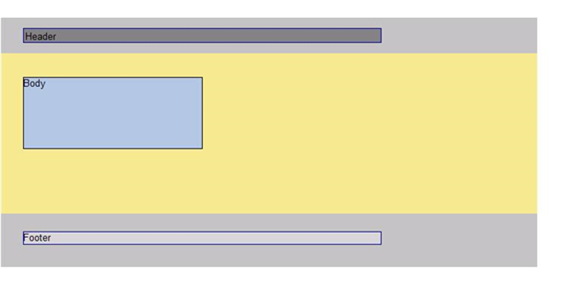

<html dir="LTR" xmlns:mshelp="http://msdn.microsoft.com/mshelp" xmlns:ddue="http://ddue.schemas.microsoft.com/authoring/2003/5" xmlns:xlink="http://www.w3.org/1999/xlink" xmlns:tool="http://www.microsoft.com/tooltip">
    <head>
        <meta http-equiv="Content-Type" content="text/html; CHARSET=utf-8"></meta>
        <meta name="save" content="history"></meta>
        <title>3.3 Report in RDL schema 2005/01</title>
        <xml>
            <mshelp:toctitle title="3.3 Report in RDL schema 2005/01"></mshelp:toctitle>
            <mshelp:rltitle title="[MS-RDL]: Report in RDL schema 2005/01"></mshelp:rltitle>
            <mshelp:keyword index="A" term="9a5c45d3-4164-48d8-bf57-ee8e5dc405ef"></mshelp:keyword>
            <mshelp:attr name="DCSext.ContentType" value="open specification"></mshelp:attr>
            <mshelp:attr name="AssetID" value="9a5c45d3-4164-48d8-bf57-ee8e5dc405ef"></mshelp:attr>
            <mshelp:attr name="TopicType" value="kbRef"></mshelp:attr>
            <mshelp:attr name="DCSext.Title" value="[MS-RDL]: Report in RDL schema 2005/01" />
        </xml>
    </head>
    <body>
        

            <h1 class="heading">3.3 Report in RDL schema 2005/01</h1>
        

        

            

                

                

                    

The following is an example of the RDL for a report in
Schema version <a href="3ebe2912-4958-4832-b391-cad1f5e13338.htm">RDL 2005/01</a>.
It shows the usage of the various properties of a <a href="6bbaafec-020b-406c-b4e7-5e4318b616cb.htm">Report</a>. This example shows
elements for describing the data: <a href="9c54b70c-c593-422b-aa16-33cb335927a1.htm">DataSources</a> and <a href="8a8301cb-c9b3-48ca-84fb-03e8724f959f.htm">DataSets</a>; elements for
describing the structure and layout: <a href="0f50dcf2-ebef-47ef-a595-69f33e6ecc7e.htm">Report.PageHeader</a>, <a href="c553f438-de3b-4e72-b4b6-ded6be1abc6a.htm">Report.PageFooter</a>, and <a href="6bf4e125-fdfd-4d04-88aa-c4395ba8a252.htm">Body</a>; and elements for
describing the <a href="615fae60-39c0-4770-8735-bdcf6d368031.htm">ReportParameters</a>
for the report.

The following figure shows an example rendering of this
report.

<b>Figure 11: RDL schema 2005/01 report rendering</b>

<dl>
<dd>

<pre> 1 &lt;?xml version=&quot;1.0&quot; encoding=&quot;utf-8&quot;?&gt;
 2 &lt;Report xmlns=&quot;http://schemas.microsoft.com/sqlserver/reporting/2005/01/reportdefinition&quot;&gt;
 3  &lt;DataSources&gt;
 4    &lt;DataSource Name=&quot;DataSource1&quot;&gt;
 5      &lt;ConnectionProperties&gt;
 6        &lt;DataProvider&gt;SQL&lt;/DataProvider&gt;
 7        &lt;ConnectString&gt;data source=DataServer; initial catalog=Northwind;&lt;/ConnectString&gt;
 8      &lt;/ConnectionProperties&gt;
 9    &lt;/DataSource&gt;
 10  &lt;/DataSources&gt;
 11  &lt;DataSets&gt;
 12    &lt;DataSet Name=&quot;DataSet1&quot;&gt;
 13      &lt;Fields&gt;
 14        &lt;Field Name=&quot;ProductID&quot;&gt;
 15          &lt;DataField&gt;ProductID&lt;/DataField&gt;
 16        &lt;/Field&gt;
 17        &lt;Field Name=&quot;ProductName&quot;&gt;
 18          &lt;DataField&gt;ProductName&lt;/DataField&gt;
 19        &lt;/Field&gt;
 20        &lt;Field Name=&quot;SupplierID&quot;&gt;
 21          &lt;DataField&gt;SupplierID&lt;/DataField&gt;
 22        &lt;/Field&gt;
 23        &lt;Field Name=&quot;CategoryID&quot;&gt;
 24          &lt;DataField&gt;CategoryID&lt;/DataField&gt;
 25        &lt;/Field&gt;
 26        &lt;Field Name=&quot;QuantityPerUnit&quot;&gt;
 27          &lt;DataField&gt;QuantityPerUnit&lt;/DataField&gt;
 28        &lt;/Field&gt;
 29        &lt;Field Name=&quot;UnitPrice&quot;&gt;
 30          &lt;DataField&gt;UnitPrice&lt;/DataField&gt;
 31        &lt;/Field&gt;
 32        &lt;Field Name=&quot;UnitsInStock&quot;&gt;
 33          &lt;DataField&gt;UnitsInStock&lt;/DataField&gt;
 34        &lt;/Field&gt;
 35        &lt;Field Name=&quot;UnitsOnOrder&quot;&gt;
 36          &lt;DataField&gt;UnitsOnOrder&lt;/DataField&gt;
 37        &lt;/Field&gt;
 38        &lt;Field Name=&quot;ReorderLevel&quot;&gt;
 39          &lt;DataField&gt;ReorderLevel&lt;/DataField&gt;
 40        &lt;/Field&gt;
 41        &lt;Field Name=&quot;Discontinued&quot;&gt;
 42          &lt;DataField&gt;Discontinued&lt;/DataField&gt;
 43        &lt;/Field&gt;
 44      &lt;/Fields&gt;
 45      &lt;Query&gt;
 46        &lt;DataSourceName&gt;DataSource1&lt;/DataSourceName&gt;
 47        &lt;CommandText&gt;Select * From Products&lt;/CommandText&gt;
 48      &lt;/Query&gt;
 49    &lt;/DataSet&gt;
 50  &lt;/DataSets&gt;
 51  &lt;Body&gt;
 52    &lt;ReportItems&gt;
 53      &lt;Textbox Name=&quot;BodyTextbox&quot;&gt;
 54        &lt;CanGrow&gt;true&lt;/CanGrow&gt;
 55        &lt;Value&gt;Body&lt;/Value&gt;
 56        &lt;Top&gt;0.33333in&lt;/Top&gt;
 57        &lt;Left&gt;0.3125in&lt;/Left&gt;
 58        &lt;Height&gt;1in&lt;/Height&gt;
 59        &lt;Width&gt;2.5in&lt;/Width&gt;
 60        &lt;Style&gt;
 61          &lt;BorderColor&gt;
 62            &lt;Default&gt;Black&lt;/Default&gt;
 63          &lt;/BorderColor&gt;
 64          &lt;BorderStyle&gt;
 65            &lt;Default&gt;Solid&lt;/Default&gt;
 66          &lt;/BorderStyle&gt;
 67          &lt;BorderWidth&gt;
 68            &lt;Default&gt;1pt&lt;/Default&gt;
 69          &lt;/BorderWidth&gt;
 70          &lt;BackgroundColor&gt;LightSteelBlue&lt;/BackgroundColor&gt;
 71        &lt;/Style&gt;
 72      &lt;/Textbox&gt;
 73    &lt;/ReportItems&gt;
 74    &lt;Height&gt;2.5in&lt;/Height&gt;
 75    &lt;Style&gt;
 76      &lt;BackgroundColor&gt;Khaki&lt;/BackgroundColor&gt;
 77    &lt;/Style&gt;
 78  &lt;/Body&gt;
 79  &lt;PageHeader&gt;
 80    &lt;Height&gt;0.5in&lt;/Height&gt;
 81    &lt;PrintOnFirstPage&gt;true&lt;/PrintOnFirstPage&gt;
 82    &lt;PrintOnLastPage&gt;true&lt;/PrintOnLastPage&gt;
 83    &lt;ReportItems&gt;
 84      &lt;Textbox Name=&quot;HeaderTextbox&quot;&gt;
 85        &lt;Value&gt;Header&lt;/Value&gt;
 86        &lt;Top&gt;0.14583in&lt;/Top&gt;
 87        &lt;Left&gt;0.3125in&lt;/Left&gt;
 88        &lt;Height&gt;0.19792in&lt;/Height&gt;
 89        &lt;Width&gt;5in&lt;/Width&gt;
 90        &lt;Style&gt;
 91          &lt;BorderColor&gt;
 92            &lt;Default&gt;DarkBlue&lt;/Default&gt;
 93          &lt;/BorderColor&gt;
 94          &lt;BorderStyle&gt;
 95            &lt;Default&gt;Solid&lt;/Default&gt;
 96          &lt;/BorderStyle&gt;
 97          &lt;BorderWidth&gt;
 98            &lt;Default&gt;1pt&lt;/Default&gt;
 99          &lt;/BorderWidth&gt;     
 100          &lt;BackgroundColor&gt;Gray&lt;/BackgroundColor&gt;
 101          &lt;PaddingLeft&gt;2pt&lt;/PaddingLeft&gt;
 102          &lt;PaddingRight&gt;2pt&lt;/PaddingRight&gt;
 103          &lt;PaddingTop&gt;2pt&lt;/PaddingTop&gt;
 104          &lt;PaddingBottom&gt;2pt&lt;/PaddingBottom&gt;
 105        &lt;/Style&gt;
 106      &lt;/Textbox&gt;
 107    &lt;/ReportItems&gt;
 108    &lt;Style&gt;
 109      &lt;BackgroundColor&gt;Silver&lt;/BackgroundColor&gt;
 110    &lt;/Style&gt;
 111  &lt;/PageHeader&gt;
 112  &lt;PageFooter&gt;
 113    &lt;Height&gt;0.75in&lt;/Height&gt;
 114    &lt;PrintOnFirstPage&gt;true&lt;/PrintOnFirstPage&gt;
 115    &lt;PrintOnLastPage&gt;true&lt;/PrintOnLastPage&gt;
 116    &lt;ReportItems&gt;
 117      &lt;Textbox Name=&quot;FooterTextbox&quot;&gt;
 118        &lt;CanGrow&gt;true&lt;/CanGrow&gt;
 119        &lt;Value&gt;Footer&lt;/Value&gt;
 120        &lt;Top&gt;0.25in&lt;/Top&gt;
 121        &lt;Left&gt;0.3125in&lt;/Left&gt;
 122        &lt;Height&gt;0.17708in&lt;/Height&gt;
 123        &lt;Width&gt;5in&lt;/Width&gt;
 124        &lt;Style&gt;
 125          &lt;BorderColor&gt;
 126            &lt;Default&gt;DarkBlue&lt;/Default&gt;
 127          &lt;/BorderColor&gt;
 128          &lt;BorderStyle&gt;
 129            &lt;Default&gt;Solid&lt;/Default&gt;
 130          &lt;/BorderStyle&gt;
 131          &lt;BorderWidth&gt;
 132            &lt;Default&gt;1pt&lt;/Default&gt;
 133          &lt;/BorderWidth&gt;     
 134          &lt;BackgroundColor&gt;LightGray&lt;/BackgroundColor&gt;
 135        &lt;/Style&gt;
 136      &lt;/Textbox&gt;
 137    &lt;/ReportItems&gt;
 138    &lt;Style&gt;
 139      &lt;BackgroundColor&gt;Silver&lt;/BackgroundColor&gt;
 140    &lt;/Style&gt;
 141  &lt;/PageFooter&gt;
 142  &lt;PageWidth&gt;8.5in&lt;/PageWidth&gt;
 143  &lt;PageHeight&gt;6in&lt;/PageHeight&gt;
 144  &lt;InteractiveWidth&gt;8.5in&lt;/InteractiveWidth&gt;
 145  &lt;LeftMargin&gt;0.5in&lt;/LeftMargin&gt;
 146  &lt;RightMargin&gt;0.5in&lt;/RightMargin&gt;
 147  &lt;TopMargin&gt;0.25in&lt;/TopMargin&gt;
 148  &lt;BottomMargin&gt;0.25in&lt;/BottomMargin&gt;
 149  &lt;Width&gt;6.5in&lt;/Width&gt;
 150  &lt;Language&gt;=User!Language&lt;/Language&gt;
 151  &lt;ReportParameters&gt;
 152    &lt;ReportParameter Name=&quot;Product&quot;&gt;
 153      &lt;DataType&gt;String&lt;/DataType&gt;
 154      &lt;DefaultValue&gt;
 155        &lt;DataSetReference&gt;
 156          &lt;DataSetName&gt;DataSet1&lt;/DataSetName&gt;
 157          &lt;ValueField&gt;ProductID&lt;/ValueField&gt;
 158        &lt;/DataSetReference&gt;
 159      &lt;/DefaultValue&gt;
 160      &lt;Prompt&gt;Product&lt;/Prompt&gt;
 161      &lt;ValidValues&gt;
 162        &lt;DataSetReference&gt;
 163          &lt;DataSetName&gt;DataSet1&lt;/DataSetName&gt;
 164          &lt;ValueField&gt;ProductID&lt;/ValueField&gt;
 165          &lt;LabelField&gt;ProductName&lt;/LabelField&gt;
 166        &lt;/DataSetReference&gt;
 167      &lt;/ValidValues&gt;
 168      &lt;MultiValue&gt;true&lt;/MultiValue&gt;
 169    &lt;/ReportParameter&gt;
 170    &lt;ReportParameter Name=&quot;Quantity&quot;&gt;
 171      &lt;DataType&gt;Integer&lt;/DataType&gt;
 172      &lt;DefaultValue&gt;
 173        &lt;Values&gt;
 174          &lt;Value&gt;0&lt;/Value&gt;
 175        &lt;/Values&gt;
 176      &lt;/DefaultValue&gt;
 177      &lt;Prompt&gt;Quantity&lt;/Prompt&gt;
 178      &lt;ValidValues&gt;
 179        &lt;ParameterValues&gt;
 180          &lt;ParameterValue&gt;
 181            &lt;Value&gt;0&lt;/Value&gt;
 182            &lt;Label&gt;0&lt;/Label&gt;
 183          &lt;/ParameterValue&gt;
 184          &lt;ParameterValue&gt;
 185            &lt;Value&gt;10&lt;/Value&gt;
 186            &lt;Label&gt;10&lt;/Label&gt;
 187          &lt;/ParameterValue&gt;
 188          &lt;ParameterValue&gt;
 189            &lt;Value&gt;50&lt;/Value&gt;
 190            &lt;Label&gt;50&lt;/Label&gt;
 191          &lt;/ParameterValue&gt;
 192        &lt;/ParameterValues&gt;
 193      &lt;/ValidValues&gt;
 194    &lt;/ReportParameter&gt;
 195  &lt;/ReportParameters&gt;
 196&lt;/Report&gt;
</pre>

</dd></dl>

                

            

        

    </body>
</html>