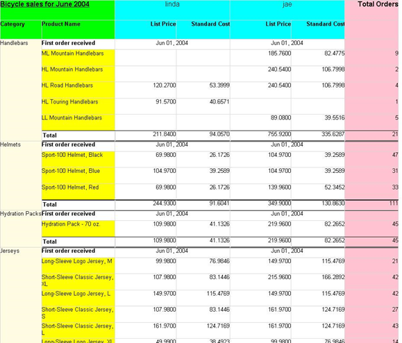

<html dir="LTR" xmlns:mshelp="http://msdn.microsoft.com/mshelp" xmlns:ddue="http://ddue.schemas.microsoft.com/authoring/2003/5" xmlns:xlink="http://www.w3.org/1999/xlink" xmlns:tool="http://www.microsoft.com/tooltip">
    <head>
        <meta http-equiv="Content-Type" content="text/html; CHARSET=utf-8"></meta>
        <meta name="save" content="history"></meta>
        <title>3.9 Tablix 3</title>
        <xml>
            <mshelp:toctitle title="3.9 Tablix 3"></mshelp:toctitle>
            <mshelp:rltitle title="[MS-RDL]: Tablix 3"></mshelp:rltitle>
            <mshelp:keyword index="A" term="aa1423b6-d08c-4035-bb15-b231d4b6fdfa"></mshelp:keyword>
            <mshelp:attr name="DCSext.ContentType" value="open specification"></mshelp:attr>
            <mshelp:attr name="AssetID" value="aa1423b6-d08c-4035-bb15-b231d4b6fdfa"></mshelp:attr>
            <mshelp:attr name="TopicType" value="kbRef"></mshelp:attr>
            <mshelp:attr name="DCSext.Title" value="[MS-RDL]: Tablix 3" />
        </xml>
    </head>
    <body>
        

            <h1 class="heading">3.9 Tablix 3</h1>
        

        

            

                

                

                    

The following is an example RDL definition of a <a href="e42fb86e-799a-4202-8845-ac38831efccb.html">Tablix</a> element used to lay
out data in nested rows, repeating columns, and a sibling column. The tablix
uses text boxes within cells to format and display the data. This layout
encompasses the functionality of the <a href="25419c0a-c7c6-43d7-8ca5-1af842666dcb.html">Matrix</a> element in schema
versions prior to <a href="1e855f94-4617-47e4-b89e-0856c6cb420f.html">RDL 2008/01</a>.
The data is fetched from the Microsoft Adventure Works example database. The
top of the rendered definition is shown in the following illustration.

<b>Figure 19: Tablix example 3</b>

The <b>Tablix</b> element has its <a href="ad4609d4-e4d7-4631-97f9-90064ca7cee8.html">Tablix.Name</a> attribute set
to &quot;Tablix3&quot;.

<dl>
<dd>

<pre>            
 s&lt;Tablix Name=&quot;Tablix3&quot;&gt;
</pre>

</dd></dl>

The column hierarchy is defining two <a href="b2482b3f-74ab-4ca8-a9e5-c07955011743.html#gt_d8aee082-104c-4091-9a95-acfb945b489b">dynamic columns</a>. The first
is colored aqua and the second is colored pink.

<dl>
<dd>

<pre>     &lt;TablixColumnHierarchy&gt;
</pre>

</dd></dl>

The first dynamic column is grouping on SalesPerson and
contains two <a href="b2482b3f-74ab-4ca8-a9e5-c07955011743.html#gt_80c4e71a-917c-44e5-bfee-5675d96c4219">static columns</a>
within the same hierarchy. All text boxes within the first tablix member are
colored aqua. The dynamic column and the static columns within it are repeated
for each SalesPerson in the data.

<dl>
<dd>

<pre>       &lt;TablixMembers&gt;
         &lt;TablixMember&gt;
           &lt;Group Name=&quot;SalesPerson&quot;&gt;
             &lt;GroupExpressions&gt;
               &lt;GroupExpression&gt;=Fields!SalesPerson.Value&lt;/GroupExpression&gt;
             &lt;/GroupExpressions&gt;
           &lt;/Group&gt;
           &lt;TablixHeader&gt;
</pre>

</dd></dl>

Because the <a href="ac71f119-59be-471b-9316-e95b931402cb.html">TablixHeader</a> element is
within the column hierarchy, the <a href="b40c092e-4fe5-4f7b-a0bf-c98df1361c90.html">RdlSize</a> value represents
row height.

<dl>
<dd>

<pre>             &lt;Size&gt;0.48438in&lt;/Size&gt;
             &lt;CellContents&gt;
               &lt;Textbox Name=&quot;SalesPerson&quot;&gt;
                 &lt;CanGrow&gt;true&lt;/CanGrow&gt;
                 &lt;KeepTogether&gt;true&lt;/KeepTogether&gt;
                 &lt;Paragraphs&gt;
                   &lt;Paragraph&gt;
                     &lt;TextRuns&gt;
                       &lt;TextRun&gt;
                         &lt;Value&gt;=Fields!SalesPerson.Value&lt;/Value&gt;
                         &lt;Style&gt;
                           &lt;FontSize&gt;12pt&lt;/FontSize&gt;
                         &lt;/Style&gt;
                       &lt;/TextRun&gt;
                     &lt;/TextRuns&gt;
                     &lt;Style&gt;
                       &lt;TextAlign&gt;Center&lt;/TextAlign&gt;
                     &lt;/Style&gt;
                   &lt;/Paragraph&gt;
                 &lt;/Paragraphs&gt;
                 &lt;Style&gt;
                   &lt;Border&gt;
                     &lt;Color&gt;LightGrey&lt;/Color&gt;
                     &lt;Style&gt;Solid&lt;/Style&gt;
                   &lt;/Border&gt;
                   &lt;BackgroundColor&gt;Aqua&lt;/BackgroundColor&gt;
                 &lt;/Style&gt;
               &lt;/Textbox&gt;
             &lt;/CellContents&gt;
           &lt;/TablixHeader&gt;
</pre>

</dd></dl>

The first nested <a href="1d8a9691-b173-4e24-9ea9-1f486bc824fd.html">TablixMember</a> defines a
nested column for List Price under each SalesPerson.

<dl>
<dd>

<pre>           &lt;TablixMembers&gt;
             &lt;TablixMember&gt;
               &lt;TablixHeader&gt;
                 &lt;Size&gt;0.45833in&lt;/Size&gt;
                 &lt;CellContents&gt;
                   &lt;Textbox Name=&quot;Textbox8&quot;&gt;
                     &lt;CanGrow&gt;true&lt;/CanGrow&gt;
                     &lt;KeepTogether&gt;true&lt;/KeepTogether&gt;
                     &lt;Paragraphs&gt;
                       &lt;Paragraph&gt;
                         &lt;TextRuns&gt;
                           &lt;TextRun&gt;
                             &lt;Value&gt;List Price&lt;/Value&gt;
                             &lt;Style&gt;
                               &lt;FontWeight&gt;Bold&lt;/FontWeight&gt;
                             &lt;/Style&gt;
                           &lt;/TextRun&gt;
                         &lt;/TextRuns&gt;
                         &lt;Style&gt;
                           &lt;TextAlign&gt;Right&lt;/TextAlign&gt;
                         &lt;/Style&gt;
                       &lt;/Paragraph&gt;
                     &lt;/Paragraphs&gt;
                     &lt;Style&gt;
                       &lt;Border&gt;
                         &lt;Color&gt;LightGrey&lt;/Color&gt;
                         &lt;Style&gt;Solid&lt;/Style&gt;
                       &lt;/Border&gt;
                       &lt;BackgroundColor&gt;Aqua&lt;/BackgroundColor&gt;
                     &lt;/Style&gt;
                   &lt;/Textbox&gt;
                 &lt;/CellContents&gt;
               &lt;/TablixHeader&gt;
             &lt;/TablixMember&gt;
</pre>

</dd></dl>

The second nested tablix member defines a nested column for
Standard Cost under each SalesPerson.

<dl>
<dd>

<pre>             &lt;TablixMember&gt;
               &lt;TablixHeader&gt;
                 &lt;Size&gt;0.45833in&lt;/Size&gt;
                 &lt;CellContents&gt;
                   &lt;Textbox Name=&quot;Textbox9&quot;&gt;
                     &lt;CanGrow&gt;true&lt;/CanGrow&gt;
                     &lt;KeepTogether&gt;true&lt;/KeepTogether&gt;
                     &lt;Paragraphs&gt;
                       &lt;Paragraph&gt;
                         &lt;TextRuns&gt;
                           &lt;TextRun&gt;
                             &lt;Value&gt;Standard Cost&lt;/Value&gt;
                             &lt;Style&gt;
                               &lt;FontWeight&gt;Bold&lt;/FontWeight&gt;
                             &lt;/Style&gt;
                           &lt;/TextRun&gt;
                         &lt;/TextRuns&gt;
                         &lt;Style&gt;
                           &lt;TextAlign&gt;Right&lt;/TextAlign&gt;
                         &lt;/Style&gt;
                       &lt;/Paragraph&gt;
                     &lt;/Paragraphs&gt;
                     &lt;Style&gt;
                       &lt;Border&gt;
                         &lt;Color&gt;LightGrey&lt;/Color&gt;
                         &lt;Style&gt;Solid&lt;/Style&gt;
                       &lt;/Border&gt;
                       &lt;BackgroundColor&gt;Aqua&lt;/BackgroundColor&gt;
                     &lt;/Style&gt;
                   &lt;/Textbox&gt;
                 &lt;/CellContents&gt;
               &lt;/TablixHeader&gt;
             &lt;/TablixMember&gt;
           &lt;/TablixMembers&gt;
         &lt;/TablixMember&gt;
</pre>

</dd></dl>

The second dynamic column is grouping on the Order Date
month. The <a href="a14782b0-2e2f-4305-83a3-3de3fd750b6a.html">DataSet</a>
contains data for only a single month. Therefore, the example renders only a
single column for this <a href="b2482b3f-74ab-4ca8-a9e5-c07955011743.html#gt_15e0998f-3c49-4315-9351-b02be92657f3">dynamic
group</a>. The size of the <b>TablixHeader</b> element is equal to the sum of
the sizes of the first dynamic column headers. This effectively means that the <a href="43ccec32-ec37-401c-ba8a-edbfa74e42f4.html">CellContents</a> span two
rendered header rows. The text box is colored pink.

<dl>
<dd>

<pre>         &lt;TablixMember&gt;
           &lt;Group Name=&quot;OrdersGroup&quot;&gt;
             &lt;GroupExpressions&gt;
               GroupExpression&gt;=Fields!OrderDate.Value.Month()&lt;/GroupExpression&gt;
             &lt;/GroupExpressions&gt;
           &lt;/Group&gt;
           &lt;SortExpressions&gt;
             &lt;SortExpression&gt;
               &lt;Value&gt;=Fields!OrderDate.Value.Month()&lt;/Value&gt;
             &lt;/SortExpression&gt;
           &lt;/SortExpressions&gt;
           &lt;TablixHeader&gt;
             &lt;Size&gt;0.94271in&lt;/Size&gt;
             &lt;CellContents&gt;
               &lt;Textbox Name=&quot;OrdersColumnHeader&quot;&gt;
                 &lt;CanGrow&gt;true&lt;/CanGrow&gt;
                 &lt;KeepTogether&gt;true&lt;/KeepTogether&gt;
                 &lt;Paragraphs&gt;
                   &lt;Paragraph&gt;
                     &lt;TextRuns&gt;
                       &lt;TextRun&gt;
                         &lt;Value&gt;Total Orders&lt;/Value&gt;
                         &lt;Style&gt;
                           &lt;FontSize&gt;12pt&lt;/FontSize&gt;
                           &lt;FontWeight&gt;Bold&lt;/FontWeight&gt;
                         &lt;/Style&gt;
                       &lt;/TextRun&gt;
                     &lt;/TextRuns&gt;
                     &lt;Style&gt;
                       &lt;TextAlign&gt;Right&lt;/TextAlign&gt;
                     &lt;/Style&gt;
                   &lt;/Paragraph&gt;
                 &lt;/Paragraphs&gt;
                 &lt;Style&gt;
                   &lt;Border&gt;
                     &lt;Color&gt;LightGrey&lt;/Color&gt;
                     &lt;Style&gt;Solid&lt;/Style&gt;
                   &lt;/Border&gt;
                   &lt;BackgroundColor&gt;Pink&lt;/BackgroundColor&gt;
                 &lt;/Style&gt;
               &lt;/Textbox&gt;
             &lt;/CellContents&gt;
           &lt;/TablixHeader&gt;
         &lt;/TablixMember&gt;
       &lt;/TablixMembers&gt;
     &lt;/TablixColumnHierarchy&gt;
</pre>

</dd></dl>

The row hierarchy defines a dynamic group (colored cornsilk
in the preceding figure) with a child dynamic group (colored yellow in the
figure above) and two static groups which act as header and footer to the child
dynamic group.

<dl>
<dd>

<pre>     &lt;TablixRowHierarchy&gt;
</pre>

</dd></dl>

The parent <a href="b2482b3f-74ab-4ca8-a9e5-c07955011743.html#gt_89a8a264-68b6-4a8f-a5d2-486261f8dd3d">dynamic
row</a> is grouping on ProductCategoryName. The text box is colored cornsilk.
This dynamic row is repeated for each unique group item, and the child row
groups are repeated within it.

<dl>
<dd>

<pre>       &lt;TablixMembers&gt;
         &lt;TablixMember&gt;
           &lt;Group Name=&quot;CategoryGroup&quot;&gt;
             &lt;GroupExpressions&gt;
                                 GroupExpression&gt;=Fields!ProductCategoryName.Value&lt;/GroupExpression&gt;
             &lt;/GroupExpressions&gt;
           &lt;/Group&gt;
           &lt;SortExpressions&gt;
             &lt;SortExpression&gt;
               &lt;Value&gt;=Fields!ProductCategoryName.Value&lt;/Value&gt;
             &lt;/SortExpression&gt;
           &lt;/SortExpressions&gt;
           &lt;TablixHeader&gt;
</pre>

</dd></dl>

Because the <b>TablixHeader</b> element is within the row
hierarchy, the size is the width of a column.

<dl>
<dd>

<pre>             &lt;Size&gt;1in&lt;/Size&gt;
             &lt;CellContents&gt;
               &lt;Textbox Name=&quot;CategoryRowHeader&quot;&gt;
                 &lt;CanGrow&gt;true&lt;/CanGrow&gt;
                 &lt;KeepTogether&gt;true&lt;/KeepTogether&gt;
                 &lt;Paragraphs&gt;
                   &lt;Paragraph&gt;
                     &lt;TextRuns&gt;
                       &lt;TextRun&gt;
                         &lt;Value&gt;=Fields!ProductCategoryName.Value&lt;/Value&gt;
                       &lt;/TextRun&gt;
                     &lt;/TextRuns&gt;
                   &lt;/Paragraph&gt;
                 &lt;/Paragraphs&gt;
                 &lt;Style&gt;
                   &lt;Border&gt;
                     &lt;Color&gt;LightGrey&lt;/Color&gt;
                     &lt;Style&gt;Solid&lt;/Style&gt;
                   &lt;/Border&gt;
                   &lt;BackgroundColor&gt;Cornsilk&lt;/BackgroundColor&gt;
                 &lt;/Style&gt;
               &lt;/Textbox&gt;
             &lt;/CellContents&gt;
           &lt;/TablixHeader&gt;
</pre>

</dd></dl>

The parent dynamic row has a child static member that is
used to display row header text at the beginning of each child dynamic row. The
header text is &quot;First order received&quot;.

<dl>
<dd>

<pre>           &lt;TablixMembers&gt;
             &lt;TablixMember&gt;
               &lt;TablixHeader&gt;
                 &lt;Size&gt;1.76562in&lt;/Size&gt;
                 &lt;CellContents&gt;
                   &lt;Textbox Name=&quot;ProductHeaderRowHeader&quot;&gt;
                     &lt;CanGrow&gt;true&lt;/CanGrow&gt;
                     &lt;KeepTogether&gt;true&lt;/KeepTogether&gt;
                     &lt;Paragraphs&gt;
                       &lt;Paragraph&gt;
                         &lt;TextRuns&gt;
                           &lt;TextRun&gt;
                             &lt;Value&gt;First order received&lt;/Value&gt;
                             &lt;Style&gt;
                               &lt;FontWeight&gt;Bold&lt;/FontWeight&gt;
                             &lt;/Style&gt;
                           &lt;/TextRun&gt;
                         &lt;/TextRuns&gt;
                       &lt;/Paragraph&gt;
                     &lt;/Paragraphs&gt;
                     &lt;Style&gt;
                       &lt;Border&gt;
                         &lt;Color&gt;LightGrey&lt;/Color&gt;
                         &lt;Style&gt;Solid&lt;/Style&gt;
                       &lt;/Border&gt;
                     &lt;/Style&gt;
                   &lt;/Textbox&gt;
                 &lt;/CellContents&gt;
               &lt;/TablixHeader&gt;
</pre>

</dd></dl>

Specifying the <a href="21e238be-5596-42ad-8583-0c8ef5fdab50.html">TablixMember.KeepWithGroup</a>
value as &quot;After&quot; means that an attempt is to be made to render this
row with the <a href="b2482b3f-74ab-4ca8-a9e5-c07955011743.html#gt_6008ef1a-6292-4d6c-a912-511bf6aa0258">dynamic member</a>
(in yellow) that follows.

<dl>
<dd>

<pre>               &lt;KeepWithGroup&gt;After&lt;/KeepWithGroup&gt;
             &lt;/TablixMember&gt;
</pre>

</dd></dl>

The child dynamic member groups on the ProductName field and
will be displayed once for each unique ProductName. The text box is colored
yellow.

<dl>
<dd>

<pre>             &lt;TablixMember&gt;
               &lt;Group Name=&quot;Product&quot;&gt;
                 &lt;GroupExpressions&gt;
                                         GroupExpression&gt;=Fields!ProductName.Value&lt;/GroupExpression&gt;
                 &lt;/GroupExpressions&gt;
               &lt;/Group&gt;
               &lt;TablixHeader&gt;
                 &lt;Size&gt;1.76562in&lt;/Size&gt;
                 &lt;CellContents&gt;
                   &lt;Textbox Name=&quot;ProductRowHeader&quot;&gt;
                     &lt;CanGrow&gt;true&lt;/CanGrow&gt;
                     &lt;KeepTogether&gt;true&lt;/KeepTogether&gt;
                     &lt;Paragraphs&gt;
                       &lt;Paragraph&gt;
                         &lt;TextRuns&gt;
                           &lt;TextRun&gt;
                             &lt;Value&gt;=Fields!ProductName.Value&lt;/Value&gt;
                           &lt;/TextRun&gt;
                         &lt;/TextRuns&gt;
                       &lt;/Paragraph&gt;
                     &lt;/Paragraphs&gt;
                     &lt;Style&gt;
                       &lt;Border&gt;
                         &lt;Color&gt;LightGrey&lt;/Color&gt;
                         &lt;Style&gt;Solid&lt;/Style&gt;
                       &lt;/Border&gt;
                       &lt;BackgroundColor&gt;Yellow&lt;/BackgroundColor&gt;
                     &lt;/Style&gt;
                   &lt;/Textbox&gt;
                 &lt;/CellContents&gt;
               &lt;/TablixHeader&gt;
             &lt;/TablixMember&gt;
</pre>

</dd></dl>

The parent dynamic row has a child static member that is
used to display row footer text at the end of each child dynamic row. The
footer text is &quot;Total&quot;.

<dl>
<dd>

<pre>             &lt;TablixMember&gt;
               &lt;TablixHeader&gt;
                 &lt;Size&gt;1.76562in&lt;/Size&gt;
                 &lt;CellContents&gt;
                   &lt;Textbox Name=&quot;ProductFooterRowHeader&quot;&gt;
                     &lt;CanGrow&gt;true&lt;/CanGrow&gt;
                     &lt;KeepTogether&gt;true&lt;/KeepTogether&gt;
                     &lt;Paragraphs&gt;
                       &lt;Paragraph&gt;
                         &lt;TextRuns&gt;
                           &lt;TextRun&gt;
                             &lt;Value&gt;Total&lt;/Value&gt;
                             &lt;Style&gt;
                               &lt;FontWeight&gt;Bold&lt;/FontWeight&gt;
                             &lt;/Style&gt;
                           &lt;/TextRun&gt;
                         &lt;/TextRuns&gt;
                       &lt;/Paragraph&gt;
                     &lt;/Paragraphs&gt;
                     &lt;Style&gt;
                       &lt;Border&gt;
                         &lt;Color&gt;LightGrey&lt;/Color&gt;
                         &lt;Style&gt;Solid&lt;/Style&gt;
                       &lt;/Border&gt;
                       &lt;TopBorder&gt;
                         &lt;Color&gt;Black&lt;/Color&gt;
                       &lt;/TopBorder&gt;
                       &lt;BottomBorder&gt;
                         &lt;Color&gt;Black&lt;/Color&gt;
                         &lt;Width&gt;2pt&lt;/Width&gt;
                       &lt;/BottomBorder&gt;
                     &lt;/Style&gt;
                   &lt;/Textbox&gt;
                 &lt;/CellContents&gt;
               &lt;/TablixHeader&gt;
</pre>

</dd></dl>

Specifying the <b>TablixMember.KeepWithGroup</b> value as
&quot;Before&quot; means that an attempt is to be made to render this row with
the preceding dynamic member (in yellow).

<dl>
<dd>

<pre>               &lt;KeepWithGroup&gt;Before&lt;/KeepWithGroup&gt;
             &lt;/TablixMember&gt;
           &lt;/TablixMembers&gt;
         &lt;/TablixMember&gt;
       &lt;/TablixMembers&gt;
     &lt;/TablixRowHierarchy&gt;
</pre>

</dd></dl>

A <a href="9512a2e6-b1e9-40f6-845a-41b4bf1bc123.html">TablixCorner</a>
element is specified (colored lime in the preceding figure) to occupy the top
left corner. Observe that there is no ability to specify width or heights
within the <b>TablixCorner</b>. The width of the columns is defined by the size
of the <b>TablixHeader</b> elements in the row hierarchy. The height of the
rows is defined by the size of the <b>TablixHeader</b> elements in the column
hierarchy.

<dl>
<dd>

<pre>     &lt;TablixCorner&gt;
       &lt;TablixCornerRows&gt;
</pre>

</dd></dl>

There are two <a href="079f1814-7516-4b42-82be-00126e990972.html">TablixCornerRow</a> elements
specified. Two are required because of the following rule that is stated in
sections 2.22 and <a href="a5a1dc9f-93ac-4009-a762-372d3d3da3f8.html">2.36.1</a>:

&quot;If a <b>TablixCorner</b> element is specified, the
quantity of descendant <b>TablixCornerRow</b> elements in the tablix MUST equal
the quantity of unique cumulative heights for each tablix <a href="b2482b3f-74ab-4ca8-a9e5-c07955011743.html#gt_0e316a29-1401-442d-96ce-bdf521b18564">column member</a> of the
tablix. 'Cumulative height' for a tablix column member is defined as the sum of
the values of all <a href="533f8462-8de0-48eb-a389-a1eaff98ac94.html">TablixHeader.Size</a>
elements that are descendants of the tablix column member.&quot;

<table>
 <thead>
  <tr>
   <th>
   
Column hierarchy

   </th>
   <th>
   
Size

   </th>
   <th>
   
Cumulative height

   </th>
  </tr>
 </thead>
 <tr>
  <td>
  
Tablix member (SalesPerson)

  </td>
  <td>
  
.43438

  </td>
  <td>
  
.43438

  </td>
 </tr>
 <tr>
  <td>
  
        Tablix
  member &quot;List Price&quot;

  </td>
  <td>
  
.43438

  </td>
  <td>
  
.43438 +.45833 = .94721

  </td>
 </tr>
 <tr>
  <td>
  
        Tablix
  member &quot;Standard Cost&quot;

  </td>
  <td>
  
.43438

  </td>
  <td>
  
.43438 +.45833 = .94721

  </td>
 </tr>
 <tr>
  <td>
  
Tablix member (SalesPerson)

  </td>
  <td>
  
.94721

  </td>
  <td>
  
.94721

  </td>
 </tr>
</table>

<b>Computation of quantity of TablixCornerRow elements</b>

This table shows the structure of the <b>TablixHeaders</b>
within the column hierarchy, identifying the size values. The cumulative height
calculation shows the addition of the <b>RdlSize</b> with all of its parent's <b>RdlSizes</b>.
There are two unique cumulative heights: these are .48438 and .94721.
Therefore, there need to be two <b>TablixCornerRow</b> elements.

There are two <a href="6cdfb648-977b-4e6a-9316-19e8d45b6c10.html">TablixCornerCell</a> elements
specified in each row. Two are required because of the following rule that is
stated in sections 2.22 and <a href="5c3dd221-30b4-461b-b8fc-6af71b81493a.html">2.37.1</a>:

&quot;If a <b>TablixCornerRow</b> element is specified, the
quantity of descendant <b>TablixCornerCell</b> elements in the tablix MUST
equal the quantity of unique cumulative widths for each tablix <a href="b2482b3f-74ab-4ca8-a9e5-c07955011743.html#gt_85da4bce-7983-4ac7-98ca-9cf698d74881">row member</a> of the tablix.
'Cumulative width' for a tablix row member is defined as the sum of the values
of all <b>TablixHeader.Size</b> elements that are descendants of the tablix row
member.&quot;

<table>
 <thead>
  <tr>
   <th>
   
Row hierarchy

   </th>
   <th>
   
Size

   </th>
   <th>
   
Cumulative width

   </th>
  </tr>
 </thead>
 <tr>
  <td>
  
Tablix member (ProductCategoryName)

  </td>
  <td>
  
1.00000

  </td>
  <td>
  
1.00000

  </td>
 </tr>
 <tr>
  <td>
  
        Tablix
  member &quot;First order received&quot;

  </td>
  <td>
  
1.76562

  </td>
  <td>
  
1.00000 + 1.76562= 2.76562

  </td>
 </tr>
 <tr>
  <td>
  
        Tablix
  member (ProductName)

  </td>
  <td>
  
1.76562

  </td>
  <td>
  
1.00000 + 1.76562= 2.76562

  </td>
 </tr>
 <tr>
  <td>
  
        Tablix
  member &quot;Total&quot;

  </td>
  <td>
  
1.76562

  </td>
  <td>
  
1.00000 + 1.76562= 2.76562

  </td>
 </tr>
</table>

<b>Tablix example 3—computation of quantity of
TablixCornerCell elements</b>

The preceding table shows the structure of the <b>TablixHeaders</b>
within the row hierarchy, identifying the size values. The cumulative width
calculation shows the addition of the size with all of its parent's sizes.
There are two unique cumulative heights: these are 1.00000 and 1.76562.
Therefore, there need to be two <b>TablixCornerCell</b> elements in each <b>TablixCornerRow</b>
element.

<dl>
<dd>

<pre>         &lt;TablixCornerRow&gt;
           &lt;TablixCornerCell&gt;
             &lt;CellContents&gt;
               &lt;Textbox Name=&quot;Textbox4&quot;&gt;
                 &lt;CanGrow&gt;true&lt;/CanGrow&gt;
                 &lt;KeepTogether&gt;true&lt;/KeepTogether&gt;
                 &lt;Paragraphs&gt;
                   &lt;Paragraph&gt;
                     &lt;TextRuns&gt;
                       &lt;TextRun&gt;
                         &lt;Value&gt;Bicycle sales for June 2004&lt;/Value&gt;
                         &lt;Style&gt;
                           &lt;FontSize&gt;12pt&lt;/FontSize&gt;
                           &lt;FontWeight&gt;Bold&lt;/FontWeight&gt;
                           &lt;TextDecoration&gt;Underline&lt;/TextDecoration&gt;
                         &lt;/Style&gt;
                       &lt;/TextRun&gt;
                     &lt;/TextRuns&gt;
                   &lt;/Paragraph&gt;
                 &lt;/Paragraphs&gt;
                 &lt;Style&gt;
                   &lt;Border&gt;
                     &lt;Color&gt;LightGrey&lt;/Color&gt;
                     &lt;Style&gt;Solid&lt;/Style&gt;
                   &lt;/Border&gt;
                   &lt;BackgroundColor&gt;Lime&lt;/BackgroundColor&gt;
                 &lt;/Style&gt;
               &lt;/Textbox&gt;
</pre>

</dd></dl>

The first row of the corner has a title that uses two cells.
The <b>CellContents</b> specifies a <b>ColSpan</b> of 2 for the first <b>TablixCornerCell</b>
and the second <b>TablixCornerCell</b> is specified as empty.

<dl>
<dd>

<pre>               &lt;ColSpan&gt;2&lt;/ColSpan&gt;
             &lt;/CellContents&gt;
           &lt;/TablixCornerCell&gt;
           &lt;TablixCornerCell /&gt;
         &lt;/TablixCornerRow&gt;
</pre>

</dd></dl>

The second row of the corner contains two text boxes to
display &quot;Category&quot; and &quot;Product Name&quot; as column titles over
the row headers.

<dl>
<dd>

<pre>         &lt;TablixCornerRow&gt;
           &lt;TablixCornerCell&gt;
             &lt;CellContents&gt;
               &lt;Textbox Name=&quot;Textbox18&quot;&gt;
                 &lt;CanGrow&gt;true&lt;/CanGrow&gt;
                 &lt;KeepTogether&gt;true&lt;/KeepTogether&gt;
                 &lt;Paragraphs&gt;
                   &lt;Paragraph&gt;
                     &lt;TextRuns&gt;
                       &lt;TextRun&gt;
                         &lt;Value&gt;Category&lt;/Value&gt;
                         &lt;Style&gt;
                           &lt;FontWeight&gt;Bold&lt;/FontWeight&gt;
                         &lt;/Style&gt;
                       &lt;/TextRun&gt;
                     &lt;/TextRuns&gt;
                   &lt;/Paragraph&gt;
                 &lt;/Paragraphs&gt;
                 &lt;Style&gt;
                   &lt;Border&gt;
                     &lt;Color&gt;LightGrey&lt;/Color&gt;
                     &lt;Style&gt;Solid&lt;/Style&gt;
                   &lt;/Border&gt;
                   &lt;BackgroundColor&gt;Lime&lt;/BackgroundColor&gt;
                 &lt;/Style&gt;
               &lt;/Textbox&gt;
             &lt;/CellContents&gt;
           &lt;/TablixCornerCell&gt;
           &lt;TablixCornerCell&gt;
             &lt;CellContents&gt;
               &lt;Textbox Name=&quot;Textbox7&quot;&gt;
                 &lt;CanGrow&gt;true&lt;/CanGrow&gt;
                 &lt;KeepTogether&gt;true&lt;/KeepTogether&gt;
                 &lt;Paragraphs&gt;
                   &lt;Paragraph&gt;
                     &lt;TextRuns&gt;
                       &lt;TextRun&gt;
                         &lt;Value&gt;Product Name&lt;/Value&gt;
                         &lt;Style&gt;
                           &lt;FontWeight&gt;Bold&lt;/FontWeight&gt;
                         &lt;/Style&gt;
                       &lt;/TextRun&gt;
                     &lt;/TextRuns&gt;
                   &lt;/Paragraph&gt;
                 &lt;/Paragraphs&gt;
                 &lt;Style&gt;
                   &lt;Border&gt;
                     &lt;Color&gt;LightGrey&lt;/Color&gt;
                     &lt;Style&gt;Solid&lt;/Style&gt;
                   &lt;/Border&gt;
                   &lt;BackgroundColor&gt;Lime&lt;/BackgroundColor&gt;
                 &lt;/Style&gt;
               &lt;/Textbox&gt;
             &lt;/CellContents&gt;
           &lt;/TablixCornerCell&gt;
         &lt;/TablixCornerRow&gt;
       &lt;/TablixCornerRows&gt;
     &lt;/TablixCorner&gt;
</pre>

</dd></dl>

The body of the tablix defines the cells that can repeat for
both columns and rows. The widths of each <a href="ad9b435a-62bb-442d-abd3-bf53ec575b63.html">TablixColumn</a> specify the
width of each column as it repeats.

<dl>
<dd>

<pre>     &lt;TablixBody&gt;
       &lt;TablixColumns&gt;
         &lt;TablixColumn&gt;
           &lt;Width&gt;1.47396in&lt;/Width&gt;
         &lt;/TablixColumn&gt;
         &lt;TablixColumn&gt;
           &lt;Width&gt;1.29167in&lt;/Width&gt;
         &lt;/TablixColumn&gt;
         &lt;TablixColumn&gt;
           &lt;Width&gt;1in&lt;/Width&gt;
         &lt;/TablixColumn&gt;
       &lt;/TablixColumns&gt;
       &lt;TablixRows&gt;
         &lt;TablixRow&gt;
</pre>

</dd></dl>

The heights of each <a href="2763daba-3372-43a9-9046-acd5c5775848.html">TablixRow</a> specify the
height of each row as it repeats.

<dl>
<dd>

<pre>           &lt;Height&gt;0.25in&lt;/Height&gt;
           &lt;TablixCells&gt;
             &lt;TablixCell&gt;
               &lt;CellContents&gt;
                 &lt;Textbox Name=&quot;OrderDate&quot;&gt;
                   &lt;CanGrow&gt;true&lt;/CanGrow&gt;
                   &lt;KeepTogether&gt;true&lt;/KeepTogether&gt;
                   &lt;Paragraphs&gt;
                     &lt;Paragraph&gt;
                       &lt;TextRuns&gt;
                         &lt;TextRun&gt;
</pre>

</dd></dl>

Because the cells are being used within groups, the data
expression uses <a href="b2482b3f-74ab-4ca8-a9e5-c07955011743.html#gt_1d75df79-dbed-4ab5-8650-588c4e94ba3b">aggregate
functions</a>.

<dl>
<dd>

<pre>                           &lt;Value&gt;=First(Fields!OrderDate.Value)&lt;/Value&gt;
                           &lt;Style&gt;
                             &lt;Format&gt;MMM dd, yyyy&lt;/Format&gt;
                           &lt;/Style&gt;
                         &lt;/TextRun&gt;
                       &lt;/TextRuns&gt;
                       &lt;Style&gt;
                         &lt;TextAlign&gt;Center&lt;/TextAlign&gt;
                       &lt;/Style&gt;
                     &lt;/Paragraph&gt;
                   &lt;/Paragraphs&gt;
                   &lt;Style&gt;
                     &lt;Border&gt;
                       &lt;Color&gt;LightGrey&lt;/Color&gt;
                       &lt;Style&gt;Solid&lt;/Style&gt;
                     &lt;/Border&gt;
                   &lt;/Style&gt;
                 &lt;/Textbox&gt;
</pre>

</dd></dl>

The <b>CellContents</b> for the <a href="33258f80-fa42-4baf-abd5-ded34ffbbc61.html">TablixCell</a> spreads across
two columns using a <b>ColSpan</b> element. This means that the following <b>TablixCell</b>
needs to be specified as empty.

<dl>
<dd>

<pre>                 &lt;ColSpan&gt;2&lt;/ColSpan&gt;
               &lt;/CellContents&gt;
             &lt;/TablixCell&gt;
             &lt;TablixCell /&gt;
             &lt;TablixCell&gt;
               &lt;CellContents&gt;
                 &lt;Textbox Name=&quot;Textbox40&quot;&gt;
                   &lt;CanGrow&gt;true&lt;/CanGrow&gt;
                   &lt;KeepTogether&gt;true&lt;/KeepTogether&gt;
                   &lt;Paragraphs&gt;
                     &lt;Paragraph&gt;
                       &lt;TextRuns&gt;
                         &lt;TextRun&gt;
                           &lt;Value /&gt;
                         &lt;/TextRun&gt;
                       &lt;/TextRuns&gt;
                       &lt;Style&gt;
                         &lt;TextAlign&gt;Center&lt;/TextAlign&gt;
                       &lt;/Style&gt;
                     &lt;/Paragraph&gt;
                   &lt;/Paragraphs&gt;
                   &lt;Style&gt;
                     &lt;Border&gt;
                       &lt;Color&gt;LightGrey&lt;/Color&gt;
                       &lt;Style&gt;Solid&lt;/Style&gt;
                     &lt;/Border&gt;
                     &lt;BackgroundColor&gt;Pink&lt;/BackgroundColor&gt;
                   &lt;/Style&gt;
                 &lt;/Textbox&gt;
               &lt;/CellContents&gt;
             &lt;/TablixCell&gt;
           &lt;/TablixCells&gt;
         &lt;/TablixRow&gt;
         &lt;TablixRow&gt;
           &lt;Height&gt;0.39062in&lt;/Height&gt;
           &lt;TablixCells&gt;
             &lt;TablixCell&gt;
               &lt;CellContents&gt;
                 &lt;Textbox Name=&quot;ListPrice&quot;&gt;
                   &lt;CanGrow&gt;true&lt;/CanGrow&gt;
                   &lt;KeepTogether&gt;true&lt;/KeepTogether&gt;
                   &lt;Paragraphs&gt;
                     &lt;Paragraph&gt;
                       &lt;TextRuns&gt;
                         &lt;TextRun&gt;
</pre>

</dd></dl>

The cell is associated with the Product dynamic group. The
aggregate function will apply across the same <a href="b2482b3f-74ab-4ca8-a9e5-c07955011743.html#gt_128cd76b-eecb-41e6-96f7-f73c2bf9235a">scope</a>.

<dl>
<dd>

<pre>                           &lt;Value&gt;=Sum(Fields!ListPrice.Value)&lt;/Value&gt;
                         &lt;/TextRun&gt;
                       &lt;/TextRuns&gt;
                     &lt;/Paragraph&gt;
                   &lt;/Paragraphs&gt;
                   &lt;Style&gt;
                     &lt;Border&gt;
                       &lt;Color&gt;LightGrey&lt;/Color&gt;
                       &lt;Style&gt;Solid&lt;/Style&gt;
                     &lt;/Border&gt;
                   &lt;/Style&gt;
                 &lt;/Textbox&gt;
               &lt;/CellContents&gt;
             &lt;/TablixCell&gt;
             &lt;TablixCell&gt;
               &lt;CellContents&gt;
                 &lt;Textbox Name=&quot;StandardCost&quot;&gt;
                   &lt;CanGrow&gt;true&lt;/CanGrow&gt;
                   &lt;KeepTogether&gt;true&lt;/KeepTogether&gt;
                   &lt;Paragraphs&gt;
                     &lt;Paragraph&gt;
                       &lt;TextRuns&gt;
                         &lt;TextRun&gt;
                           &lt;Value&gt;=Sum(Fields!StandardCost.Value)&lt;/Value&gt;
                         &lt;/TextRun&gt;
                       &lt;/TextRuns&gt;
                     &lt;/Paragraph&gt;
                   &lt;/Paragraphs&gt;
                   &lt;Style&gt;
                     &lt;Border&gt;
                       &lt;Color&gt;LightGrey&lt;/Color&gt;
                       &lt;Style&gt;Solid&lt;/Style&gt;
                     &lt;/Border&gt;
                   &lt;/Style&gt;
                 &lt;/Textbox&gt;
               &lt;/CellContents&gt;
             &lt;/TablixCell&gt;
             &lt;TablixCell&gt;
               &lt;CellContents&gt;
                 &lt;Textbox Name=&quot;OrderQty&quot;&gt;
                   &lt;CanGrow&gt;true&lt;/CanGrow&gt;
                   &lt;KeepTogether&gt;true&lt;/KeepTogether&gt;
                   &lt;Paragraphs&gt;
                     &lt;Paragraph&gt;
                       &lt;TextRuns&gt;
                         &lt;TextRun&gt;
                           &lt;Value&gt;=Sum(Fields!OrderQty.Value)&lt;/Value&gt;
                         &lt;/TextRun&gt;
                       &lt;/TextRuns&gt;
                     &lt;/Paragraph&gt;
                   &lt;/Paragraphs&gt;
                   &lt;Style&gt;
                     &lt;Border&gt;
                       &lt;Color&gt;LightGrey&lt;/Color&gt;
                       &lt;Style&gt;Solid&lt;/Style&gt;
                     &lt;/Border&gt;
                     &lt;BackgroundColor&gt;Pink&lt;/BackgroundColor&gt;
                   &lt;/Style&gt;
                 &lt;/Textbox&gt;
               &lt;/CellContents&gt;
             &lt;/TablixCell&gt;
           &lt;/TablixCells&gt;
         &lt;/TablixRow&gt;
         &lt;TablixRow&gt;
           &lt;Height&gt;0.25in&lt;/Height&gt;
           &lt;TablixCells&gt;
             &lt;TablixCell&gt;
               &lt;CellContents&gt;
                 &lt;Textbox Name=&quot;ListPrice1&quot;&gt;
                   &lt;CanGrow&gt;true&lt;/CanGrow&gt;
                   &lt;KeepTogether&gt;true&lt;/KeepTogether&gt;
                   &lt;Paragraphs&gt;
                     &lt;Paragraph&gt;
                       &lt;TextRuns&gt;
                         &lt;TextRun&gt;
</pre>

</dd></dl>

This cell is associated with the static group under the
dynamic grouping of Product Category. The aggregate will apply to Product
Category.

<dl>
<dd>

<pre>                           &lt;Value&gt;=Sum(Fields!ListPrice.Value)&lt;/Value&gt;
                         &lt;/TextRun&gt;
                       &lt;/TextRuns&gt;
                     &lt;/Paragraph&gt;
                   &lt;/Paragraphs&gt;
                   &lt;Style&gt;
                     &lt;Border&gt;
                       &lt;Color&gt;LightGrey&lt;/Color&gt;
                       &lt;Style&gt;Solid&lt;/Style&gt;
                     &lt;/Border&gt;
                     &lt;TopBorder&gt;
                       &lt;Color&gt;Black&lt;/Color&gt;
                     &lt;/TopBorder&gt;
                     &lt;BottomBorder&gt;
                       &lt;Color&gt;Black&lt;/Color&gt;
                       &lt;Width&gt;2pt&lt;/Width&gt;
                     &lt;/BottomBorder&gt;
                   &lt;/Style&gt;
                 &lt;/Textbox&gt;
               &lt;/CellContents&gt;
             &lt;/TablixCell&gt;
             &lt;TablixCell&gt;
               &lt;CellContents&gt;
                 &lt;Textbox Name=&quot;StandardCost1&quot;&gt;
                   &lt;CanGrow&gt;true&lt;/CanGrow&gt;
                   &lt;KeepTogether&gt;true&lt;/KeepTogether&gt;
                   &lt;Paragraphs&gt;
                     &lt;Paragraph&gt;
                       &lt;TextRuns&gt;
                         &lt;TextRun&gt;
                           &lt;Value&gt;=Sum(Fields!StandardCost.Value)&lt;/Value&gt;
                         &lt;/TextRun&gt;
                       &lt;/TextRuns&gt;
                     &lt;/Paragraph&gt;
                   &lt;/Paragraphs&gt;
                   &lt;Style&gt;
                     &lt;Border&gt;
                       &lt;Color&gt;LightGrey&lt;/Color&gt;
                       &lt;Style&gt;Solid&lt;/Style&gt;
                     &lt;/Border&gt;
                     &lt;TopBorder&gt;
                       &lt;Color&gt;Black&lt;/Color&gt;
                     &lt;/TopBorder&gt;
                     &lt;BottomBorder&gt;
                       &lt;Color&gt;Black&lt;/Color&gt;
                       &lt;Width&gt;2pt&lt;/Width&gt;
                     &lt;/BottomBorder&gt;
                   &lt;/Style&gt;
                 &lt;/Textbox&gt;
               &lt;/CellContents&gt;
             &lt;/TablixCell&gt;
             &lt;TablixCell&gt;
               &lt;CellContents&gt;
                 &lt;Textbox Name=&quot;Textbox42&quot;&gt;
                   &lt;CanGrow&gt;true&lt;/CanGrow&gt;
                   &lt;KeepTogether&gt;true&lt;/KeepTogether&gt;
                   &lt;Paragraphs&gt;
                     &lt;Paragraph&gt;
                       &lt;TextRuns&gt;
                         &lt;TextRun&gt;
                           &lt;Value&gt;=Sum(Fields!OrderQty.Value)&lt;/Value&gt;
                         &lt;/TextRun&gt;
                       &lt;/TextRuns&gt;
                     &lt;/Paragraph&gt;
                   &lt;/Paragraphs&gt;
                   &lt;Style&gt;
                     &lt;Border&gt;
                       &lt;Color&gt;LightGrey&lt;/Color&gt;
                       &lt;Style&gt;Solid&lt;/Style&gt;
                     &lt;/Border&gt;
                     &lt;TopBorder&gt;
                       &lt;Color&gt;Black&lt;/Color&gt;
                     &lt;/TopBorder&gt;
                     &lt;BottomBorder&gt;
                       &lt;Color&gt;Black&lt;/Color&gt;
                       &lt;Width&gt;2pt&lt;/Width&gt;
                     &lt;/BottomBorder&gt;
                     &lt;BackgroundColor&gt;Pink&lt;/BackgroundColor&gt;
                   &lt;/Style&gt;
                 &lt;/Textbox&gt;
               &lt;/CellContents&gt;
             &lt;/TablixCell&gt;
           &lt;/TablixCells&gt;
         &lt;/TablixRow&gt;
       &lt;/TablixRows&gt;
     &lt;/TablixBody&gt;
     &lt;DataSetName&gt;DataSet1&lt;/DataSetName&gt;
     &lt;Style&gt;
       &lt;Border&gt;
         &lt;Style&gt;None&lt;/Style&gt;
       &lt;/Border&gt;
     &lt;/Style&gt;
   &lt;/Tablix&gt;
</pre>

</dd></dl>

                

            

        

    </body>
</html>