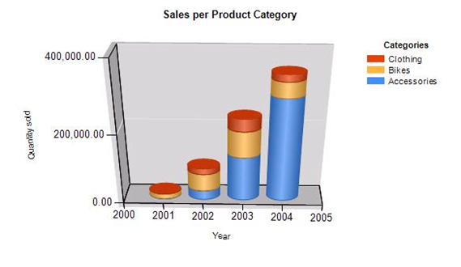
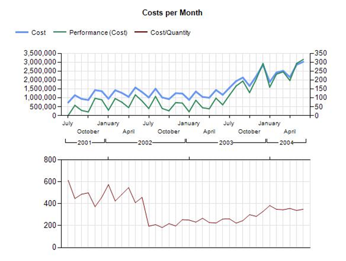

<html dir="LTR" xmlns:mshelp="http://msdn.microsoft.com/mshelp" xmlns:ddue="http://ddue.schemas.microsoft.com/authoring/2003/5" xmlns:xlink="http://www.w3.org/1999/xlink" xmlns:tool="http://www.microsoft.com/tooltip">
    <head>
        <meta http-equiv="Content-Type" content="text/html; CHARSET=utf-8"></meta>
        <meta name="save" content="history"></meta>
        <title>3.4 Column and Line Chart</title>
        <xml>
            <mshelp:toctitle title="3.4 Column and Line Chart"></mshelp:toctitle>
            <mshelp:rltitle title="[MS-RDL]: Column and Line Chart"></mshelp:rltitle>
            <mshelp:keyword index="A" term="b60a7495-b47e-4af0-8c91-2f00b44e4e77"></mshelp:keyword>
            <mshelp:attr name="DCSext.ContentType" value="open specification"></mshelp:attr>
            <mshelp:attr name="AssetID" value="b60a7495-b47e-4af0-8c91-2f00b44e4e77"></mshelp:attr>
            <mshelp:attr name="TopicType" value="kbRef"></mshelp:attr>
            <mshelp:attr name="DCSext.Title" value="[MS-RDL]: Column and Line Chart" />
        </xml>
    </head>
    <body>
        

            <h1 class="heading">3.4 Column and Line Chart</h1>
        

        

            

                

                

                    

<b><i>Applies to </i></b><a href="1e855f94-4617-47e4-b89e-0856c6cb420f.html"><b><i>RDL 2008/01</i></b></a><b><i>,
</i></b><a href="3428e690-a348-4ec7-8a6a-8efb42d2cdee.html"><b><i>RDL 2010/01</i></b></a><b><i>,
and </i></b><a href="52ce3983-2bfc-4e72-9359-42aaf5fe4509.html"><b><i>RDL 2016/01</i></b></a>

The following example report shows two independent charts.
The first <a href="b0ab5524-7eb2-47a7-a4d3-230f5c8c5526.html">Chart</a>—referenced
as Chart1—starts from line 90 to line 379 in the RDL example at the end of this
topic.

<b>Figure 12: Chart1 example</b>

This is a column chart with one set of series and series
grouping. To understand how this chart is bound to data, consider the following
table that shows the data that this chart displays.

<table>
 <thead>
  <tr>
   <th>
   
Product category name

   </th>
   <th>
   
Year

   </th>
   <th>
   
Quantity

   </th>
  </tr>
 </thead>
 <tr>
  <td rowspan="5">
  
Accessories

  </td>
  <td>
  
2001

  </td>
  <td>
  
1003

  </td>
 </tr>
 <tr>
  <td>
  
2002

  </td>
  <td>
  
27207

  </td>
 </tr>
 <tr>
  <td>
  
2003

  </td>
  <td>
  
23734

  </td>
 </tr>
 <tr>
  <td>
  
2003

  </td>
  <td>
  
103978

  </td>
 </tr>
 <tr>
  <td>
  
2004

  </td>
  <td>
  
292660

  </td>
 </tr>
 <tr>
  <td rowspan="5">
  
Bikes

  </td>
  <td>
  
2001

  </td>
  <td>
  
14256

  </td>
 </tr>
 <tr>
  <td>
  
2002

  </td>
  <td>
  
49810

  </td>
 </tr>
 <tr>
  <td>
  
2003

  </td>
  <td>
  
30773

  </td>
 </tr>
 <tr>
  <td>
  
2003

  </td>
  <td>
  
43241

  </td>
 </tr>
 <tr>
  <td>
  
2004

  </td>
  <td>
  
42456

  </td>
 </tr>
 <tr>
  <td rowspan="5">
  
Clothing

  </td>
  <td>
  
2001

  </td>
  <td>
  
2132

  </td>
 </tr>
 <tr>
  <td>
  
2002

  </td>
  <td>
  
16927

  </td>
 </tr>
 <tr>
  <td>
  
2003

  </td>
  <td>
  
16515

  </td>
 </tr>
 <tr>
  <td>
  
2003

  </td>
  <td>
  
18862

  </td>
 </tr>
 <tr>
  <td>
  
2004

  </td>
  <td>
  
19234

  </td>
 </tr>
 <tr>
  <td rowspan="5">
  
Components

  </td>
  <td>
  
2001

  </td>
  <td>
  
75892

  </td>
 </tr>
 <tr>
  <td>
  
2002

  </td>
  <td>
  
332885

  </td>
 </tr>
 <tr>
  <td>
  
2003

  </td>
  <td>
  
266860

  </td>
 </tr>
 <tr>
  <td>
  
2003

  </td>
  <td>
  
314930

  </td>
 </tr>
 <tr>
  <td>
  
2004

  </td>
  <td>
  
661065

  </td>
 </tr>
</table>

The <a href="1d2b1998-e078-435f-8c03-a3d894a9843e.html">Query</a>
and the data fields are specified from line 10 to line 44. <b>Chart</b> is
bound to the <a href="a14782b0-2e2f-4305-83a3-3de3fd750b6a.html">DataSet</a>
&quot;SalesPerProduct&quot; (see line 366).

The category axis displays the value of the Year column, the
value axis displays the value of the Quantity column, and the data values are
grouped by the Product category name column.

The category hierarchy is specified from line 91 to line
102; the series hierarchy is specified from line 103 to line 123.

Note that the last product category in the table is not
displayed in the chart. There is a <a href="b2482b3f-74ab-4ca8-a9e5-c07955011743.html#gt_ffbe7b55-8e84-4f41-a18d-fc29191a4cda">filter</a>  applied to the
series grouping (lines 110 to 118) to skip every row of the <a href="b2482b3f-74ab-4ca8-a9e5-c07955011743.html#gt_923243dc-859b-43c8-9c19-9cc458fd5769">dataset</a> where the product
category name equals to &quot;Components&quot;.

This chart has only one set of series specified (its name is
&quot;Quantity&quot;) in the <a href="ea50ecc2-f4ce-41b7-ae9c-f8dbbb516ec9.html">ChartSeriesCollection</a>
element (lines 125 to 167).

Because this is a 3D chart with the projection mode set to
&quot;Perspective&quot;, 3D properties are specified from line 308 to line 313,
except for the shape of the columns, which is specified by custom properties
for the series (from lines 154 to 159).

The second chart (specified as Chart2 from line 380 to line
898) displays three series (one of them is calculated) with nested category
grouping. This example also shows how to use secondary axes and how to align
chart areas to match gridlines.

<b>Figure 13: Chart2 example</b>

Chart2 has two chart areas:

<ul><li>
 
Chart area &quot;Default&quot; (lines 533 to 676) displays series
(<i>Cost</i>) and calculated series (<i>Performance (Cost)</i>).

</li><li>
 
&quot;ChartArea2&quot; (lines 677 to 835) displays the
Cost/Quantity series; it is aligned to chart area one on the inner plot
position (line 830 to line 834).

</li></ul>
Note that on the first chart area, the category axis
displays a hierarchy of years and months. To understand this behavior, consider
the following table that shows a subset of data applied to the chart. (The <a href="b2482b3f-74ab-4ca8-a9e5-c07955011743.html#gt_37fbc661-f744-48fa-9d8e-f34513cab9c2">query</a> and the data fields
are specified from line 45 to line 87. The <b>Chart</b> is bound to the <b>DataSet</b>
&quot;CostsPerMonth&quot;.)

<table>
 <thead>
  <tr>
   <th>
   
Year

   </th>
   <th>
   
Month

   </th>
   <th>
   
Cost

   </th>
   <th>
   
Quantity

   </th>
  </tr>
 </thead>
 <tr>
  <td rowspan="6">
  
2001

  </td>
  <td>
  
7

  </td>
  <td>
  
726727.4476

  </td>
  <td>
  
1187

  </td>
 </tr>
 <tr>
  <td>
  
8

  </td>
  <td>
  
1142665.9223

  </td>
  <td>
  
2560

  </td>
 </tr>
 <tr>
  <td>
  
9

  </td>
  <td>
  
934633.6329

  </td>
  <td>
  
1924

  </td>
 </tr>
 <tr>
  <td>
  
10

  </td>
  <td>
  
873968.9087

  </td>
  <td>
  
1754

  </td>
 </tr>
 <tr>
  <td>
  
11

  </td>
  <td>
  
1427743.5228

  </td>
  <td>
  
3837

  </td>
 </tr>
 <tr>
  <td>
  
12

  </td>
  <td>
  
1369873.0300

  </td>
  <td>
  
2994

  </td>
 </tr>
 <tr>
  <td rowspan="12">
  
2002

  </td>
  <td>
  
1

  </td>
  <td>
  
945210.0341

  </td>
  <td>
  
1649

  </td>
 </tr>
 <tr>
  <td>
  
2

  </td>
  <td>
  
1421680.2332

  </td>
  <td>
  
3355

  </td>
 </tr>
 <tr>
  <td>
  
3

  </td>
  <td>
  
1270261.5659

  </td>
  <td>
  
2620

  </td>
 </tr>
 <tr>
  <td>
  
4

  </td>
  <td>
  
1051384.7585

  </td>
  <td>
  
1927

  </td>
 </tr>
 <tr>
  <td>
  
5

  </td>
  <td>
  
1573531.6562

  </td>
  <td>
  
3854

  </td>
 </tr>
 <tr>
  <td>
  
6

  </td>
  <td>
  
1318811.3400

  </td>
  <td>
  
2884

  </td>
 </tr>
 <tr>
  <td>
  
7

  </td>
  <td>
  
1013621.4783

  </td>
  <td>
  
5226

  </td>
 </tr>
 <tr>
  <td>
  
8

  </td>
  <td>
  
1506516.6655

  </td>
  <td>
  
7227

  </td>
 </tr>
 <tr>
  <td>
  
9

  </td>
  <td>
  
1014436.2328

  </td>
  <td>
  
5582

  </td>
 </tr>
 <tr>
  <td>
  
10

  </td>
  <td>
  
920017.4347

  </td>
  <td>
  
4223

  </td>
 </tr>
 <tr>
  <td>
  
11

  </td>
  <td>
  
1253971.9866

  </td>
  <td>
  
6396

  </td>
 </tr>
 <tr>
  <td>
  
12

  </td>
  <td>
  
1235027.0052

  </td>
  <td>
  
4867

  </td>
 </tr>
</table>

This table has two columns that are used for category
grouping. Look at the embedded category <a href="b2482b3f-74ab-4ca8-a9e5-c07955011743.html#gt_5d78ca78-a9b1-4791-8126-bf9494304b11">members</a> from line 381 to
line 402. Also notice that—although this chart has no series grouping—two
static members are specified in the series hierarchy (lines 403 to 412).

The hierarchy of category groups is automatically reflected
on the category axis: Year is the parent group, and Month is the child group;
therefore, <b>Axis</b> does not need any alteration.

As previously mentioned, the first chart area displays two
series. The second set of series is calculated, which means that it takes the
values of the first series and, depending on the formula that is applied,
displays its values as a different series.

The calculated series (Series1) is specified from line 492
to line 530. Note that calculated series need references to the series they're
applied to (line 527). Because the values of the calculated series are in a
different range, the secondary axis is used. To achieve this, it is sufficient
to assign the series to the secondary value axis (line 520) as long as the <a href="4447caf6-29c2-4ecb-8bdf-6eb65ec0b6b0.html">Visible</a> property of the
related axis is set to &quot;Auto&quot; (because &quot;Auto&quot; is the
default value for the <b>Visible</b> element, it is not present in the RDL
file).

The second area shows two category axes. Because this chart
area is aligned to the previous one and the chart displays values in the same
range, it is not necessary to show anything on any of the axes. Instead, the
primary axis of the first chart area is reused.

The primary axis is enabled to display a frame at the bottom
of the chart area, but it does not display labels (see line 715).

The secondary axis, however, is visible (line 718), and the <a href="1b9932b7-d7f4-471c-bc03-232228948a85.html">ChartMajorTickMarks</a>
elements' <a href="88a56953-eba2-4003-99b6-cc2f210b78ea.html">Interval</a> and <a href="3db0cb34-88b4-4d0f-b5f1-a2c4b1620d98.html">IntervalOffset</a> properties
are used to display tick marks for the first month for each year (from lines
744 to 748).           

<dl>
<dd>

<pre> 1&lt;?xml version=&quot;1.0&quot; encoding=&quot;utf-8&quot;?&gt;
 2&lt;Report xmlns:rd=&quot;http://schemas.microsoft.com/SQLServer/reporting/reportdesigner&quot; xmlns=&quot;http://schemas.microsoft.com/sqlserver/reporting/2008/01/reportdefinition&quot;&gt;
 3  &lt;DataSources&gt;
 4    &lt;DataSource Name=&quot;Chart&quot;&gt;
 5      &lt;DataSourceReference&gt;AdventureWorks&lt;/DataSourceReference&gt;
 6      &lt;rd:DataSourceID&gt;98587803-9a41-40bd-9855-5bf01cb26c13&lt;/rd:DataSourceID&gt;
 7    &lt;/DataSource&gt;
 8  &lt;/DataSources&gt;
 9  &lt;DataSets&gt;
 10    &lt;DataSet Name=&quot;SalesPerProduct&quot;&gt;
 11      &lt;Fields&gt;
 12        &lt;Field Name=&quot;ProductCategoryName&quot;&gt;
 13          &lt;DataField&gt;ProductCategoryName&lt;/DataField&gt;
 14          &lt;rd:TypeName&gt;System.String&lt;/rd:TypeName&gt;
 15        &lt;/Field&gt;
 16        &lt;Field Name=&quot;Year&quot;&gt;
 17          &lt;DataField&gt;Year&lt;/DataField&gt;
 18          &lt;rd:TypeName&gt;System.Int32&lt;/rd:TypeName&gt;
 19        &lt;/Field&gt;
 20        &lt;Field Name=&quot;Quantity&quot;&gt;
 21          &lt;DataField&gt;Quantity&lt;/DataField&gt;
 22          &lt;rd:TypeName&gt;System.Int32&lt;/rd:TypeName&gt;
 23        &lt;/Field&gt;
 24      &lt;/Fields&gt;
 25      &lt;Query&gt;
 26        &lt;DataSourceName&gt;Chart&lt;/DataSourceName&gt;
 27        &lt;CommandText&gt;SELECT     Production.ProductCategory.Name AS ProductCategoryName, YEAR(Production.TransactionHistory.TransactionDate) AS Year, 
 28                      SUM(Production.TransactionHistory.Quantity) AS Quantity
 29FROM         Production.Product INNER JOIN
 30                      Production.ProductSubcategory ON Production.Product.ProductSubcategoryID = Production.ProductSubcategory.ProductSubcategoryID INNER JOIN
 31                      Production.ProductCategory ON Production.ProductSubcategory.ProductCategoryID = Production.ProductCategory.ProductCategoryID INNER JOIN
 32                      Production.TransactionHistory ON Production.Product.ProductID = Production.TransactionHistory.ProductID
 33GROUP BY Production.ProductCategory.Name, YEAR(Production.TransactionHistory.TransactionDate)
 34UNION
 35SELECT     Production.ProductCategory.Name AS ProductCategoryName, YEAR(Production.TransactionHistoryArchive.TransactionDate) AS Year, 
 36                      SUM(Production.TransactionHistoryArchive.Quantity) AS Quantity
 37FROM         Production.Product INNER JOIN
 38                      Production.ProductSubcategory ON Production.Product.ProductSubcategoryID = Production.ProductSubcategory.ProductSubcategoryID INNER JOIN
 39                      Production.ProductCategory ON Production.ProductSubcategory.ProductCategoryID = Production.ProductCategory.ProductCategoryID INNER JOIN
 40                      Production.TransactionHistoryArchive ON Production.Product.ProductID = Production.TransactionHistoryArchive.ProductID
 41GROUP BY Production.ProductCategory.Name, YEAR(Production.TransactionHistoryArchive.TransactionDate)&lt;/CommandText&gt;
 42        &lt;rd:UseGenericDesigner&gt;true&lt;/rd:UseGenericDesigner&gt;
 43      &lt;/Query&gt;
 44    &lt;/DataSet&gt;
 45    &lt;DataSet Name=&quot;CostsPerMonth&quot;&gt;
 46      &lt;Fields&gt;
 47        &lt;Field Name=&quot;Year&quot;&gt;
 48          &lt;DataField&gt;Year&lt;/DataField&gt;
 49          &lt;rd:TypeName&gt;System.Int32&lt;/rd:TypeName&gt;
 50        &lt;/Field&gt;
 51        &lt;Field Name=&quot;Month&quot;&gt;
 52          &lt;DataField&gt;Month&lt;/DataField&gt;
 53          &lt;rd:TypeName&gt;System.Int32&lt;/rd:TypeName&gt;
 54        &lt;/Field&gt;
 55        &lt;Field Name=&quot;Cost&quot;&gt;
 56          &lt;DataField&gt;Cost&lt;/DataField&gt;
 57          &lt;rd:TypeName&gt;System.Decimal&lt;/rd:TypeName&gt;
 58        &lt;/Field&gt;
 59        &lt;Field Name=&quot;Quantity&quot;&gt;
 60          &lt;DataField&gt;Quantity&lt;/DataField&gt;
 61          &lt;rd:TypeName&gt;System.Int32&lt;/rd:TypeName&gt;
 62        &lt;/Field&gt;
 63      &lt;/Fields&gt;
 64      &lt;Query&gt;
 65        &lt;DataSourceName&gt;Chart&lt;/DataSourceName&gt;
 66        &lt;CommandText&gt;SELECT     YEAR(Production.TransactionHistory.TransactionDate) AS Year, MONTH(Production.TransactionHistory.TransactionDate) AS Month, 
 67                      SUM(Production.TransactionHistory.ActualCost) AS Cost, SUM(Production.TransactionHistory.Quantity) AS Quantity
 68FROM         Production. Product INNER JOIN
 69                      Production.ProductSubcategory ON Production. Product .ProductSubcategoryID = Production.ProductSubcategory.ProductSubcategoryID INNER JOIN
 70                      Production.ProductCategory ON Production.ProductSubcategory.ProductCategoryID = Production.ProductCategory.ProductCategoryID INNER JOIN
 71                      Production.TransactionHistory ON Production. Product .ProductID = Production.TransactionHistory.ProductID
 72WHERE     (Production.ProductCategory.Name = 'Bikes')
 73GROUP BY YEAR(Production.TransactionHistory.TransactionDate), MONTH(Production.TransactionHistory.TransactionDate)
 74HAVING      SUM(Production.TransactionHistory.ActualCost) &amp;gt; 0
 75UNION ALL
 76SELECT     YEAR(Production.TransactionHistoryArchive.TransactionDate) AS Year, MONTH(Production.TransactionHistoryArchive.TransactionDate) AS Month, 
 77                      SUM(Production.TransactionHistoryArchive.ActualCost) AS Cost, SUM(Production.TransactionHistoryArchive.Quantity) AS Quantity
 78FROM         Production. Product INNER JOIN
 79                      Production.ProductSubcategory ON Production. Product .ProductSubcategoryID = Production.ProductSubcategory.ProductSubcategoryID INNER JOIN
 80                      Production.ProductCategory ON Production.ProductSubcategory.ProductCategoryID = Production.ProductCategory.ProductCategoryID INNER JOIN
 81                      Production.TransactionHistoryArchive ON Production. Product .ProductID = Production.TransactionHistoryArchive.ProductID
 82WHERE     (Production.ProductCategory.Name = 'Bikes')
 83GROUP BY YEAR(Production.TransactionHistoryArchive.TransactionDate), MONTH(Production.TransactionHistoryArchive.TransactionDate)
 84ORDER BY Year, Month&lt;/CommandText&gt;
 85      &lt;/Query&gt;
 86    &lt;/DataSet&gt;
 87  &lt;/DataSets&gt;
 88  &lt;Body&gt;
 89    &lt;ReportItems&gt;
 90      &lt;Chart Name=&quot;Chart1&quot;&gt;
 91        &lt;ChartCategoryHierarchy&gt;
 92          &lt;ChartMembers&gt;
 93            &lt;ChartMember&gt;
 94              &lt;Group Name=&quot;Chart1_CategoryGroup1&quot;&gt;
 95                &lt;GroupExpressions&gt;
 96                  &lt;GroupExpression&gt;=Fields!Year.Value&lt;/GroupExpression&gt;
 97                &lt;/GroupExpressions&gt;
 98              &lt;/Group&gt;
 99              &lt;Label&gt;=Fields!Year.Value&lt;/Label&gt;
 100            &lt;/ChartMember&gt;
 101          &lt;/ChartMembers&gt;
 102        &lt;/ChartCategoryHierarchy&gt;
 103        &lt;ChartSeriesHierarchy&gt;
 104          &lt;ChartMembers&gt;
 105            &lt;ChartMember&gt;
 106              &lt;Group Name=&quot;Chart1_SeriesGroup1&quot;&gt;
 107                &lt;GroupExpressions&gt;
 108                  &lt;GroupExpression&gt;=Fields!ProductCategoryName.Value&lt;/GroupExpression&gt;
            
 109                &lt;/GroupExpressions&gt;
 110                &lt;Filters&gt;
 111                  &lt;Filter&gt;
 112                    &lt;FilterExpression&gt;=Fields!ProductCategoryName.Value&lt;/FilterExpression&gt;
 113                    &lt;Operator&gt;NotEqual&lt;/Operator&gt;
 114                    &lt;FilterValues&gt;
 115                      &lt;FilterValue&gt;Components&lt;/FilterValue&gt;
 116                    &lt;/FilterValues&gt;
 117                  &lt;/Filter&gt;
 118                &lt;/Filters&gt;
 119              &lt;/Group&gt;
 120              &lt;Label&gt;=Fields!ProductCategoryName.Value&lt;/Label&gt;
 121            &lt;/ChartMember&gt;
 122          &lt;/ChartMembers&gt;
 123        &lt;/ChartSeriesHierarchy&gt;
 124        &lt;ChartData&gt;
 125          &lt;ChartSeriesCollection&gt;
 126            &lt;ChartSeries Name=&quot;Quantity&quot;&gt;
 127              &lt;ChartDataPoints&gt;
 128                &lt;ChartDataPoint&gt;
 129                  &lt;ChartDataPointValues&gt;
 130                    &lt;X&gt;=Fields!Year.Value&lt;/X&gt;
 131                    &lt;Y&gt;=Sum(Fields!Quantity.Value)&lt;/Y&gt;
 132                  &lt;/ChartDataPointValues&gt;
 133                  &lt;ChartDataLabel&gt;
 134                    &lt;Style /&gt;
 135                  &lt;/ChartDataLabel&gt;
 136                  &lt;Style /&gt;
 137                  &lt;ChartMarker&gt;
 138                    &lt;Style /&gt;
 139                  &lt;/ChartMarker&gt;
 140                  &lt;DataElementOutput&gt;Output&lt;/DataElementOutput&gt;
 141                &lt;/ChartDataPoint&gt;
 142              &lt;/ChartDataPoints&gt;
 143              &lt;Subtype&gt;Stacked&lt;/Subtype&gt;
 144              &lt;Style /&gt;
 145              &lt;ChartEmptyPoints&gt;
 146                &lt;Style /&gt;
 147                &lt;ChartMarker&gt;
 148                  &lt;Style /&gt;
 149                &lt;/ChartMarker&gt;
 150                &lt;ChartDataLabel&gt;
 151                  &lt;Style /&gt;
 152                &lt;/ChartDataLabel&gt;
 153              &lt;/ChartEmptyPoints&gt;
 154              &lt;CustomProperties&gt;
 155                &lt;CustomProperty&gt;
 156                  &lt;Name&gt;DrawingStyle&lt;/Name&gt;
 157                  &lt;Value&gt;Cylinder&lt;/Value&gt;
 158                &lt;/CustomProperty&gt;
 159              &lt;/CustomProperties&gt;
 160              &lt;ValueAxisName&gt;Primary&lt;/ValueAxisName&gt;
 161              &lt;CategoryAxisName&gt;Primary&lt;/CategoryAxisName&gt;
 162              &lt;ChartSmartLabel&gt;
 163                &lt;CalloutLineColor&gt;Black&lt;/CalloutLineColor&gt;
 164                &lt;MinMovingDistance&gt;0pt&lt;/MinMovingDistance&gt;
 165              &lt;/ChartSmartLabel&gt;
 166            &lt;/ChartSeries&gt;
 167          &lt;/ChartSeriesCollection&gt;
 168        &lt;/ChartData&gt;
 169        &lt;ChartAreas&gt;
 170          &lt;ChartArea Name=&quot;Default&quot;&gt;
 171            &lt;ChartCategoryAxes&gt;
 172              &lt;ChartAxis Name=&quot;Primary&quot;&gt;
 173                &lt;Style&gt;
 174                  &lt;FontSize&gt;8pt&lt;/FontSize&gt;
 175                &lt;/Style&gt;
 176                &lt;ChartAxisTitle&gt;
 177                  &lt;Caption&gt;Year&lt;/Caption&gt;
 178                  &lt;Style&gt;
 179                    &lt;FontSize&gt;8pt&lt;/FontSize&gt;
 180                  &lt;/Style&gt;
 181                &lt;/ChartAxisTitle&gt;
 182                &lt;ChartMajorGridLines&gt;
 183                  &lt;Enabled&gt;False&lt;/Enabled&gt;
 184                  &lt;Style&gt;
 185                    &lt;Border&gt;
 186                      &lt;Color&gt;Gainsboro&lt;/Color&gt;
 187                    &lt;/Border&gt;
 188                  &lt;/Style&gt;
 189                &lt;/ChartMajorGridLines&gt;
 190                &lt;ChartMinorGridLines&gt;
 191                  &lt;Style&gt;
 192                    &lt;Border&gt;
 193                      &lt;Color&gt;Gainsboro&lt;/Color&gt;
 194                      &lt;Style&gt;Dotted&lt;/Style&gt;
 195                    &lt;/Border&gt;
 196                  &lt;/Style&gt;
 197                &lt;/ChartMinorGridLines&gt;
 198                &lt;ChartMinorTickMarks&gt;
 199                  &lt;Length&gt;0.5&lt;/Length&gt;
 200                &lt;/ChartMinorTickMarks&gt;
            
 201                &lt;CrossAt&gt;NaN&lt;/CrossAt&gt;
 202                &lt;Minimum&gt;NaN&lt;/Minimum&gt;
 203                &lt;Maximum&gt;NaN&lt;/Maximum&gt;
 204              &lt;/ChartAxis&gt;
 205              &lt;ChartAxis Name=&quot;Secondary&quot;&gt;
 206                &lt;Style&gt;
 207                  &lt;FontSize&gt;8pt&lt;/FontSize&gt;
 208                &lt;/Style&gt;
 209                &lt;ChartAxisTitle&gt;
 210                  &lt;Caption&gt;Axis Title&lt;/Caption&gt;
 211                  &lt;Style&gt;
 212                    &lt;FontSize&gt;8pt&lt;/FontSize&gt;
 213                  &lt;/Style&gt;
 214                &lt;/ChartAxisTitle&gt;
 215                &lt;ChartMajorGridLines&gt;
 216                  &lt;Enabled&gt;False&lt;/Enabled&gt;
 217                  &lt;Style&gt;
 218                    &lt;Border&gt;
 219                      &lt;Color&gt;Gainsboro&lt;/Color&gt;
 220                    &lt;/Border&gt;
 221                  &lt;/Style&gt;
 222                &lt;/ChartMajorGridLines&gt;
 223                &lt;ChartMinorGridLines&gt;
 224                  &lt;Style&gt;
 225                    &lt;Border&gt;
 226                      &lt;Color&gt;Gainsboro&lt;/Color&gt;
 227                      &lt;Style&gt;Dotted&lt;/Style&gt;
 228                    &lt;/Border&gt;
 229                  &lt;/Style&gt;
 230                &lt;/ChartMinorGridLines&gt;
 231                &lt;ChartMinorTickMarks&gt;
 232                  &lt;Length&gt;0.5&lt;/Length&gt;
 233                &lt;/ChartMinorTickMarks&gt;
 234                &lt;CrossAt&gt;NaN&lt;/CrossAt&gt;
 235                &lt;Location&gt;Opposite&lt;/Location&gt;
 236                &lt;Minimum&gt;NaN&lt;/Minimum&gt;
 237                &lt;Maximum&gt;NaN&lt;/Maximum&gt;
 238              &lt;/ChartAxis&gt;
 239            &lt;/ChartCategoryAxes&gt;
 240            &lt;ChartValueAxes&gt;
 241              &lt;ChartAxis Name=&quot;Primary&quot;&gt;
 242                &lt;Style&gt;
 243                  &lt;FontSize&gt;8pt&lt;/FontSize&gt;
 244                  &lt;Format&gt;#,0.00;(#,0.00)&lt;/Format&gt;
 245                &lt;/Style&gt;
 246                &lt;ChartAxisTitle&gt;
 247                  &lt;Caption&gt;Quantity sold&lt;/Caption&gt;
 248                  &lt;Style&gt;
 249                    &lt;FontSize&gt;8pt&lt;/FontSize&gt;
 250                  &lt;/Style&gt;
 251                &lt;/ChartAxisTitle&gt;
 252                &lt;ChartMajorGridLines&gt;
 253                  &lt;Style&gt;
 254                    &lt;Border&gt;
 255                      &lt;Color&gt;Gainsboro&lt;/Color&gt;
 256                    &lt;/Border&gt;
 257                  &lt;/Style&gt;
 258                &lt;/ChartMajorGridLines&gt;
 259                &lt;ChartMinorGridLines&gt;
 260                  &lt;Style&gt;
 261                    &lt;Border&gt;
 262                      &lt;Color&gt;Gainsboro&lt;/Color&gt;
 263                      &lt;Style&gt;Dotted&lt;/Style&gt;
 264                    &lt;/Border&gt;
 265                  &lt;/Style&gt;
 266                &lt;/ChartMinorGridLines&gt;
 267                &lt;ChartMinorTickMarks&gt;
 268                  &lt;Length&gt;0.5&lt;/Length&gt;
 269                &lt;/ChartMinorTickMarks&gt;
 270                &lt;CrossAt&gt;NaN&lt;/CrossAt&gt;
 271                &lt;Minimum&gt;NaN&lt;/Minimum&gt;
 272                &lt;Maximum&gt;NaN&lt;/Maximum&gt;
 273              &lt;/ChartAxis&gt;
 274              &lt;ChartAxis Name=&quot;Secondary&quot;&gt;
 275                &lt;Style&gt;
 276                  &lt;FontSize&gt;8pt&lt;/FontSize&gt;
 277                &lt;/Style&gt;
 278                &lt;ChartAxisTitle&gt;
 279                  &lt;Caption&gt;Axis Title&lt;/Caption&gt;
 280                  &lt;Style&gt;
 281                    &lt;FontSize&gt;8pt&lt;/FontSize&gt;
 282                  &lt;/Style&gt;
 283                &lt;/ChartAxisTitle&gt;
 284                &lt;ChartMajorGridLines&gt;
 285                  &lt;Style&gt;
 286                    &lt;Border&gt;
 287                      &lt;Color&gt;Gainsboro&lt;/Color&gt;
 288                    &lt;/Border&gt;
 289                  &lt;/Style&gt;
 290                &lt;/ChartMajorGridLines&gt;
 291                &lt;ChartMinorGridLines&gt;
 292                  &lt;Style&gt;
 293                    &lt;Border&gt;
 294                      &lt;Color&gt;Gainsboro&lt;/Color&gt;
 295                      &lt;Style&gt;Dotted&lt;/Style&gt;
 296                    &lt;/Border&gt;
 297                  &lt;/Style&gt;
 298                &lt;/ChartMinorGridLines&gt;
 299                &lt;ChartMinorTickMarks&gt;
 300                  &lt;Length&gt;0.5&lt;/Length&gt;
 301                &lt;/ChartMinorTickMarks&gt;
 302                &lt;CrossAt&gt;NaN&lt;/CrossAt&gt;
 303                &lt;Location&gt;Opposite&lt;/Location&gt;
 304                &lt;Minimum&gt;NaN&lt;/Minimum&gt;
 305                &lt;Maximum&gt;NaN&lt;/Maximum&gt;
 306              &lt;/ChartAxis&gt;
 307            &lt;/ChartValueAxes&gt;
 308            &lt;ChartThreeDProperties&gt;
 309              &lt;Enabled&gt;true&lt;/Enabled&gt;
 310              &lt;ProjectionMode&gt;Perspective&lt;/ProjectionMode&gt;
 311              &lt;Perspective&gt;9&lt;/Perspective&gt;
 312              &lt;Rotation&gt;2&lt;/Rotation&gt;
 313            &lt;/ChartThreeDProperties&gt;
 314            &lt;Style&gt;
 315              &lt;BackgroundGradientType&gt;None&lt;/BackgroundGradientType&gt;
 316            &lt;/Style&gt;
 317          &lt;/ChartArea&gt;
 318        &lt;/ChartAreas&gt;
 319        &lt;ChartLegends&gt;
 320          &lt;ChartLegend Name=&quot;Default&quot;&gt;
 321            &lt;Style&gt;
 322              &lt;BackgroundGradientType&gt;None&lt;/BackgroundGradientType&gt;
 323              &lt;FontSize&gt;8pt&lt;/FontSize&gt;
 324            &lt;/Style&gt;
 325            &lt;DockToChartArea&gt;Default&lt;/DockToChartArea&gt;
 326            &lt;DockOutsideChartArea&gt;true&lt;/DockOutsideChartArea&gt;
 327            &lt;ChartLegendTitle&gt;
 328              &lt;Caption&gt;Categories&lt;/Caption&gt;
 329              &lt;Style&gt;
 330                &lt;FontSize&gt;8pt&lt;/FontSize&gt;
 331                &lt;FontWeight&gt;Bold&lt;/FontWeight&gt;
 332                &lt;TextAlign&gt;Center&lt;/TextAlign&gt;
 333              &lt;/Style&gt;
 334            &lt;/ChartLegendTitle&gt;
 335            &lt;HeaderSeparatorColor&gt;Black&lt;/HeaderSeparatorColor&gt;
 336            &lt;ColumnSeparatorColor&gt;Black&lt;/ColumnSeparatorColor&gt;
 337          &lt;/ChartLegend&gt;
 338        &lt;/ChartLegends&gt;
 339        &lt;ChartTitles&gt;
 340          &lt;ChartTitle Name=&quot;Default&quot;&gt;
 341            &lt;Caption&gt;Sales per Product Category&lt;/Caption&gt;
 342            &lt;Style&gt;
 343              &lt;BackgroundGradientType&gt;None&lt;/BackgroundGradientType&gt;
 344              &lt;FontWeight&gt;Bold&lt;/FontWeight&gt;
 345              &lt;TextAlign&gt;General&lt;/TextAlign&gt;
 346              &lt;VerticalAlign&gt;Top&lt;/VerticalAlign&gt;
 347            &lt;/Style&gt;
 348          &lt;/ChartTitle&gt;
 349        &lt;/ChartTitles&gt;
 350        &lt;Palette&gt;BrightPastel&lt;/Palette&gt;
 351        &lt;ChartBorderSkin&gt;
 352          &lt;Style&gt;
 353            &lt;BackgroundColor&gt;Gray&lt;/BackgroundColor&gt;
 354            &lt;BackgroundGradientType&gt;None&lt;/BackgroundGradientType&gt;
 355            &lt;Color&gt;White&lt;/Color&gt;
 356          &lt;/Style&gt;
 357        &lt;/ChartBorderSkin&gt;
 358        &lt;ChartNoDataMessage Name=&quot;NoDataMessage&quot;&gt;
 359          &lt;Caption&gt;No Data Available&lt;/Caption&gt;
 360          &lt;Style&gt;
 361            &lt;BackgroundGradientType&gt;None&lt;/BackgroundGradientType&gt;
 362            &lt;TextAlign&gt;General&lt;/TextAlign&gt;
 363            &lt;VerticalAlign&gt;Top&lt;/VerticalAlign&gt;
 364          &lt;/Style&gt;
 365        &lt;/ChartNoDataMessage&gt;
 366        &lt;DataSetName&gt;SalesPerProduct&lt;/DataSetName&gt;
 367        &lt;Top&gt;0.25708in&lt;/Top&gt;
 368        &lt;Left&gt;0.21542in&lt;/Left&gt;
 369        &lt;Height&gt;3.53125in&lt;/Height&gt;
 370        &lt;Width&gt;6.08333in&lt;/Width&gt;
 371        &lt;Style&gt;
 372          &lt;Border&gt;
 373            &lt;Color&gt;LightGrey&lt;/Color&gt;
 374            &lt;Style&gt;Solid&lt;/Style&gt;
 375          &lt;/Border&gt;
 376          &lt;BackgroundColor&gt;White&lt;/BackgroundColor&gt;
 377          &lt;BackgroundGradientType&gt;None&lt;/BackgroundGradientType&gt;
 378        &lt;/Style&gt;
 379      &lt;/Chart&gt;
 380      &lt;Chart Name=&quot;Chart2&quot;&gt;
 381        &lt;ChartCategoryHierarchy&gt;
 382          &lt;ChartMembers&gt;
 383            &lt;ChartMember&gt;
 384              &lt;Group Name=&quot;Chart2_CategoryGroup1&quot;&gt;
 385                &lt;GroupExpressions&gt;
 386                  &lt;GroupExpression&gt;=Fields!Year.Value&lt;/GroupExpression&gt;
 387                &lt;/GroupExpressions&gt;
 388              &lt;/Group&gt;
 389              &lt;ChartMembers&gt;
 390                &lt;ChartMember&gt;
 391                  &lt;Group Name=&quot;Chart2_CategoryGroup2&quot;&gt;
 392                    &lt;GroupExpressions&gt;
 393                      &lt;GroupExpression&gt;=Fields!Month.Value&lt;/GroupExpression&gt;
 394                    &lt;/GroupExpressions&gt;
 395                  &lt;/Group&gt;
 396                  &lt;Label&gt;=MonthName(Fields!Month.Value)&lt;/Label&gt;
 397                &lt;/ChartMember&gt;
 398              &lt;/ChartMembers&gt;
 399              &lt;Label&gt;=Fields!Year.Value&lt;/Label&gt;
 400            &lt;/ChartMember&gt;
 401          &lt;/ChartMembers&gt;
 402        &lt;/ChartCategoryHierarchy&gt;
 403        &lt;ChartSeriesHierarchy&gt;
 404          &lt;ChartMembers&gt;
 405            &lt;ChartMember&gt;
 406              &lt;Label&gt;Cost&lt;/Label&gt;
 407            &lt;/ChartMember&gt;
 408            &lt;ChartMember&gt;
 409              &lt;Label&gt;Cost&lt;/Label&gt;
 410            &lt;/ChartMember&gt;
 411          &lt;/ChartMembers&gt;
 412        &lt;/ChartSeriesHierarchy&gt;
 413        &lt;ChartData&gt;
 414          &lt;ChartSeriesCollection&gt;
 415            &lt;ChartSeries Name=&quot;Cost&quot;&gt;
 416              &lt;ChartDataPoints&gt;
 417                &lt;ChartDataPoint&gt;
 418                  &lt;ChartDataPointValues&gt;
 419                    &lt;Y&gt;=Sum(Fields!Cost.Value)&lt;/Y&gt;
 420                  &lt;/ChartDataPointValues&gt;
 421                  &lt;ChartDataLabel&gt;
 422                    &lt;Style /&gt;
 423                  &lt;/ChartDataLabel&gt;
 424                  &lt;Style&gt;
 425                    &lt;Border&gt;
 426                      &lt;Width&gt;2pt&lt;/Width&gt;
 427                    &lt;/Border&gt;
 428                  &lt;/Style&gt;
 429                  &lt;ChartMarker&gt;
 430                    &lt;Style /&gt;
 431                  &lt;/ChartMarker&gt;
 432                  &lt;DataElementOutput&gt;Output&lt;/DataElementOutput&gt;
 433                &lt;/ChartDataPoint&gt;
 434              &lt;/ChartDataPoints&gt;
 435              &lt;Type&gt;Line&lt;/Type&gt;
 436              &lt;Style /&gt;
 437              &lt;ChartEmptyPoints&gt;
 438                &lt;Style /&gt;
 439                &lt;ChartMarker&gt;
 440                  &lt;Style /&gt;
 441                &lt;/ChartMarker&gt;
 442                &lt;ChartDataLabel&gt;
 443                  &lt;Style /&gt;
 444                &lt;/ChartDataLabel&gt;
 445              &lt;/ChartEmptyPoints&gt;
 446              &lt;ValueAxisName&gt;Primary&lt;/ValueAxisName&gt;
 447              &lt;CategoryAxisName&gt;Primary&lt;/CategoryAxisName&gt;
 448              &lt;ChartSmartLabel&gt;
 449                &lt;CalloutLineColor&gt;Black&lt;/CalloutLineColor&gt;
 450                &lt;MinMovingDistance&gt;0pt&lt;/MinMovingDistance&gt;
 451              &lt;/ChartSmartLabel&gt;
 452            &lt;/ChartSeries&gt;
 453            &lt;ChartSeries Name=&quot;Cost1&quot;&gt;
 454              &lt;ChartDataPoints&gt;
 455                &lt;ChartDataPoint&gt;
 456                  &lt;ChartDataPointValues&gt;
 457                    &lt;Y&gt;=Sum(Fields!Cost.Value) / Sum(Fields!Quantity.Value)&lt;/Y&gt;
 458                  &lt;/ChartDataPointValues&gt;
 459                  &lt;ChartDataLabel&gt;
 460                    &lt;Style /&gt;
 461                  &lt;/ChartDataLabel&gt;
 462                  &lt;Style /&gt;
 463                  &lt;ChartMarker&gt;
 464                    &lt;Style /&gt;
 465                  &lt;/ChartMarker&gt;
 466                  &lt;DataElementOutput&gt;Output&lt;/DataElementOutput&gt;
 467                &lt;/ChartDataPoint&gt;
 468              &lt;/ChartDataPoints&gt;
 469              &lt;Type&gt;Line&lt;/Type&gt;
 470              &lt;Style /&gt;
 471              &lt;ChartEmptyPoints&gt;
 472                &lt;Style /&gt;
 473                &lt;ChartMarker&gt;
 474                  &lt;Style /&gt;
 475                &lt;/ChartMarker&gt;
 476                &lt;ChartDataLabel&gt;
 477                  &lt;Style /&gt;
 478                &lt;/ChartDataLabel&gt;
 479              &lt;/ChartEmptyPoints&gt;
 480              &lt;ChartItemInLegend&gt;
 481                &lt;LegendText&gt;Cost/Quantity&lt;/LegendText&gt;
 482              &lt;/ChartItemInLegend&gt;
 483              &lt;ChartAreaName&gt;ChartArea2&lt;/ChartAreaName&gt;
 484              &lt;ValueAxisName&gt;Primary&lt;/ValueAxisName&gt;
 485              &lt;CategoryAxisName&gt;Primary&lt;/CategoryAxisName&gt;
 486              &lt;ChartSmartLabel&gt;
 487                &lt;CalloutLineColor&gt;Black&lt;/CalloutLineColor&gt;
 488                &lt;MinMovingDistance&gt;0pt&lt;/MinMovingDistance&gt;
 489              &lt;/ChartSmartLabel&gt;
 490            &lt;/ChartSeries&gt;
 491          &lt;/ChartSeriesCollection&gt;
 492          &lt;ChartDerivedSeriesCollection&gt;
 493            &lt;ChartDerivedSeries&gt;
 494              &lt;ChartSeries Name=&quot;Series1&quot;&gt;
 495                &lt;Type&gt;Line&lt;/Type&gt;
 496                &lt;Style&gt;
 497                  &lt;Border&gt;
 498                    &lt;Width&gt;1.5pt&lt;/Width&gt;
 499                  &lt;/Border&gt;
 500                &lt;/Style&gt;
 501                &lt;ChartMarker&gt;
 502                  &lt;Style /&gt;
 503                &lt;/ChartMarker&gt;
 504                &lt;ChartDataLabel&gt;
 505                  &lt;Style /&gt;
 506                &lt;/ChartDataLabel&gt;
 507                &lt;ChartEmptyPoints&gt;
 508                  &lt;Style /&gt;
 509                  &lt;ChartMarker&gt;
 510                    &lt;Style /&gt;
 511                  &lt;/ChartMarker&gt;
 512                  &lt;ChartDataLabel&gt;
 513                    &lt;Style /&gt;
 514                  &lt;/ChartDataLabel&gt;
 515                &lt;/ChartEmptyPoints&gt;
 516                &lt;ChartItemInLegend&gt;
 517                  &lt;LegendText&gt;Performance (Cost)&lt;/LegendText&gt;
 518                &lt;/ChartItemInLegend&gt;
 519                &lt;ChartAreaName&gt;Default&lt;/ChartAreaName&gt;
 520                &lt;ValueAxisName&gt;Secondary&lt;/ValueAxisName&gt;
 521                &lt;CategoryAxisName&gt;Primary&lt;/CategoryAxisName&gt;
 522                &lt;ChartSmartLabel&gt;
 523                  &lt;CalloutLineColor&gt;Black&lt;/CalloutLineColor&gt;
 524                  &lt;MinMovingDistance&gt;0pt&lt;/MinMovingDistance&gt;
 525                &lt;/ChartSmartLabel&gt;
 526              &lt;/ChartSeries&gt;
 527              &lt;SourceChartSeriesName&gt;Cost&lt;/SourceChartSeriesName&gt;
 528              &lt;DerivedSeriesFormula&gt;Performance&lt;/DerivedSeriesFormula&gt;
 529            &lt;/ChartDerivedSeries&gt;
 530          &lt;/ChartDerivedSeriesCollection&gt;
 531        &lt;/ChartData&gt;
 532        &lt;ChartAreas&gt;
 533          &lt;ChartArea Name=&quot;Default&quot;&gt;
 534            &lt;ChartCategoryAxes&gt;
 535              &lt;ChartAxis Name=&quot;Primary&quot;&gt;
 536                &lt;Style&gt;
 537                  &lt;FontSize&gt;8pt&lt;/FontSize&gt;
 538                &lt;/Style&gt;
 539                &lt;ChartAxisTitle&gt;
 540                  &lt;Caption /&gt;
 541                  &lt;Style&gt;
 542                    &lt;FontSize&gt;8pt&lt;/FontSize&gt;
 543                  &lt;/Style&gt;
 544                &lt;/ChartAxisTitle&gt;
 545                &lt;Interval&gt;3&lt;/Interval&gt;
 546                &lt;IntervalOffset&gt;1&lt;/IntervalOffset&gt;
 547                &lt;ChartMajorGridLines&gt;
 548                  &lt;Enabled&gt;True&lt;/Enabled&gt;
 549                  &lt;Style&gt;
 550                    &lt;Border&gt;
 551                      &lt;Color&gt;Gainsboro&lt;/Color&gt;
 552                    &lt;/Border&gt;
 553                  &lt;/Style&gt;
 554                  &lt;Interval&gt;1&lt;/Interval&gt;
 555                &lt;/ChartMajorGridLines&gt;
 556                &lt;ChartMinorGridLines&gt;
 557                  &lt;Style&gt;
 558                    &lt;Border&gt;
 559                      &lt;Color&gt;Gainsboro&lt;/Color&gt;
 560                      &lt;Style&gt;Dotted&lt;/Style&gt;
 561                    &lt;/Border&gt;
 562                  &lt;/Style&gt;
 563                &lt;/ChartMinorGridLines&gt;
 564                &lt;ChartMinorTickMarks&gt;
 565                  &lt;Length&gt;0.5&lt;/Length&gt;
 566                &lt;/ChartMinorTickMarks&gt;
 567                &lt;CrossAt&gt;NaN&lt;/CrossAt&gt;
 568                &lt;Minimum&gt;NaN&lt;/Minimum&gt;
 569                &lt;Maximum&gt;NaN&lt;/Maximum&gt;
 570              &lt;/ChartAxis&gt;
 571              &lt;ChartAxis Name=&quot;Secondary&quot;&gt;
 572                &lt;Style&gt;
 573                  &lt;FontSize&gt;8pt&lt;/FontSize&gt;
 574                &lt;/Style&gt;
 575                &lt;ChartAxisTitle&gt;
 576                  &lt;Caption&gt;Axis Title&lt;/Caption&gt;
 577                  &lt;Style&gt;
 578                    &lt;FontSize&gt;8pt&lt;/FontSize&gt;
 579                  &lt;/Style&gt;
 580                &lt;/ChartAxisTitle&gt;
 581                &lt;ChartMajorGridLines&gt;
 582                  &lt;Enabled&gt;False&lt;/Enabled&gt;
 583                  &lt;Style&gt;
 584                    &lt;Border&gt;
 585                      &lt;Color&gt;Gainsboro&lt;/Color&gt;
 586                    &lt;/Border&gt;
 587                  &lt;/Style&gt;
 588                &lt;/ChartMajorGridLines&gt;
 589                &lt;ChartMinorGridLines&gt;
 590                  &lt;Style&gt;
 591                    &lt;Border&gt;
 592                      &lt;Color&gt;Gainsboro&lt;/Color&gt;
 593                      &lt;Style&gt;Dotted&lt;/Style&gt;
 594                    &lt;/Border&gt;
 595                  &lt;/Style&gt;
 596                &lt;/ChartMinorGridLines&gt;
 597                &lt;ChartMinorTickMarks&gt;
 598                  &lt;Length&gt;0.5&lt;/Length&gt;
 599                &lt;/ChartMinorTickMarks&gt;
 600                &lt;CrossAt&gt;NaN&lt;/CrossAt&gt;
 601                &lt;Location&gt;Opposite&lt;/Location&gt;
 602                &lt;Minimum&gt;NaN&lt;/Minimum&gt;
 603                &lt;Maximum&gt;NaN&lt;/Maximum&gt;
 604              &lt;/ChartAxis&gt;
 605            &lt;/ChartCategoryAxes&gt;
 606            &lt;ChartValueAxes&gt;
 607              &lt;ChartAxis Name=&quot;Primary&quot;&gt;
 608                &lt;Style&gt;
 609                  &lt;FontSize&gt;8pt&lt;/FontSize&gt;
 610                &lt;/Style&gt;
 611                &lt;ChartAxisTitle&gt;
 612                  &lt;Caption /&gt;
 613                  &lt;Style&gt;
 614                    &lt;FontSize&gt;8pt&lt;/FontSize&gt;
 615                  &lt;/Style&gt;
 616                &lt;/ChartAxisTitle&gt;
 617                &lt;ChartMajorGridLines&gt;
 618                  &lt;Style&gt;
 619                    &lt;Border&gt;
 620                      &lt;Color&gt;Gainsboro&lt;/Color&gt;
 621                    &lt;/Border&gt;
 622                  &lt;/Style&gt;
 623                &lt;/ChartMajorGridLines&gt;
 624                &lt;ChartMinorGridLines&gt;
 625                  &lt;Style&gt;
 626                    &lt;Border&gt;
 627                      &lt;Color&gt;Gainsboro&lt;/Color&gt;
 628                      &lt;Style&gt;Dotted&lt;/Style&gt;
 629                    &lt;/Border&gt;
 630                  &lt;/Style&gt;
 631                &lt;/ChartMinorGridLines&gt;
 632                &lt;ChartMinorTickMarks&gt;
 633                  &lt;Length&gt;0.5&lt;/Length&gt;
 634                &lt;/ChartMinorTickMarks&gt;
 635                &lt;CrossAt&gt;NaN&lt;/CrossAt&gt;
 636                &lt;Minimum&gt;NaN&lt;/Minimum&gt;
 637                &lt;Maximum&gt;NaN&lt;/Maximum&gt;
 638              &lt;/ChartAxis&gt;
 639              &lt;ChartAxis Name=&quot;Secondary&quot;&gt;
 640                &lt;Style&gt;
 641                  &lt;FontSize&gt;8pt&lt;/FontSize&gt;
 642                &lt;/Style&gt;
 643                &lt;ChartAxisTitle&gt;
 644                  &lt;Caption /&gt;
 645                  &lt;Style&gt;
 646                    &lt;FontSize&gt;8pt&lt;/FontSize&gt;
 647                  &lt;/Style&gt;
 648                &lt;/ChartAxisTitle&gt;
 649                &lt;ChartMajorGridLines&gt;
 650                  &lt;Style&gt;
 651                    &lt;Border&gt;
 652                      &lt;Color&gt;Gainsboro&lt;/Color&gt;
 653                    &lt;/Border&gt;
 654                  &lt;/Style&gt;
 655                &lt;/ChartMajorGridLines&gt;
 656                &lt;ChartMinorGridLines&gt;
 657                  &lt;Style&gt;
 658                    &lt;Border&gt;
 659                      &lt;Color&gt;Gainsboro&lt;/Color&gt;
 660                      &lt;Style&gt;Dotted&lt;/Style&gt;
 661                    &lt;/Border&gt;
 662                  &lt;/Style&gt;
 663                &lt;/ChartMinorGridLines&gt;
 664                &lt;ChartMinorTickMarks&gt;
 665                  &lt;Length&gt;0.5&lt;/Length&gt;
 666                &lt;/ChartMinorTickMarks&gt;
 667                &lt;CrossAt&gt;NaN&lt;/CrossAt&gt;
 668                &lt;Location&gt;Opposite&lt;/Location&gt;
 669                &lt;Minimum&gt;NaN&lt;/Minimum&gt;
 670                &lt;Maximum&gt;NaN&lt;/Maximum&gt;
 671              &lt;/ChartAxis&gt;
 672            &lt;/ChartValueAxes&gt;
 673            &lt;Style&gt;
 674              &lt;BackgroundGradientType&gt;None&lt;/BackgroundGradientType&gt;
 675            &lt;/Style&gt;
 676          &lt;/ChartArea&gt;
 677          &lt;ChartArea Name=&quot;ChartArea2&quot;&gt;
 678            &lt;ChartCategoryAxes&gt;
 679              &lt;ChartAxis Name=&quot;Primary&quot;&gt;
 680                &lt;Style&gt;
 681                  &lt;FontSize&gt;8pt&lt;/FontSize&gt;
 682                &lt;/Style&gt;
 683                &lt;ChartAxisTitle&gt;
 684                  &lt;Caption /&gt;
 685                  &lt;Style&gt;
 686                    &lt;FontSize&gt;8pt&lt;/FontSize&gt;
 687                  &lt;/Style&gt;
 688                &lt;/ChartAxisTitle&gt;
 689                &lt;ChartMajorGridLines&gt;
 690                  &lt;Enabled&gt;True&lt;/Enabled&gt;
 691                  &lt;Style&gt;
 692                    &lt;Border&gt;
 693                      &lt;Color&gt;Gainsboro&lt;/Color&gt;
 694                    &lt;/Border&gt;
 695                  &lt;/Style&gt;
 696                  &lt;Interval&gt;1&lt;/Interval&gt;
 697                &lt;/ChartMajorGridLines&gt;
 698                &lt;ChartMinorGridLines&gt;
 699                  &lt;Style&gt;
 700                    &lt;Border&gt;
 701                      &lt;Color&gt;Gainsboro&lt;/Color&gt;
 702                      &lt;Style&gt;Dotted&lt;/Style&gt;
 703                    &lt;/Border&gt;
 704                  &lt;/Style&gt;
 705                &lt;/ChartMinorGridLines&gt;
 706                &lt;ChartMajorTickMarks&gt;
 707                  &lt;Enabled&gt;False&lt;/Enabled&gt;
 708                &lt;/ChartMajorTickMarks&gt;
 709                &lt;ChartMinorTickMarks&gt;
 710                  &lt;Length&gt;0.5&lt;/Length&gt;
 711                &lt;/ChartMinorTickMarks&gt;
 712                &lt;CrossAt&gt;NaN&lt;/CrossAt&gt;
 713                &lt;Minimum&gt;NaN&lt;/Minimum&gt;
 714                &lt;Maximum&gt;NaN&lt;/Maximum&gt;
 715                &lt;HideLabels&gt;true&lt;/HideLabels&gt;
 716              &lt;/ChartAxis&gt;
 717              &lt;ChartAxis Name=&quot;Secondary&quot;&gt;
 718                &lt;Visible&gt;True&lt;/Visible&gt;
 719                &lt;Style&gt;
 720                  &lt;FontSize&gt;8pt&lt;/FontSize&gt;
 721                &lt;/Style&gt;
 722                &lt;ChartAxisTitle&gt;
 723                  &lt;Caption /&gt;
 724                  &lt;Style&gt;
 725                    &lt;FontSize&gt;8pt&lt;/FontSize&gt;
 726                  &lt;/Style&gt;
 727                &lt;/ChartAxisTitle&gt;
 728                &lt;ChartMajorGridLines&gt;
 729                  &lt;Enabled&gt;False&lt;/Enabled&gt;
 730                  &lt;Style&gt;
 731                    &lt;Border&gt;
 732                      &lt;Color&gt;Gainsboro&lt;/Color&gt;
 733                    &lt;/Border&gt;
 734                  &lt;/Style&gt;
 735                &lt;/ChartMajorGridLines&gt;
 736                &lt;ChartMinorGridLines&gt;
 737                  &lt;Style&gt;
 738                    &lt;Border&gt;
 739                      &lt;Color&gt;Gainsboro&lt;/Color&gt;
 740                      &lt;Style&gt;Dotted&lt;/Style&gt;
 741                    &lt;/Border&gt;
 742                  &lt;/Style&gt;
 743                &lt;/ChartMinorGridLines&gt;
 744                &lt;ChartMajorTickMarks&gt;
 745                  &lt;Enabled&gt;True&lt;/Enabled&gt;
 746                  &lt;Interval&gt;12&lt;/Interval&gt;
 747                  &lt;IntervalOffset&gt;=First(Fields!Month.Value)&lt;/IntervalOffset&gt;
 748                &lt;/ChartMajorTickMarks&gt;
 749                &lt;ChartMinorTickMarks&gt;
 750                  &lt;Length&gt;0.5&lt;/Length&gt;
 751                &lt;/ChartMinorTickMarks&gt;
 752                &lt;CrossAt&gt;NaN&lt;/CrossAt&gt;
 753                &lt;Location&gt;Opposite&lt;/Location&gt;
 754                &lt;Minimum&gt;NaN&lt;/Minimum&gt;
 755                &lt;Maximum&gt;NaN&lt;/Maximum&gt;
 756                &lt;HideLabels&gt;true&lt;/HideLabels&gt;
 757              &lt;/ChartAxis&gt;
 758            &lt;/ChartCategoryAxes&gt;
 759            &lt;ChartValueAxes&gt;
 760              &lt;ChartAxis Name=&quot;Primary&quot;&gt;
 761                &lt;Style&gt;
 762                  &lt;FontSize&gt;8pt&lt;/FontSize&gt;
 763                  &lt;Format&gt;#,0.00;(#,0.00)&lt;/Format&gt;
 764                &lt;/Style&gt;
 765                &lt;ChartAxisTitle&gt;
 766                  &lt;Caption /&gt;
 767                  &lt;Style&gt;
 768                    &lt;FontSize&gt;8pt&lt;/FontSize&gt;
 769                  &lt;/Style&gt;
 770                &lt;/ChartAxisTitle&gt;
 771                &lt;ChartMajorGridLines&gt;
 772                  &lt;Style&gt;
 773                    &lt;Border&gt;
 774                      &lt;Color&gt;Gainsboro&lt;/Color&gt;
 775                    &lt;/Border&gt;
 776                  &lt;/Style&gt;
 777                &lt;/ChartMajorGridLines&gt;
 778                &lt;ChartMinorGridLines&gt;
 779                  &lt;Style&gt;
 780                    &lt;Border&gt;
 781                      &lt;Color&gt;Gainsboro&lt;/Color&gt;
 782                      &lt;Style&gt;Dotted&lt;/Style&gt;
 783                    &lt;/Border&gt;
 784                  &lt;/Style&gt;
 785                &lt;/ChartMinorGridLines&gt;
 786                &lt;ChartMinorTickMarks&gt;
 787                  &lt;Length&gt;0.5&lt;/Length&gt;
 788                &lt;/ChartMinorTickMarks&gt;
 789                &lt;CrossAt&gt;NaN&lt;/CrossAt&gt;
 790                &lt;Minimum&gt;NaN&lt;/Minimum&gt;
 791                &lt;Maximum&gt;NaN&lt;/Maximum&gt;
 792              &lt;/ChartAxis&gt;
 793              &lt;ChartAxis Name=&quot;Secondary&quot;&gt;
 794                &lt;Style&gt;
 795                  &lt;FontSize&gt;8pt&lt;/FontSize&gt;
 796                &lt;/Style&gt;
 797                &lt;ChartAxisTitle&gt;
 798                  &lt;Caption /&gt;
 799                  &lt;Style&gt;
 800                    &lt;FontSize&gt;8pt&lt;/FontSize&gt;
 801                  &lt;/Style&gt;
 802                &lt;/ChartAxisTitle&gt;
 803                &lt;ChartMajorGridLines&gt;
 804                  &lt;Style&gt;
 805                    &lt;Border&gt;
 806                      &lt;Color&gt;Gainsboro&lt;/Color&gt;
 807                    &lt;/Border&gt;
 808                  &lt;/Style&gt;
 809                &lt;/ChartMajorGridLines&gt;
 810                &lt;ChartMinorGridLines&gt;
 811                  &lt;Style&gt;
 812                    &lt;Border&gt;
 813                      &lt;Color&gt;Gainsboro&lt;/Color&gt;
 814                      &lt;Style&gt;Dotted&lt;/Style&gt;
 815                    &lt;/Border&gt;
 816                  &lt;/Style&gt;
 817                &lt;/ChartMinorGridLines&gt;
 818                &lt;ChartMinorTickMarks&gt;
 819                  &lt;Length&gt;0.5&lt;/Length&gt;
 820                &lt;/ChartMinorTickMarks&gt;
 821                &lt;CrossAt&gt;NaN&lt;/CrossAt&gt;
 822                &lt;Location&gt;Opposite&lt;/Location&gt;
 823                &lt;Minimum&gt;NaN&lt;/Minimum&gt;
 824                &lt;Maximum&gt;NaN&lt;/Maximum&gt;
 825              &lt;/ChartAxis&gt;
 826            &lt;/ChartValueAxes&gt;
 827            &lt;Style&gt;
 828              &lt;BackgroundGradientType&gt;None&lt;/BackgroundGradientType&gt;
 829            &lt;/Style&gt;
 830            &lt;AlignOrientation&gt;Vertical&lt;/AlignOrientation&gt;
 831            &lt;ChartAlignType&gt;
 832              &lt;InnerPlotPosition&gt;true&lt;/InnerPlotPosition&gt;
 833            &lt;/ChartAlignType&gt;
 834            &lt;AlignWithChartArea&gt;Default&lt;/AlignWithChartArea&gt;
 835          &lt;/ChartArea&gt;
 836        &lt;/ChartAreas&gt;
 837        &lt;ChartLegends&gt;
 838          &lt;ChartLegend Name=&quot;Default&quot;&gt;
 839            &lt;Style&gt;
 840              &lt;BackgroundGradientType&gt;None&lt;/BackgroundGradientType&gt;
 841              &lt;FontSize&gt;8pt&lt;/FontSize&gt;
 842            &lt;/Style&gt;
 843            &lt;Position&gt;TopLeft&lt;/Position&gt;
 844            &lt;DockOutsideChartArea&gt;true&lt;/DockOutsideChartArea&gt;
 845            &lt;ChartLegendTitle&gt;
 846              &lt;Caption /&gt;
 847              &lt;Style&gt;
 848                &lt;FontSize&gt;8pt&lt;/FontSize&gt;
 849                &lt;FontWeight&gt;Bold&lt;/FontWeight&gt;
 850                &lt;TextAlign&gt;Center&lt;/TextAlign&gt;
 851              &lt;/Style&gt;
 852            &lt;/ChartLegendTitle&gt;
 853            &lt;HeaderSeparatorColor&gt;Black&lt;/HeaderSeparatorColor&gt;
 854            &lt;ColumnSeparatorColor&gt;Black&lt;/ColumnSeparatorColor&gt;
 855          &lt;/ChartLegend&gt;
 856        &lt;/ChartLegends&gt;
 857        &lt;ChartTitles&gt;
 858          &lt;ChartTitle Name=&quot;Default&quot;&gt;
 859            &lt;Caption&gt;Costs per Month&lt;/Caption&gt;
 860            &lt;Style&gt;
 861              &lt;BackgroundGradientType&gt;None&lt;/BackgroundGradientType&gt;
 862              &lt;FontWeight&gt;Bold&lt;/FontWeight&gt;
 863              &lt;TextAlign&gt;General&lt;/TextAlign&gt;
 864              &lt;VerticalAlign&gt;Top&lt;/VerticalAlign&gt;
 865            &lt;/Style&gt;
 866          &lt;/ChartTitle&gt;
 867        &lt;/ChartTitles&gt;
 868        &lt;Palette&gt;BrightPastel&lt;/Palette&gt;
 869        &lt;ChartBorderSkin&gt;
 870          &lt;Style&gt;
 871            &lt;BackgroundColor&gt;Gray&lt;/BackgroundColor&gt;
 872            &lt;BackgroundGradientType&gt;None&lt;/BackgroundGradientType&gt;
 873            &lt;Color&gt;White&lt;/Color&gt;
 874          &lt;/Style&gt;
 875        &lt;/ChartBorderSkin&gt;
 876        &lt;ChartNoDataMessage Name=&quot;NoDataMessage&quot;&gt;
 877          &lt;Caption&gt;No Data Available&lt;/Caption&gt;
 878          &lt;Style&gt;
 879            &lt;BackgroundGradientType&gt;None&lt;/BackgroundGradientType&gt;
 880            &lt;TextAlign&gt;General&lt;/TextAlign&gt;
 881            &lt;VerticalAlign&gt;Top&lt;/VerticalAlign&gt;
 882          &lt;/Style&gt;
 883        &lt;/ChartNoDataMessage&gt;
 884        &lt;DataSetName&gt;CostsPerMonth&lt;/DataSetName&gt;
 885        &lt;Top&gt;3.99667in&lt;/Top&gt;
 886        &lt;Left&gt;0.21542in&lt;/Left&gt;
 887        &lt;Height&gt;4.60417in&lt;/Height&gt;
 888        &lt;Width&gt;6.08333in&lt;/Width&gt;
 889        &lt;ZIndex&gt;1&lt;/ZIndex&gt;
 890        &lt;Style&gt;
 891          &lt;Border&gt;
 892            &lt;Color&gt;LightGrey&lt;/Color&gt;
 893            &lt;Style&gt;Solid&lt;/Style&gt;
 894          &lt;/Border&gt;
 895          &lt;BackgroundColor&gt;White&lt;/BackgroundColor&gt;
 896          &lt;BackgroundGradientType&gt;None&lt;/BackgroundGradientType&gt;
 897        &lt;/Style&gt;
 898      &lt;/Chart&gt;
 899    &lt;/ReportItems&gt;
 900    &lt;Height&gt;8.80917in&lt;/Height&gt;
 901    &lt;Style /&gt;
 902  &lt;/Body&gt;
 903  &lt;Width&gt;6.5175in&lt;/Width&gt;
 904  &lt;Page&gt;
 905    &lt;LeftMargin&gt;1in&lt;/LeftMargin&gt;
 906    &lt;RightMargin&gt;1in&lt;/RightMargin&gt;
 907    &lt;TopMargin&gt;1in&lt;/TopMargin&gt;
 908    &lt;BottomMargin&gt;1in&lt;/BottomMargin&gt;
 909    &lt;Style /&gt;
 910  &lt;/Page&gt;
 911  &lt;rd:ReportID&gt;19e8862d-b091-4af2-affb-3de14da9fcbe&lt;/rd:ReportID&gt;
 912  &lt;rd:ReportUnitType&gt;Inch&lt;/rd:ReportUnitType&gt;
 913&lt;/Report&gt;           
</pre>

</dd></dl>

                

            

        

    </body>
</html>