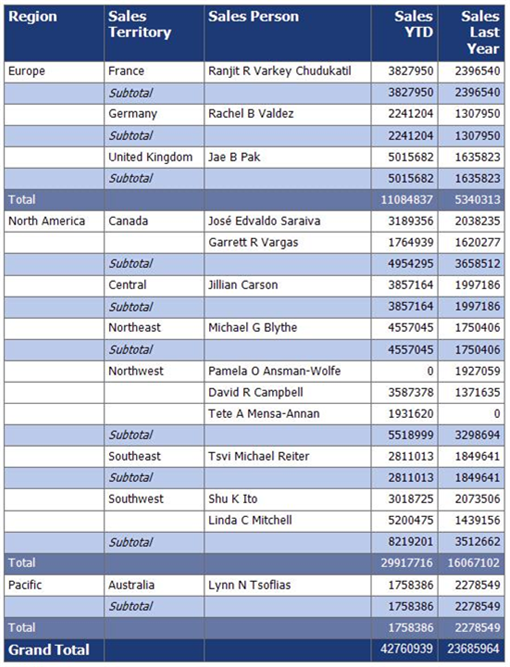

<html dir="LTR" xmlns:mshelp="http://msdn.microsoft.com/mshelp" xmlns:ddue="http://ddue.schemas.microsoft.com/authoring/2003/5" xmlns:xlink="http://www.w3.org/1999/xlink" xmlns:tool="http://www.microsoft.com/tooltip">
    <head>
        <meta http-equiv="Content-Type" content="text/html; CHARSET=utf-8"></meta>
        <meta name="save" content="history"></meta>
        <title>3.19 Table</title>
        <xml>
            <mshelp:toctitle title="3.19 Table"></mshelp:toctitle>
            <mshelp:rltitle title="[MS-RDL]: Table"></mshelp:rltitle>
            <mshelp:keyword index="A" term="c90ab0ed-9054-4ae9-8010-5670693e6f30"></mshelp:keyword>
            <mshelp:attr name="DCSext.ContentType" value="open specification"></mshelp:attr>
            <mshelp:attr name="AssetID" value="c90ab0ed-9054-4ae9-8010-5670693e6f30"></mshelp:attr>
            <mshelp:attr name="TopicType" value="kbRef"></mshelp:attr>
            <mshelp:attr name="DCSext.Title" value="[MS-RDL]: Table" />
        </xml>
    </head>
    <body>
        

            <h1 class="heading">3.19 Table</h1>
        

        

            

                

                

                    

<b><i>Applies to </i></b><a href="a7e2ad00-07c8-4f6d-80ab-3ad55df7b233.htm"><b><i>RDL 2003/10</i></b></a><b>
<i>and </i></b><a href="3ebe2912-4958-4832-b391-cad1f5e13338.htm"><b><i>RDL 2005/01</i></b></a>

The following example of a <a href="660db744-699e-4ca3-a2d6-a5cab4bcf9b0.htm">Table</a> element is an
extract from an RDL specification of a report. This example is from a report
for the Adventure Works database and shows year-to-date (YTD) sales and last
year's sales for each salesperson grouped by region and sales territory. This
example illustrates the use of a <a href="b2482b3f-74ab-4ca8-a9e5-c07955011743.htm#gt_d3a7da8d-a597-4838-9756-25e30b640ba7">table</a> data region to
provide a tabular grouped listing of data in a grid, providing subtotals for
each of the two groups and a grand total for the whole table.

The following figure shows the <b>Table</b> example. The
first and last rows of the table have a dark blue background color. These are
the header and footer rows of the table. The header provides column headers and
the footer provides grand totals of YTD sales and last year's sales. The rows
with the medium blue background color present subtotals of sales for all the
territories within a region. The rows with the light blue background color
present the subtotals of sales for all the salespersons within a territory. The
rows with the white background color are the detail rows of the table, which
provide the sales information for each salesperson.

<b>Figure 28: Example of a table with grouping and totals rows</b>

The following is the extract from the RDL report file that
produces the preceding table. The <b>Table</b> element has its <b>Name</b>
attribute set to &quot;table1&quot;. The table is bound to the data in the <a href="a14782b0-2e2f-4305-83a3-3de3fd750b6a.htm">DataSet</a> AdventureWorks by
the <a href="b6c3ce4e-4d4e-404a-bac1-7bbc5b12bcf4.htm">Table.DataSetName</a>
element. The <a href="a77c110c-1a17-442e-bf0e-52f8af626c64.htm">Top</a>
element specifies that the table is 0.33 inches from the top edge of its
containing report item, which is the body of the report.

<dl>
<dd>

<pre>  
   &lt;Table Name=&quot;table1&quot;&gt;
     &lt;DataSetName&gt;AdventureWorks&lt;/DataSetName&gt;
     &lt;Top&gt;0.33in&lt;/Top&gt;
     &lt;TableGroups&gt;
</pre>

</dd></dl>

This table has two <a href="a23c61be-758a-4247-a3ab-fd1159ff0520.htm">TableGroup</a> elements in its
<a href="23c207ee-ee5e-44ac-b1ff-05f733ad1397.htm">TableGroups</a> collection.
This is an ordered list that specifies the groupings from outermost to
innermost. The first <b>TableGroup</b> element specifies a grouping by region.

The <a href="7d574154-eefe-4fc1-8b78-3a18b9350e87.htm">Grouping</a>
element that has its <b>Name</b> attribute set to &quot;table1_Region&quot;
that specifies that the data is grouped by the expression =Fields!Region.Value;
that is, the data is grouped by the <a href="940b8522-5d1f-4a2a-ab79-087ef6a69881.htm">Field</a> &quot;Region&quot;.
The <a href="1bf282fa-97a7-4dc0-b8af-171f4e777f73.htm">Sorting</a> element
specifies that this group is sorted by the <b>Field</b> &quot;Region&quot; in
ascending order. This is shown in the figure where the regions listed are
Europe, North America, and Pacific, which are sorted in alphabetical
(ascending) order.

<dl>
<dd>

<pre>       &lt;TableGroup&gt;
         &lt;Grouping Name=&quot;table1_Region&quot;&gt;
           &lt;GroupExpressions&gt;
             &lt;GroupExpression&gt;=Fields!Region.Value&lt;/GroupExpression&gt;
           &lt;/GroupExpressions&gt;
         &lt;/Grouping&gt;
         &lt;Sorting&gt;
           &lt;SortBy&gt;
             &lt;SortExpression&gt;=Fields!Region.Value&lt;/SortExpression&gt;
             &lt;Direction&gt;Ascending&lt;/Direction&gt;
           &lt;/SortBy&gt;
         &lt;/Sorting&gt;
</pre>

</dd></dl>

The <a href="5a2e529e-b9c2-4277-b6e2-3124c563b48c.htm">Footer</a>
element of the <b>TableGroup</b> specifies the rows in the figure that are
medium blue in color. These are the lines that represent the total sales for
all territories in a region. The <a href="469d0032-b5ec-43d9-ab36-d3a88b9cc1f6.htm">Textbox</a> that has its <b>Name</b>
attribute value set to &quot;textbox7&quot; specifies the Total label. The text
boxes with <b>Name</b> attribute values &quot;textbox10&quot; and
&quot;textbox11&quot; specify expressions by using the aggregate function <a href="c00b6434-9f4a-434b-91b9-44eba2d2cdb5.htm">Sum</a> to total all the YTD
and last year's sales values in this <a href="b2482b3f-74ab-4ca8-a9e5-c07955011743.htm#gt_8f79cf8c-5f95-4ef4-9c1d-eeb887605a34">grouping scope</a>.

<dl>
<dd>

<pre>         &lt;Footer&gt;
           &lt;TableRows&gt;
             &lt;TableRow&gt;
               &lt;TableCells&gt;
                 &lt;TableCell&gt;
                   &lt;ReportItems&gt;
                     &lt;Textbox Name=&quot;textbox7&quot;&gt;
                       &lt;rd:DefaultName&gt;textbox7&lt;/rd:DefaultName&gt;
                       &lt;Style&gt;
                         &lt;Color&gt;White&lt;/Color&gt;
                         &lt;BackgroundColor&gt;#60759b&lt;/BackgroundColor&gt;
                         &lt;BorderColor&gt;
                           &lt;Default&gt;DimGray&lt;/Default&gt;
                         &lt;/BorderColor&gt;
                         &lt;BorderStyle&gt;
                           &lt;Default&gt;Solid&lt;/Default&gt;
                         &lt;/BorderStyle&gt;
                         &lt;FontFamily&gt;Tahoma&lt;/FontFamily&gt;
                         &lt;PaddingLeft&gt;2pt&lt;/PaddingLeft&gt;
                         &lt;PaddingRight&gt;2pt&lt;/PaddingRight&gt;
                         &lt;PaddingTop&gt;2pt&lt;/PaddingTop&gt;
                         &lt;PaddingBottom&gt;2pt&lt;/PaddingBottom&gt;
                       &lt;/Style&gt;
                       &lt;ZIndex&gt;14&lt;/ZIndex&gt;
                       &lt;CanGrow&gt;true&lt;/CanGrow&gt;
                       &lt;Value&gt;Total&lt;/Value&gt;
                     &lt;/Textbox&gt;
                   &lt;/ReportItems&gt;
                 &lt;/TableCell&gt;
                 &lt;TableCell&gt;
                   &lt;ReportItems&gt;
                     &lt;Textbox Name=&quot;textbox8&quot;&gt;
                       &lt;rd:DefaultName&gt;textbox8&lt;/rd:DefaultName&gt;
                       &lt;Style&gt;
                         &lt;Color&gt;White&lt;/Color&gt;
                         &lt;BackgroundColor&gt;#60759b&lt;/BackgroundColor&gt;
                         &lt;BorderColor&gt;
                           &lt;Default&gt;DimGray&lt;/Default&gt;
                         &lt;/BorderColor&gt;
                         &lt;BorderStyle&gt;
                           &lt;Default&gt;Solid&lt;/Default&gt;
                         &lt;/BorderStyle&gt;
                         &lt;FontFamily&gt;Tahoma&lt;/FontFamily&gt;
                         &lt;PaddingLeft&gt;2pt&lt;/PaddingLeft&gt;
                         &lt;PaddingRight&gt;2pt&lt;/PaddingRight&gt;
                         &lt;PaddingTop&gt;2pt&lt;/PaddingTop&gt;
                         &lt;PaddingBottom&gt;2pt&lt;/PaddingBottom&gt;
                       &lt;/Style&gt;
                       &lt;ZIndex&gt;13&lt;/ZIndex&gt;
                       &lt;CanGrow&gt;true&lt;/CanGrow&gt;
                       &lt;Value&gt;
                       &lt;/Value&gt;
                     &lt;/Textbox&gt;
                   &lt;/ReportItems&gt;
                 &lt;/TableCell&gt;
                 &lt;TableCell&gt;
                   &lt;ReportItems&gt;
                     &lt;Textbox Name=&quot;textbox9&quot;&gt;
                       &lt;rd:DefaultName&gt;textbox9&lt;/rd:DefaultName&gt;
                       &lt;Style&gt;
                         &lt;Color&gt;White&lt;/Color&gt;
                         &lt;BackgroundColor&gt;#60759b&lt;/BackgroundColor&gt;
                         &lt;BorderColor&gt;
                           &lt;Default&gt;DimGray&lt;/Default&gt;
                         &lt;/BorderColor&gt;
                         &lt;BorderStyle&gt;
                           &lt;Default&gt;Solid&lt;/Default&gt;
                         &lt;/BorderStyle&gt;
                         &lt;FontFamily&gt;Tahoma&lt;/FontFamily&gt;
                         &lt;PaddingLeft&gt;2pt&lt;/PaddingLeft&gt;
                         &lt;PaddingRight&gt;2pt&lt;/PaddingRight&gt;
                         &lt;PaddingTop&gt;2pt&lt;/PaddingTop&gt;
                         &lt;PaddingBottom&gt;2pt&lt;/PaddingBottom&gt;
                       &lt;/Style&gt;
                       &lt;ZIndex&gt;12&lt;/ZIndex&gt;
                       &lt;CanGrow&gt;true&lt;/CanGrow&gt;
                       &lt;Value&gt;
                       &lt;/Value&gt;
                     &lt;/Textbox&gt;
                   &lt;/ReportItems&gt;
                 &lt;/TableCell&gt;
                 &lt;TableCell&gt;
                   &lt;ReportItems&gt;
                     &lt;Textbox Name=&quot;textbox10&quot;&gt;
                       &lt;rd:DefaultName&gt;textbox10&lt;/rd:DefaultName&gt;
                       &lt;Style&gt;
                         &lt;Color&gt;White&lt;/Color&gt;
                         &lt;BackgroundColor&gt;#60759b&lt;/BackgroundColor&gt;
                         &lt;BorderColor&gt;
                           &lt;Default&gt;DimGray&lt;/Default&gt;
                         &lt;/BorderColor&gt;
                         &lt;BorderStyle&gt;
                           &lt;Default&gt;Solid&lt;/Default&gt;
                         &lt;/BorderStyle&gt;
                         &lt;FontFamily&gt;Tahoma&lt;/FontFamily&gt;
                         &lt;PaddingLeft&gt;2pt&lt;/PaddingLeft&gt;
                         &lt;PaddingRight&gt;2pt&lt;/PaddingRight&gt;
                         &lt;PaddingTop&gt;2pt&lt;/PaddingTop&gt;
                         &lt;PaddingBottom&gt;2pt&lt;/PaddingBottom&gt;
                       &lt;/Style&gt;
                       &lt;ZIndex&gt;11&lt;/ZIndex&gt;
                       &lt;CanGrow&gt;true&lt;/CanGrow&gt;
                       &lt;Value&gt;=Round(Sum(Fields!Sales___YTD.Value))&lt;/Value&gt;
                     &lt;/Textbox&gt;
                   &lt;/ReportItems&gt;
                 &lt;/TableCell&gt;
                 &lt;TableCell&gt;
                   &lt;ReportItems&gt;
                     &lt;Textbox Name=&quot;textbox11&quot;&gt;
                       &lt;rd:DefaultName&gt;textbox11&lt;/rd:DefaultName&gt;
                       &lt;Style&gt;
                         &lt;Color&gt;White&lt;/Color&gt;
                         &lt;BackgroundColor&gt;#60759b&lt;/BackgroundColor&gt;
                         &lt;BorderColor&gt;
                           &lt;Default&gt;DimGray&lt;/Default&gt;
                         &lt;/BorderColor&gt;
                         &lt;BorderStyle&gt;
                           &lt;Default&gt;Solid&lt;/Default&gt;
                         &lt;/BorderStyle&gt;
                         &lt;FontFamily&gt;Tahoma&lt;/FontFamily&gt;
                         &lt;PaddingLeft&gt;2pt&lt;/PaddingLeft&gt;
                         &lt;PaddingRight&gt;2pt&lt;/PaddingRight&gt;
                         &lt;PaddingTop&gt;2pt&lt;/PaddingTop&gt;
                         &lt;PaddingBottom&gt;2pt&lt;/PaddingBottom&gt;
                       &lt;/Style&gt;
                       &lt;ZIndex&gt;10&lt;/ZIndex&gt;
                       &lt;CanGrow&gt;true&lt;/CanGrow&gt;
                       &lt;Value&gt;=Round(Sum(Fields!Sales___Last_Year.Value))&lt;/Value&gt;
                     &lt;/Textbox&gt;
                   &lt;/ReportItems&gt;
                 &lt;/TableCell&gt;
               &lt;/TableCells&gt;
               &lt;Height&gt;0.21in&lt;/Height&gt;
             &lt;/TableRow&gt;
           &lt;/TableRows&gt;
         &lt;/Footer&gt;
       &lt;/TableGroup&gt;
</pre>

</dd></dl>

The second <b>TableGroup</b> element in the following RDL
specifies a grouping by sales territory. There is a <b>Grouping</b> element
with the <b>Name</b> attribute &quot;table1_Sales_Territory&quot; that
specifies that the data is grouped by the expression =Fields!
Sales_Territory.Value; that is, the data is grouped by the <b>Field</b>
&quot;Sales_Territory&quot;. A <b>Sorting</b> element specifies that this group
is sorted by the <b>Field</b> Sales_Territory in ascending order. This is shown
in the figure where the sales territories listed are France, Germany, and
United Kingdom, under the region Europe, and these are sorted in alphabetical
(ascending) order.

<dl>
<dd>

<pre>       &lt;TableGroup&gt;
         &lt;Grouping Name=&quot;table1_Sales_Territory&quot;&gt;
           &lt;GroupExpressions&gt;
             &lt;GroupExpression&gt;=Fields!Sales_Territory.Value&lt;/GroupExpression&gt;
           &lt;/GroupExpressions&gt;
         &lt;/Grouping&gt;
         &lt;Sorting&gt;
           &lt;SortBy&gt;
             &lt;SortExpression&gt;=Fields!Sales_Territory.Value&lt;/SortExpression&gt;
             &lt;Direction&gt;Ascending&lt;/Direction&gt;
           &lt;/SortBy&gt;
         &lt;/Sorting&gt;
</pre>

</dd></dl>

The <b>Footer</b> element of this <b>TableGroup</b>
specifies the rows in the figure that are light blue in color. These are the
lines that represent the total sales for all salespersons within a sales
territory. The <b>Textbox</b> with the <b>Name</b> attribute value
&quot;textbox13&quot; specifies the label &quot;subtotal&quot;. The text boxes
with <b>Name</b> attribute values &quot;textbox15&quot; and
&quot;textbox16&quot; specify expressions by using the aggregate function <b>Sum</b>
to total all the YTD and last year's sales values in this grouping scope.

<dl>
<dd>

<pre>         &lt;Footer&gt;
           &lt;TableRows&gt;
             &lt;TableRow&gt;
               &lt;TableCells&gt;
                 &lt;TableCell&gt;
                   &lt;ReportItems&gt;
                     &lt;Textbox Name=&quot;textbox12&quot;&gt;
                       &lt;rd:DefaultName&gt;textbox12&lt;/rd:DefaultName&gt;
                       &lt;Style&gt;
                         &lt;BackgroundColor&gt;LightSteelBlue&lt;/BackgroundColor&gt;
                         &lt;BorderColor&gt;
                           &lt;Default&gt;DimGray&lt;/Default&gt;
                         &lt;/BorderColor&gt;
                         &lt;BorderStyle&gt;
                           &lt;Default&gt;Solid&lt;/Default&gt;
                         &lt;/BorderStyle&gt;
                         &lt;FontFamily&gt;Tahoma&lt;/FontFamily&gt;
                         &lt;PaddingLeft&gt;2pt&lt;/PaddingLeft&gt;
                         &lt;PaddingRight&gt;2pt&lt;/PaddingRight&gt;
                         &lt;PaddingTop&gt;2pt&lt;/PaddingTop&gt;
                         &lt;PaddingBottom&gt;2pt&lt;/PaddingBottom&gt;
                       &lt;/Style&gt;
                       &lt;ZIndex&gt;9&lt;/ZIndex&gt;
                       &lt;CanGrow&gt;true&lt;/CanGrow&gt;
                       &lt;Value&gt;
                       &lt;/Value&gt;
                     &lt;/Textbox&gt;
                   &lt;/ReportItems&gt;
                 &lt;/TableCell&gt;
                 &lt;TableCell&gt;
                   &lt;ReportItems&gt;
                     &lt;Textbox Name=&quot;textbox13&quot;&gt;
                       &lt;rd:DefaultName&gt;textbox13&lt;/rd:DefaultName&gt;
                       &lt;Style&gt;
                         &lt;BackgroundColor&gt;LightSteelBlue&lt;/BackgroundColor&gt;
                         &lt;BorderColor&gt;
                           &lt;Default&gt;DimGray&lt;/Default&gt;
                         &lt;/BorderColor&gt;
                         &lt;BorderStyle&gt;
                           &lt;Default&gt;Solid&lt;/Default&gt;
                         &lt;/BorderStyle&gt;
                         &lt;FontStyle&gt;Italic&lt;/FontStyle&gt;
                         &lt;FontFamily&gt;Tahoma&lt;/FontFamily&gt;
                         &lt;PaddingLeft&gt;2pt&lt;/PaddingLeft&gt;
                         &lt;PaddingRight&gt;2pt&lt;/PaddingRight&gt;
                         &lt;PaddingTop&gt;2pt&lt;/PaddingTop&gt;
                         &lt;PaddingBottom&gt;2pt&lt;/PaddingBottom&gt;
                       &lt;/Style&gt;
                       &lt;ZIndex&gt;8&lt;/ZIndex&gt;
                       &lt;CanGrow&gt;true&lt;/CanGrow&gt;
                       &lt;Value&gt;Subtotal&lt;/Value&gt;
                     &lt;/Textbox&gt;
                   &lt;/ReportItems&gt;
                 &lt;/TableCell&gt;
                 &lt;TableCell&gt;
                   &lt;ReportItems&gt;
                     &lt;Textbox Name=&quot;textbox14&quot;&gt;
                       &lt;rd:DefaultName&gt;textbox14&lt;/rd:DefaultName&gt;
                       &lt;Style&gt;
                         &lt;BackgroundColor&gt;LightSteelBlue&lt;/BackgroundColor&gt;
                         &lt;BorderColor&gt;
                           &lt;Default&gt;DimGray&lt;/Default&gt;
                         &lt;/BorderColor&gt;
                         &lt;BorderStyle&gt;
                           &lt;Default&gt;Solid&lt;/Default&gt;
                         &lt;/BorderStyle&gt;
                         &lt;FontFamily&gt;Tahoma&lt;/FontFamily&gt;
                         &lt;PaddingLeft&gt;2pt&lt;/PaddingLeft&gt;
                         &lt;PaddingRight&gt;2pt&lt;/PaddingRight&gt;
                         &lt;PaddingTop&gt;2pt&lt;/PaddingTop&gt;
                         &lt;PaddingBottom&gt;2pt&lt;/PaddingBottom&gt;
                       &lt;/Style&gt;
                       &lt;ZIndex&gt;7&lt;/ZIndex&gt;
                       &lt;CanGrow&gt;true&lt;/CanGrow&gt;
                       &lt;Value&gt;
                       &lt;/Value&gt;
                     &lt;/Textbox&gt;
                   &lt;/ReportItems&gt;
                 &lt;/TableCell&gt;
                 &lt;TableCell&gt;
                   &lt;ReportItems&gt;
                     &lt;Textbox Name=&quot;textbox15&quot;&gt;
                       &lt;rd:DefaultName&gt;textbox15&lt;/rd:DefaultName&gt;
                       &lt;Style&gt;
                         &lt;BackgroundColor&gt;LightSteelBlue&lt;/BackgroundColor&gt;
                         &lt;BorderColor&gt;
                           &lt;Default&gt;DimGray&lt;/Default&gt;
                         &lt;/BorderColor&gt;
                         &lt;BorderStyle&gt;
                           &lt;Default&gt;Solid&lt;/Default&gt;
                         &lt;/BorderStyle&gt;
                         &lt;FontFamily&gt;Tahoma&lt;/FontFamily&gt;
                         &lt;PaddingLeft&gt;2pt&lt;/PaddingLeft&gt;
                         &lt;PaddingRight&gt;2pt&lt;/PaddingRight&gt;
                         &lt;PaddingTop&gt;2pt&lt;/PaddingTop&gt;
                         &lt;PaddingBottom&gt;2pt&lt;/PaddingBottom&gt;
                       &lt;/Style&gt;
                       &lt;ZIndex&gt;6&lt;/ZIndex&gt;
                       &lt;CanGrow&gt;true&lt;/CanGrow&gt;
                       &lt;Value&gt;=ROUND(Sum(Fields!Sales___YTD.Value))&lt;/Value&gt;
                     &lt;/Textbox&gt;
                   &lt;/ReportItems&gt;
                 &lt;/TableCell&gt;
                 &lt;TableCell&gt;
                   &lt;ReportItems&gt;
                     &lt;Textbox Name=&quot;textbox16&quot;&gt;
                       &lt;rd:DefaultName&gt;textbox16&lt;/rd:DefaultName&gt;
                       &lt;Style&gt;
                         &lt;BackgroundColor&gt;LightSteelBlue&lt;/BackgroundColor&gt;
                         &lt;BorderColor&gt;
                           &lt;Default&gt;DimGray&lt;/Default&gt;
                         &lt;/BorderColor&gt;
                         &lt;BorderStyle&gt;
                           &lt;Default&gt;Solid&lt;/Default&gt;
                         &lt;/BorderStyle&gt;
                         &lt;FontFamily&gt;Tahoma&lt;/FontFamily&gt;
                         &lt;PaddingLeft&gt;2pt&lt;/PaddingLeft&gt;
                         &lt;PaddingRight&gt;2pt&lt;/PaddingRight&gt;
                         &lt;PaddingTop&gt;2pt&lt;/PaddingTop&gt;
                         &lt;PaddingBottom&gt;2pt&lt;/PaddingBottom&gt;
                       &lt;/Style&gt;
                       &lt;ZIndex&gt;5&lt;/ZIndex&gt;
                       &lt;CanGrow&gt;true&lt;/CanGrow&gt;
  
               Value&gt;=Round(Sum(Fields!Sales___Last_Year.Value))&lt;/Value&gt;
                   &lt;/Textbox&gt;
                 &lt;/ReportItems&gt;
               &lt;/TableCell&gt;
             &lt;/TableCells&gt;
             &lt;Height&gt;0.21in&lt;/Height&gt;
           &lt;/TableRow&gt;
         &lt;/TableRows&gt;
       &lt;/Footer&gt;
     &lt;/TableGroup&gt;
   &lt;/TableGroups&gt;
</pre>

</dd></dl>

The <a href="10728959-73bf-46f9-b7a8-1b3612eda445.htm">Details</a>
element of this <b>Table</b> specifies the rows in the figure that have a white
background color. These are the rows that represent the details of sales for
each salesperson within a sales territory. The text boxes with the <b>Name</b>
attribute values &quot;Region&quot; and &quot;Sales_Territory&quot; specify the
values of the region and sales territory for a given salesperson. The <a href="520f1136-8158-48d8-8cfb-d9b95054bf1b.htm">Textbox.HideDuplicates</a>
element specifies that only the first occurrence of each of these will appear
within their respective groups. This is why the values North America and Canada
are not repeated for the details row for salesperson Garrett R Vargas in the
figure. The <b>Textbox</b> with the <b>Name</b> attribute value
&quot;Sales_Person&quot; specifies the name of the salesperson. The remaining
two text boxes specify the salesperson's YTD sales and last year's sales.

<dl>
<dd>

<pre>   &lt;Details&gt;
     &lt;TableRows&gt;
       &lt;TableRow&gt;
         &lt;TableCells&gt;
           &lt;TableCell&gt;
             &lt;ReportItems&gt;
               &lt;Textbox Name=&quot;Region&quot;&gt;
                 &lt;rd:DefaultName&gt;Region&lt;/rd:DefaultName&gt;
                 &lt;HideDuplicates&gt;AdventureWorks&lt;/HideDuplicates&gt;
                 &lt;Style&gt;
                   &lt;BorderColor&gt;
                     &lt;Default&gt;DimGray&lt;/Default&gt;
                   &lt;/BorderColor&gt;
                   &lt;BorderStyle&gt;
                     &lt;Default&gt;Solid&lt;/Default&gt;
                   &lt;/BorderStyle&gt;
                   &lt;FontFamily&gt;Tahoma&lt;/FontFamily&gt;
                   &lt;PaddingLeft&gt;2pt&lt;/PaddingLeft&gt;
                   &lt;PaddingRight&gt;2pt&lt;/PaddingRight&gt;
                   &lt;PaddingTop&gt;2pt&lt;/PaddingTop&gt;
                   &lt;PaddingBottom&gt;2pt&lt;/PaddingBottom&gt;
                 &lt;/Style&gt;
                 &lt;ZIndex&gt;4&lt;/ZIndex&gt;
                 &lt;CanGrow&gt;true&lt;/CanGrow&gt;
                 &lt;Value&gt;=Fields!Region.Value&lt;/Value&gt;
               &lt;/Textbox&gt;
             &lt;/ReportItems&gt;
           &lt;/TableCell&gt;
           &lt;TableCell&gt;
             &lt;ReportItems&gt;
               &lt;Textbox Name=&quot;Sales_Territory&quot;&gt;
                 &lt;rd:DefaultName&gt;Sales_Territory&lt;/rd:DefaultName&gt;
                 &lt;HideDuplicates&gt;AdventureWorks&lt;/HideDuplicates&gt;
                 &lt;Style&gt;
                   &lt;BorderColor&gt;
                     &lt;Default&gt;DimGray&lt;/Default&gt;
                   &lt;/BorderColor&gt;
                   &lt;BorderStyle&gt;
                     &lt;Default&gt;Solid&lt;/Default&gt;
                   &lt;/BorderStyle&gt;
                   &lt;FontFamily&gt;Tahoma&lt;/FontFamily&gt;
                   &lt;PaddingLeft&gt;2pt&lt;/PaddingLeft&gt;
                   &lt;PaddingRight&gt;2pt&lt;/PaddingRight&gt;
                   &lt;PaddingTop&gt;2pt&lt;/PaddingTop&gt;
                   &lt;PaddingBottom&gt;2pt&lt;/PaddingBottom&gt;
                 &lt;/Style&gt;
                 &lt;ZIndex&gt;3&lt;/ZIndex&gt;
                 &lt;CanGrow&gt;true&lt;/CanGrow&gt;
                 &lt;Value&gt;=Fields!Sales_Territory.Value&lt;/Value&gt;
               &lt;/Textbox&gt;
             &lt;/ReportItems&gt;
           &lt;/TableCell&gt;
           &lt;TableCell&gt;
             &lt;ReportItems&gt;
               &lt;Textbox Name=&quot;Sales_Person&quot;&gt;
                 &lt;rd:DefaultName&gt;Sales_Person&lt;/rd:DefaultName&gt;
                 &lt;Style&gt;
                   &lt;BorderColor&gt;
                     &lt;Default&gt;DimGray&lt;/Default&gt;
                   &lt;/BorderColor&gt;
                   &lt;BorderStyle&gt;
                     &lt;Default&gt;Solid&lt;/Default&gt;
                   &lt;/BorderStyle&gt;
                   &lt;FontFamily&gt;Tahoma&lt;/FontFamily&gt;
                   &lt;PaddingLeft&gt;2pt&lt;/PaddingLeft&gt;
                   &lt;PaddingRight&gt;2pt&lt;/PaddingRight&gt;
                   &lt;PaddingTop&gt;2pt&lt;/PaddingTop&gt;
                   &lt;PaddingBottom&gt;2pt&lt;/PaddingBottom&gt;
                 &lt;/Style&gt;
                 &lt;ZIndex&gt;2&lt;/ZIndex&gt;
                 &lt;CanGrow&gt;true&lt;/CanGrow&gt;
                 &lt;Value&gt;=Fields!Sales_Person.Value&lt;/Value&gt;
               &lt;/Textbox&gt;
             &lt;/ReportItems&gt;
           &lt;/TableCell&gt;
           &lt;TableCell&gt;
             &lt;ReportItems&gt;
               &lt;Textbox Name=&quot;Sales___YTD&quot;&gt;
                 &lt;rd:DefaultName&gt;Sales___YTD&lt;/rd:DefaultName&gt;
                 &lt;Style&gt;
                   &lt;BorderColor&gt;
                     &lt;Default&gt;DimGray&lt;/Default&gt;
                   &lt;/BorderColor&gt;
                   &lt;BorderStyle&gt;
                     &lt;Default&gt;Solid&lt;/Default&gt;
                   &lt;/BorderStyle&gt;
                   &lt;FontFamily&gt;Tahoma&lt;/FontFamily&gt;
                   &lt;PaddingLeft&gt;2pt&lt;/PaddingLeft&gt;
                   &lt;PaddingRight&gt;2pt&lt;/PaddingRight&gt;
                   &lt;PaddingTop&gt;2pt&lt;/PaddingTop&gt;
                   &lt;PaddingBottom&gt;2pt&lt;/PaddingBottom&gt;
                 &lt;/Style&gt;
                 &lt;ZIndex&gt;1&lt;/ZIndex&gt;
                 &lt;CanGrow&gt;true&lt;/CanGrow&gt;
                 &lt;Value&gt;=Round(Fields!Sales___YTD.Value)&lt;/Value&gt;
               &lt;/Textbox&gt;
             &lt;/ReportItems&gt;
           &lt;/TableCell&gt;
           &lt;TableCell&gt;
             &lt;ReportItems&gt;
               &lt;Textbox Name=&quot;Sales___Last_Year&quot;&gt;
                 &lt;rd:DefaultName&gt;Sales___Last_Year&lt;/rd:DefaultName&gt;
                 &lt;Style&gt;
                   &lt;BorderColor&gt;
                     &lt;Default&gt;DimGray&lt;/Default&gt;
                   &lt;/BorderColor&gt;
                   &lt;BorderStyle&gt;
                     &lt;Default&gt;Solid&lt;/Default&gt;
                   &lt;/BorderStyle&gt;
                   &lt;FontFamily&gt;Tahoma&lt;/FontFamily&gt;
                   &lt;PaddingLeft&gt;2pt&lt;/PaddingLeft&gt;
                   &lt;PaddingRight&gt;2pt&lt;/PaddingRight&gt;
                   &lt;PaddingTop&gt;2pt&lt;/PaddingTop&gt;
                   &lt;PaddingBottom&gt;2pt&lt;/PaddingBottom&gt;
                 &lt;/Style&gt;
                 &lt;CanGrow&gt;true&lt;/CanGrow&gt;
                 &lt;Value&gt;=Round(Fields!Sales___Last_Year.Value)&lt;/Value&gt;
               &lt;/Textbox&gt;
             &lt;/ReportItems&gt;
           &lt;/TableCell&gt;
         &lt;/TableCells&gt;
         &lt;Height&gt;0.21in&lt;/Height&gt;
       &lt;/TableRow&gt;
     &lt;/TableRows&gt;
</pre>

</dd></dl>

The following <b>Sorting</b> element specifies that the
details are sorted by the <b>Field</b> &quot;LastName&quot; in ascending order.
We see this in the preceding figure where the salespersons in the Northwest
Territory of the North America region are Pamela O Ansman-Wolfe, David R
Campbell, and Tete A Mensa-Annan, who are sorted in alphabetical (ascending)
order by their last name. Note that the <b>Field</b> &quot;Sales_Person&quot;
is not used to sort the details because this would sort the salespersons by
their full name, which would sort them by their first name.

<dl>
<dd>

<pre>     &lt;Sorting&gt;
       &lt;SortBy&gt;
         &lt;SortExpression&gt;=Fields!LastName.Value&lt;/SortExpression&gt;
         &lt;Direction&gt;Ascending&lt;/Direction&gt;
       &lt;/SortBy&gt;
     &lt;/Sorting&gt;
   &lt;/Details&gt;
</pre>

</dd></dl>

The <b>Header</b> element specifies the header rows of the
table, which is the very first row in the figure. This is the dark blue row
that contains the column headers.

<dl>
<dd>

<pre>   &lt;Header&gt;
     &lt;TableRows&gt;
       &lt;TableRow&gt;
         &lt;TableCells&gt;
           &lt;TableCell&gt;
             &lt;ReportItems&gt;
               &lt;Textbox Name=&quot;textbox2&quot;&gt;
                 &lt;rd:DefaultName&gt;textbox2&lt;/rd:DefaultName&gt;
                 &lt;Style&gt;
                   &lt;Color&gt;White&lt;/Color&gt;
                   &lt;BackgroundColor&gt;#1c3a70&lt;/BackgroundColor&gt;
                   &lt;BorderColor&gt;
                     &lt;Default&gt;DimGray&lt;/Default&gt;
                   &lt;/BorderColor&gt;
                   &lt;BorderStyle&gt;
                     &lt;Default&gt;Solid&lt;/Default&gt;
                   &lt;/BorderStyle&gt;
                   &lt;FontFamily&gt;Tahoma&lt;/FontFamily&gt;
                   &lt;FontSize&gt;11pt&lt;/FontSize&gt;
                   &lt;FontWeight&gt;700&lt;/FontWeight&gt;
                   &lt;PaddingLeft&gt;2pt&lt;/PaddingLeft&gt;
                   &lt;PaddingRight&gt;2pt&lt;/PaddingRight&gt;
                   &lt;PaddingTop&gt;2pt&lt;/PaddingTop&gt;
                   &lt;PaddingBottom&gt;2pt&lt;/PaddingBottom&gt;
                 &lt;/Style&gt;
                 &lt;ZIndex&gt;24&lt;/ZIndex&gt;
                 &lt;CanGrow&gt;true&lt;/CanGrow&gt;
                 &lt;Value&gt;Region&lt;/Value&gt;
               &lt;/Textbox&gt;
             &lt;/ReportItems&gt;
           &lt;/TableCell&gt;
           &lt;TableCell&gt;
             &lt;ReportItems&gt;
               &lt;Textbox Name=&quot;textbox3&quot;&gt;
                 &lt;rd:DefaultName&gt;textbox3&lt;/rd:DefaultName&gt;
                 &lt;Style&gt;
                   &lt;Color&gt;White&lt;/Color&gt;
                   &lt;BackgroundColor&gt;#1c3a70&lt;/BackgroundColor&gt;
                   &lt;BorderColor&gt;
                     &lt;Default&gt;DimGray&lt;/Default&gt;
                   &lt;/BorderColor&gt;
                   &lt;BorderStyle&gt;
                     &lt;Default&gt;Solid&lt;/Default&gt;
                   &lt;/BorderStyle&gt;
                   &lt;FontFamily&gt;Tahoma&lt;/FontFamily&gt;
                   &lt;FontSize&gt;11pt&lt;/FontSize&gt;
                   &lt;FontWeight&gt;700&lt;/FontWeight&gt;
                   &lt;PaddingLeft&gt;2pt&lt;/PaddingLeft&gt;
                   &lt;PaddingRight&gt;2pt&lt;/PaddingRight&gt;
                   &lt;PaddingTop&gt;2pt&lt;/PaddingTop&gt;
                   &lt;PaddingBottom&gt;2pt&lt;/PaddingBottom&gt;
                 &lt;/Style&gt;
                 &lt;ZIndex&gt;23&lt;/ZIndex&gt;
                 &lt;CanGrow&gt;true&lt;/CanGrow&gt;
                 &lt;Value&gt;Sales Territory&lt;/Value&gt;
               &lt;/Textbox&gt;
             &lt;/ReportItems&gt;
           &lt;/TableCell&gt;
           &lt;TableCell&gt;
             &lt;ReportItems&gt;
               &lt;Textbox Name=&quot;textbox4&quot;&gt;
                 &lt;rd:DefaultName&gt;textbox4&lt;/rd:DefaultName&gt;
                 &lt;Style&gt;
                   &lt;Color&gt;White&lt;/Color&gt;
                   &lt;BackgroundColor&gt;#1c3a70&lt;/BackgroundColor&gt;
                   &lt;BorderColor&gt;
                     &lt;Default&gt;DimGray&lt;/Default&gt;
                   &lt;/BorderColor&gt;
                   &lt;BorderStyle&gt;
                     &lt;Default&gt;Solid&lt;/Default&gt;
                   &lt;/BorderStyle&gt;
                   &lt;FontFamily&gt;Tahoma&lt;/FontFamily&gt;
                   &lt;FontSize&gt;11pt&lt;/FontSize&gt;
                   &lt;FontWeight&gt;700&lt;/FontWeight&gt;
                   &lt;PaddingLeft&gt;2pt&lt;/PaddingLeft&gt;
                   &lt;PaddingRight&gt;2pt&lt;/PaddingRight&gt;
                   &lt;PaddingTop&gt;2pt&lt;/PaddingTop&gt;
                   &lt;PaddingBottom&gt;2pt&lt;/PaddingBottom&gt;
                 &lt;/Style&gt;
                 &lt;ZIndex&gt;22&lt;/ZIndex&gt;
                 &lt;CanGrow&gt;true&lt;/CanGrow&gt;
                 &lt;Value&gt;Sales Person&lt;/Value&gt;
               &lt;/Textbox&gt;
             &lt;/ReportItems&gt;
           &lt;/TableCell&gt;
           &lt;TableCell&gt;
             &lt;ReportItems&gt;
               &lt;Textbox Name=&quot;textbox5&quot;&gt;
                 &lt;rd:DefaultName&gt;textbox5&lt;/rd:DefaultName&gt;
                 &lt;Style&gt;
                   &lt;Color&gt;White&lt;/Color&gt;
                   &lt;BackgroundColor&gt;#1c3a70&lt;/BackgroundColor&gt;
                   &lt;BorderColor&gt;
                     &lt;Default&gt;DimGray&lt;/Default&gt;
                   &lt;/BorderColor&gt;
                   &lt;BorderStyle&gt;
                     &lt;Default&gt;Solid&lt;/Default&gt;
                   &lt;/BorderStyle&gt;
                   &lt;FontFamily&gt;Tahoma&lt;/FontFamily&gt;
                   &lt;FontSize&gt;11pt&lt;/FontSize&gt;
                   &lt;FontWeight&gt;700&lt;/FontWeight&gt;
                   &lt;TextAlign&gt;Right&lt;/TextAlign&gt;
                   &lt;PaddingLeft&gt;2pt&lt;/PaddingLeft&gt;
                   &lt;PaddingRight&gt;2pt&lt;/PaddingRight&gt;
                   &lt;PaddingTop&gt;2pt&lt;/PaddingTop&gt;
                   &lt;PaddingBottom&gt;2pt&lt;/PaddingBottom&gt;
                 &lt;/Style&gt;
                 &lt;ZIndex&gt;21&lt;/ZIndex&gt;
                 &lt;CanGrow&gt;true&lt;/CanGrow&gt;
                 &lt;Value&gt;Sales YTD&lt;/Value&gt;
               &lt;/Textbox&gt;
             &lt;/ReportItems&gt;
           &lt;/TableCell&gt;
           &lt;TableCell&gt;
             &lt;ReportItems&gt;
               &lt;Textbox Name=&quot;textbox6&quot;&gt;
                 &lt;rd:DefaultName&gt;textbox6&lt;/rd:DefaultName&gt;
                 &lt;Style&gt;
                   &lt;Color&gt;White&lt;/Color&gt;
                   &lt;BackgroundColor&gt;#1c3a70&lt;/BackgroundColor&gt;
                   &lt;BorderColor&gt;
                     &lt;Default&gt;DimGray&lt;/Default&gt;
                   &lt;/BorderColor&gt;
                   &lt;BorderStyle&gt;
                     &lt;Default&gt;Solid&lt;/Default&gt;
                   &lt;/BorderStyle&gt;
                   &lt;FontFamily&gt;Tahoma&lt;/FontFamily&gt;
                   &lt;FontSize&gt;11pt&lt;/FontSize&gt;
                   &lt;FontWeight&gt;700&lt;/FontWeight&gt;
                   &lt;TextAlign&gt;Right&lt;/TextAlign&gt;
                   &lt;PaddingLeft&gt;2pt&lt;/PaddingLeft&gt;
                   &lt;PaddingRight&gt;2pt&lt;/PaddingRight&gt;
                   &lt;PaddingTop&gt;2pt&lt;/PaddingTop&gt;
                   &lt;PaddingBottom&gt;2pt&lt;/PaddingBottom&gt;
                 &lt;/Style&gt;
                 &lt;ZIndex&gt;20&lt;/ZIndex&gt;
                 &lt;CanGrow&gt;true&lt;/CanGrow&gt;
                 &lt;Value&gt;Sales Last Year&lt;/Value&gt;
               &lt;/Textbox&gt;
             &lt;/ReportItems&gt;
           &lt;/TableCell&gt;
         &lt;/TableCells&gt;
         &lt;Height&gt;0.22in&lt;/Height&gt;
       &lt;/TableRow&gt;
     &lt;/TableRows&gt;
     &lt;RepeatOnNewPage&gt;true&lt;/RepeatOnNewPage&gt;
   &lt;/Header&gt;
</pre>

</dd></dl>

The <a href="b17c8664-e7b1-433a-ba80-eaf8574c38ff.htm">TableColumns</a>
element specifies the widths of the five columns in the figure that show the
example table.

<dl>
<dd>

<pre>   &lt;TableColumns&gt;
     &lt;TableColumn&gt;
       &lt;Width&gt;1.125in&lt;/Width&gt;
     &lt;/TableColumn&gt;
     &lt;TableColumn&gt;
       &lt;Width&gt;1.125in&lt;/Width&gt;
     &lt;/TableColumn&gt;
     &lt;TableColumn&gt;
       &lt;Width&gt;1.875in&lt;/Width&gt;
     &lt;/TableColumn&gt;
     &lt;TableColumn&gt;
       &lt;Width&gt;0.75in&lt;/Width&gt;
     &lt;/TableColumn&gt;
     &lt;TableColumn&gt;
       &lt;Width&gt;0.75in&lt;/Width&gt;
     &lt;/TableColumn&gt;
   &lt;/TableColumns&gt;
</pre>

</dd></dl>

The <b>Footer</b> element specifies the footer rows of the
table, which is the very last row in the preceding figure. This is the dark
blue row that contains the grand totals. The <b>Textbox</b> with the <b>Name</b>
attribute value &quot;textbox17&quot; specifies the Grand Total label, which
appears in the first column of the footer row. The text boxes with <b>Name</b>
attribute values &quot;textbox20&quot; and &quot;textbox21&quot; specify
expressions by using the aggregate function <b>Sum</b> to total all the YTD and
last year's sales values for all salespersons.

<dl>
<dd>

<pre>   &lt;Footer&gt;
     &lt;TableRows&gt;
       &lt;TableRow&gt;
         &lt;TableCells&gt;
           &lt;TableCell&gt;
             &lt;ReportItems&gt;
               &lt;Textbox Name=&quot;textbox17&quot;&gt;
                 &lt;rd:DefaultName&gt;textbox17&lt;/rd:DefaultName&gt;
                 &lt;Style&gt;
                   &lt;Color&gt;White&lt;/Color&gt;
                   &lt;BackgroundColor&gt;#1c3a70&lt;/BackgroundColor&gt;
                   &lt;BorderColor&gt;
                     &lt;Default&gt;DimGray&lt;/Default&gt;
                   &lt;/BorderColor&gt;
                   &lt;BorderStyle&gt;
                     &lt;Default&gt;Solid&lt;/Default&gt;
                   &lt;/BorderStyle&gt;
                   &lt;FontFamily&gt;Tahoma&lt;/FontFamily&gt;
                   &lt;FontSize&gt;11pt&lt;/FontSize&gt;
                   &lt;FontWeight&gt;700&lt;/FontWeight&gt;
                   &lt;PaddingLeft&gt;2pt&lt;/PaddingLeft&gt;
                   &lt;PaddingRight&gt;2pt&lt;/PaddingRight&gt;
                   &lt;PaddingTop&gt;2pt&lt;/PaddingTop&gt;
                   &lt;PaddingBottom&gt;2pt&lt;/PaddingBottom&gt;
                 &lt;/Style&gt;
                 &lt;ZIndex&gt;19&lt;/ZIndex&gt;
                 &lt;CanGrow&gt;true&lt;/CanGrow&gt;
                 &lt;Value&gt;Grand Total&lt;/Value&gt;
               &lt;/Textbox&gt;
             &lt;/ReportItems&gt;
           &lt;/TableCell&gt;
           &lt;TableCell&gt;
             &lt;ReportItems&gt;
               &lt;Textbox Name=&quot;textbox18&quot;&gt;
                 &lt;rd:DefaultName&gt;textbox18&lt;/rd:DefaultName&gt;
                 &lt;Style&gt;
                   &lt;BackgroundColor&gt;#1c3a70&lt;/BackgroundColor&gt;
                   &lt;BorderColor&gt;
                     &lt;Default&gt;DimGray&lt;/Default&gt;
                   &lt;/BorderColor&gt;
                   &lt;BorderStyle&gt;
                     &lt;Default&gt;Solid&lt;/Default&gt;
                   &lt;/BorderStyle&gt;
                   &lt;PaddingLeft&gt;2pt&lt;/PaddingLeft&gt;
                   &lt;PaddingRight&gt;2pt&lt;/PaddingRight&gt;
                   &lt;PaddingTop&gt;2pt&lt;/PaddingTop&gt;
                   &lt;PaddingBottom&gt;2pt&lt;/PaddingBottom&gt;
                 &lt;/Style&gt;
                 &lt;ZIndex&gt;18&lt;/ZIndex&gt;
                 &lt;CanGrow&gt;true&lt;/CanGrow&gt;
                 &lt;Value /&gt;
               &lt;/Textbox&gt;
             &lt;/ReportItems&gt;
           &lt;/TableCell&gt;
           &lt;TableCell&gt;
             &lt;ReportItems&gt;
               &lt;Textbox Name=&quot;textbox19&quot;&gt;
                 &lt;rd:DefaultName&gt;textbox19&lt;/rd:DefaultName&gt;
                 &lt;Style&gt;
                   &lt;BackgroundColor&gt;#1c3a70&lt;/BackgroundColor&gt;
                   &lt;BorderColor&gt;
                     &lt;Default&gt;DimGray&lt;/Default&gt;
                   &lt;/BorderColor&gt;
                   &lt;BorderStyle&gt;
                     &lt;Default&gt;Solid&lt;/Default&gt;
                   &lt;/BorderStyle&gt;
                   &lt;PaddingLeft&gt;2pt&lt;/PaddingLeft&gt;
                   &lt;PaddingRight&gt;2pt&lt;/PaddingRight&gt;
                   &lt;PaddingTop&gt;2pt&lt;/PaddingTop&gt;
                   &lt;PaddingBottom&gt;2pt&lt;/PaddingBottom&gt;
                 &lt;/Style&gt;
                 &lt;ZIndex&gt;17&lt;/ZIndex&gt;
                 &lt;CanGrow&gt;true&lt;/CanGrow&gt;
                 &lt;Value /&gt;
               &lt;/Textbox&gt;
             &lt;/ReportItems&gt;
           &lt;/TableCell&gt;
           &lt;TableCell&gt;
             &lt;ReportItems&gt;
               &lt;Textbox Name=&quot;textbox20&quot;&gt;
                 &lt;rd:DefaultName&gt;textbox20&lt;/rd:DefaultName&gt;
                 &lt;Style&gt;
                   &lt;Color&gt;White&lt;/Color&gt;
                   &lt;BackgroundColor&gt;#1c3a70&lt;/BackgroundColor&gt;
                   &lt;BorderColor&gt;
                     &lt;Default&gt;DimGray&lt;/Default&gt;
                   &lt;/BorderColor&gt;
                   &lt;BorderStyle&gt;
                     &lt;Default&gt;Solid&lt;/Default&gt;
                   &lt;/BorderStyle&gt;
                   &lt;PaddingLeft&gt;2pt&lt;/PaddingLeft&gt;
                   &lt;PaddingRight&gt;2pt&lt;/PaddingRight&gt;
                   &lt;PaddingTop&gt;2pt&lt;/PaddingTop&gt;
                   &lt;PaddingBottom&gt;2pt&lt;/PaddingBottom&gt;
                 &lt;/Style&gt;
                 &lt;ZIndex&gt;16&lt;/ZIndex&gt;
                 &lt;CanGrow&gt;true&lt;/CanGrow&gt;
                 &lt;Value&gt;=ROUND(Sum(Fields!Sales___YTD.Value))&lt;/Value&gt;
               &lt;/Textbox&gt;
             &lt;/ReportItems&gt;
           &lt;/TableCell&gt;
           &lt;TableCell&gt;
             &lt;ReportItems&gt;
               &lt;Textbox Name=&quot;textbox21&quot;&gt;
                 &lt;rd:DefaultName&gt;textbox21&lt;/rd:DefaultName&gt;
                 &lt;Style&gt;
                   &lt;Color&gt;White&lt;/Color&gt;
                   &lt;BackgroundColor&gt;#1c3a70&lt;/BackgroundColor&gt;
                   &lt;BorderColor&gt;
                     &lt;Default&gt;DimGray&lt;/Default&gt;
                   &lt;/BorderColor&gt;
                   &lt;BorderStyle&gt;
                     &lt;Default&gt;Solid&lt;/Default&gt;
                   &lt;/BorderStyle&gt;
                   &lt;PaddingLeft&gt;2pt&lt;/PaddingLeft&gt;
                   &lt;PaddingRight&gt;2pt&lt;/PaddingRight&gt;
                   &lt;PaddingTop&gt;2pt&lt;/PaddingTop&gt;
                   &lt;PaddingBottom&gt;2pt&lt;/PaddingBottom&gt;
                 &lt;/Style&gt;
                 &lt;ZIndex&gt;15&lt;/ZIndex&gt;
                 &lt;CanGrow&gt;true&lt;/CanGrow&gt;
                 &lt;Value&gt;=Round(Sum(Fields!Sales___Last_Year.Value))&lt;/Value&gt;
               &lt;/Textbox&gt;
             &lt;/ReportItems&gt;
           &lt;/TableCell&gt;
         &lt;/TableCells&gt;
         &lt;Height&gt;0.25in&lt;/Height&gt;
       &lt;/TableRow&gt;
     &lt;/TableRows&gt;
   &lt;/Footer&gt;
</pre>

</dd></dl>

The <a href="62714b7f-704b-4c36-b230-0d514045d4b8.htm">Table.Left</a>
element specifies that the table is placed 0.125 inches to the right of
the left edge of its parent containing report item, which is the report body.

<dl>
<dd>

<pre>   &lt;Left&gt;0.125in&lt;/Left&gt;
 &lt;/Table&gt;
</pre>

</dd></dl>

                

            

        

    </body>
</html>