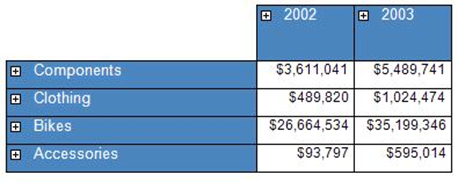
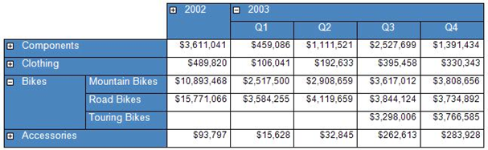

<html dir="LTR" xmlns:mshelp="http://msdn.microsoft.com/mshelp" xmlns:ddue="http://ddue.schemas.microsoft.com/authoring/2003/5" xmlns:xlink="http://www.w3.org/1999/xlink" xmlns:tool="http://www.microsoft.com/tooltip">
    <head>
        <meta http-equiv="Content-Type" content="text/html; CHARSET=utf-8"></meta>
        <meta name="save" content="history"></meta>
        <title>3.18 Matrix</title>
        <xml>
            <mshelp:toctitle title="3.18 Matrix"></mshelp:toctitle>
            <mshelp:rltitle title="[MS-RDL]: Matrix"></mshelp:rltitle>
            <mshelp:keyword index="A" term="d511b3d0-24a7-46e4-83ed-2b6576c884fe"></mshelp:keyword>
            <mshelp:attr name="DCSext.ContentType" value="open specification"></mshelp:attr>
            <mshelp:attr name="AssetID" value="d511b3d0-24a7-46e4-83ed-2b6576c884fe"></mshelp:attr>
            <mshelp:attr name="TopicType" value="kbRef"></mshelp:attr>
            <mshelp:attr name="DCSext.Title" value="[MS-RDL]: Matrix" />
        </xml>
    </head>
    <body>
        

            <h1 class="heading">3.18 Matrix</h1>
        

        

            

                

                

                    

<b><i>Applies to </i></b><a href="a7e2ad00-07c8-4f6d-80ab-3ad55df7b233.html"><b><i>RDL 2003/10</i></b></a><b>
<i>and </i></b><a href="3ebe2912-4958-4832-b391-cad1f5e13338.html"><b><i>RDL 2005/01</i></b></a>

The following example of a <a href="25419c0a-c7c6-43d7-8ca5-1af842666dcb.html">Matrix</a> element is an
extract from an RDL specification of a report. This example is from a report
for the Adventure Works database and shows sales by quarter and product
category. This example illustrates the use of a <a href="b2482b3f-74ab-4ca8-a9e5-c07955011743.html#gt_45c821b5-ef4d-462e-a97f-12116e176bde">matrix data region</a> that
provides drilldown from summary data into detail data by showing and hiding
rows. The following figures show the matrix in its collapsed state and in a
partially expanded state.

The following figure shows the <b>Matrix</b> example in its
collapsed state. The row headers are the product categories Components,
Clothing, Bikes, and Accessories. They are sorted in descending order. The
column headers are the years 2002 and 2003; they are sorted in ascending order.
The detail cells contain sales data that represent the sum total of all sales for
a given category and year. Clicking a plus sign in the category row headers or
year column headers expands the row or column to drill down into the data.

<b>Figure 26: Example of a matrix with dynamic columns in
collapsed state</b>

The following figure shows the <b>Matrix</b> example in a
partially expanded state. In the Bikes category, a row header is expanded to
show the three subcategories of Mountain Bikes, Road Bikes, and Touring Bikes.
Also, the column header 2003 is expanded to show the four quarters
of 2003. The cell data now represents the sum total of all sales per
subcategory and quarter for those cells that are in a subcategory row and under
a quarter column. In a partially expanded matrix, there are also details cells
that present data at a higher summarization level. For example, the value
$262,613 is the sum total of all sales for all subcategories of Accessories for
the third quarter of 2003. This is because the row Accessories is not
expanded.

<b>Figure 27: Example of a matrix with dynamic columns in
partially expanded state</b>

The following is the extract from the RDL report file that
produces the matrix that is shown above. The <b>Matrix</b> element has its <a href="d96fe531-ad4d-48ab-bd5b-6cbad6795aa6.html">Name</a> attribute set to
&quot;SalesMatrix&quot;. It has a single <a href="6fac9dfd-e5b6-4cf9-bb09-48b375eeccb8.html">MatrixColumn</a> in the <a href="f7861a0c-2518-4980-aa18-15abb3116c8c.html">MatrixColumns</a> collection
that specifies the width of the cells of the detail data to be
0.875 inches. The matrix is bound to the data in the <a href="a14782b0-2e2f-4305-83a3-3de3fd750b6a.html">DataSet</a> &quot;Sales&quot;
by the <a href="23b78c39-d8c4-429d-a8a0-3dba29cd4861.html">Matrix.DataSetName</a>
element.

<dl>
<dd>

<pre> &lt;Matrix Name=&quot;SalesMatrix&quot;&gt;
   &lt;MatrixColumns&gt;
     &lt;MatrixColumn&gt;
       &lt;Width&gt;0.875in&lt;/Width&gt;
     &lt;/MatrixColumn&gt;
   &lt;/MatrixColumns&gt;
   &lt;DataSetName&gt;Sales&lt;/DataSetName&gt;
   &lt;RowGroupings&gt;
</pre>

</dd></dl>

This matrix has two <a href="b5d38fa6-6490-4b26-8e9d-dcd9571a6378.html">RowGrouping</a> elements in
its <a href="fdd934e6-1fb8-4bc8-aca9-b96560e22e5b.html">RowGroupings</a>
collection. This is an ordered list specifying the groupings from outermost to
innermost. The first <b>RowGrouping</b> element specifies a grouping by
category. The width of this <b>RowGrouping</b> is set to 1.125 inches,
which is the width of the expanded row header cell containing &quot;Bikes&quot;
in the preceding figure.

The first <b>RowGrouping</b> element has a <a href="ae8d4d93-e1d0-4379-ac48-4744a347f9db.html">DynamicRows</a> element that
specifies the content of the row header along with grouping and sorting
information. The <a href="469d0032-b5ec-43d9-ab36-d3a88b9cc1f6.html">Textbox</a>
with <a href="0896fc9e-7234-4d75-ac22-cd77791acadd.html">Name</a> attribute
&quot;Category&quot; has a <a href="ea446209-9c6a-46ce-b472-fae8b8350b37.html">Style</a>
element that specifies that the row header value is white lettering on a steel
blue background. The values that are displayed as row headers come from the <a href="940b8522-5d1f-4a2a-ab79-087ef6a69881.html">Field</a> named
&quot;ProdCat&quot; as is specified in the <a href="2c55aa61-e69e-41fe-9f23-9440eea9ed65.html">Value</a> element of the <b>Textbox</b>
as the expression =Fields!ProdCat.Value.

There is a <a href="7d574154-eefe-4fc1-8b78-3a18b9350e87.html">Grouping</a> element with its <a href="4d08883b-d937-4d6e-b0b2-5dec684678ec.html">Name</a> attribute set to
&quot;ProductCategory&quot; that specifies that the data is grouped by the
expression &quot;=Fields!ProdCat.Value&quot;; that is, the data is grouped by
the  &quot;ProdCat&quot; <b>Field</b>. Also, there is a <a href="1bf282fa-97a7-4dc0-b8af-171f4e777f73.html">Sorting</a> element that
specifies that this group is sorted by the &quot;ProdCat&quot; <b>Field</b> in
descending order. This is seen in the preceding figure where the categories
listed are Components, Clothing, Bikes, and Accessories, which are sorted in
reverse alphabetical (descending) order.

<dl>
<dd>

<pre>     &lt;RowGrouping&gt;
       &lt;Width&gt;1.125in&lt;/Width&gt;
       &lt;DynamicRows&gt;
         &lt;ReportItems&gt;
           &lt;Textbox Name=&quot;Category&quot;&gt;
             &lt;Style&gt;
               &lt;Color&gt;White&lt;/Color&gt;
               &lt;BorderStyle&gt;
                 &lt;Default&gt;Solid&lt;/Default&gt;
               &lt;/BorderStyle&gt;
               &lt;PaddingLeft&gt;2pt&lt;/PaddingLeft&gt;
               &lt;PaddingRight&gt;2pt&lt;/PaddingRight&gt;
               &lt;BackgroundColor&gt;SteelBlue&lt;/BackgroundColor&gt;
             &lt;/Style&gt;
             &lt;ZIndex&gt;2&lt;/ZIndex&gt;
             &lt;Value&gt;=Fields!ProdCat.Value&lt;/Value&gt;
           &lt;/Textbox&gt;
         &lt;/ReportItems&gt;
         &lt;Grouping Name=&quot;ProductCategory&quot;&gt;
           &lt;GroupExpressions&gt;
             &lt;GroupExpression&gt;=Fields!ProdCat.Value&lt;/GroupExpression&gt;
           &lt;/GroupExpressions&gt;
         &lt;/Grouping&gt;
         &lt;Sorting&gt;
           &lt;SortBy&gt;
             &lt;SortExpression&gt;=Fields!ProdCat.Value&lt;/SortExpression&gt;
             &lt;Direction&gt;Descending&lt;/Direction&gt;
           &lt;/SortBy&gt;
         &lt;/Sorting&gt;
       &lt;/DynamicRows&gt;
     &lt;/RowGrouping&gt;
</pre>

</dd></dl>

The second <b>RowGrouping</b> element specifies a grouping
by subcategory. The width of this <b>RowGrouping</b> is set to
1.125 inches, which is the width of the row header cell containing
Mountain Bikes in the figure. This <b>RowGrouping</b> element has a <b>DynamicRows</b>
element that specifies the content of the row header along with grouping and
sorting information. The <b>Textbox</b> with <b>Name</b> attribute
&quot;SubCategory&quot; has a <b>Style</b> element that specifies that the row
header value is white lettering on a steel blue background. The values to
display as row headers come from the <b>Field</b> named &quot;SubCat&quot; as
is specified in the <b>Value</b> element of the <b>Textbox</b> as the
expression =Fields!SubCat.Value.

This element has something that the previous <b>RowGrouping</b>
does not have. It has the <a href="1d1d752d-f776-41a5-9c1b-c50a701a66f7.html">Visibility</a>
element, which specifies that this row grouping is initially hidden and that
the <b>RowGrouping</b> that has the <b>Name</b> attribute &quot;Category&quot;
is used to toggle whether this row grouping is visible or hidden—that is,
expanded or collapsed.

The <b>Grouping</b> element that has the <b>Name</b>
attribute &quot;ProductSubcategory&quot; specifies that the data is grouped by
the expression =Fields!SubCat.Value, that is, grouped by the <b>Field</b>
&quot;SubCat&quot;. Also, a <b>Sorting</b> element specifies that this group is
sorted by the <b>Field</b> &quot;SubCat&quot; in ascending order. This is shown
in the figure where the subcategories are Mountain Bikes, Road Bikes, and
Touring Bikes, which are sorted in alphabetical (ascending) order.

<dl>
<dd>

<pre>     &lt;RowGrouping&gt;
       &lt;Width&gt;1.125in&lt;/Width&gt;
       &lt;DynamicRows&gt;
         &lt;Visibility&gt;
           &lt;Hidden&gt;true&lt;/Hidden&gt;
           &lt;ToggleItem&gt;Category&lt;/ToggleItem&gt;
         &lt;/Visibility&gt;
         &lt;ReportItems&gt;
           &lt;Textbox Name=&quot;SubCategory&quot;&gt;
             &lt;Style&gt;
               &lt;Color&gt;White&lt;/Color&gt;
               &lt;BorderStyle&gt;
                 &lt;Default&gt;Solid&lt;/Default&gt;
               &lt;/BorderStyle&gt;
               &lt;PaddingLeft&gt;2pt&lt;/PaddingLeft&gt;
               &lt;PaddingRight&gt;2pt&lt;/PaddingRight&gt;
               &lt;BackgroundColor&gt;SteelBlue&lt;/BackgroundColor&gt;
             &lt;/Style&gt;
             &lt;ZIndex&gt;1&lt;/ZIndex&gt;
             &lt;Value&gt;=Fields!SubCat.Value&lt;/Value&gt;
           &lt;/Textbox&gt;
         &lt;/ReportItems&gt;
         &lt;Grouping Name=&quot;ProductSubcategory&quot;&gt;
           &lt;GroupExpressions&gt;
             &lt;GroupExpression&gt;=Fields!SubCat.Value&lt;/GroupExpression&gt;
           &lt;/GroupExpressions&gt;
         &lt;/Grouping&gt;
         &lt;Sorting&gt;
           &lt;SortBy&gt;
             &lt;SortExpression&gt;=Fields!SubCat.Value&lt;/SortExpression&gt;
             &lt;Direction&gt;Ascending&lt;/Direction&gt;
           &lt;/SortBy&gt;
         &lt;/Sorting&gt;
       &lt;/DynamicRows&gt;
     &lt;/RowGrouping&gt;
   &lt;/RowGroupings&gt;
   &lt;MatrixRows&gt;
</pre>

</dd></dl>

This matrix has a single <a href="43e99561-2c44-4329-ad8b-3657dca6728f.html">MatrixRow</a> element in its <a href="626a6635-ee15-421e-97a5-55011d8c4618.html">MatrixRows</a> collection.
This <b>MatrixRow</b> has a single <a href="633bf979-190d-4b98-8571-84d25fb09ac9.html">MatrixCell</a> element in its <a href="bcb7e609-bf3c-49c8-a5eb-32866c0b4d58.html">MatrixCells</a> collection.
The <b>Textbox</b> specifies the content of the details cells of the matrix. It
sets the background color to white; the content of the details is an aggregate
expression that computes the total sales under the current row headers and
column headers of the details cell. That aggregate is specified by the
expression =Sum(Fields!Sales.Value).

The height of this <b>MatrixRow</b> is set to
0.25 inches, which is the height of a detail cell such as the one
containing $283,928 in the figure.

Additionally, just after the <b>MatrixRows</b> element, the <b>Top</b>
element specifies that the matrix is placed 1.0625 inches below the top of
its parent report item.

<dl>
<dd>

<pre>     &lt;MatrixRow&gt;
       &lt;MatrixCells&gt;
         &lt;MatrixCell&gt;
           &lt;ReportItems&gt;
             &lt;Textbox Name=&quot;Sales&quot;&gt;
               &lt;Style&gt;
                 &lt;BorderStyle&gt;
                   &lt;Default&gt;Solid&lt;/Default&gt;
                 &lt;/BorderStyle&gt;
                 &lt;FontSize&gt;9pt&lt;/FontSize&gt;
                 &lt;Format&gt;C0&lt;/Format&gt;
                 &lt;PaddingLeft&gt;2pt&lt;/PaddingLeft&gt;
                 &lt;PaddingRight&gt;2pt&lt;/PaddingRight&gt;
                 &lt;BackgroundColor&gt;White&lt;/BackgroundColor&gt;
               &lt;/Style&gt;
               &lt;Value&gt;=Sum(Fields!Sales.Value)&lt;/Value&gt;
             &lt;/Textbox&gt;
           &lt;/ReportItems&gt;
         &lt;/MatrixCell&gt;
       &lt;/MatrixCells&gt;
       &lt;Height&gt;0.25in&lt;/Height&gt;
     &lt;/MatrixRow&gt;
   &lt;/MatrixRows&gt;
   &lt;Top&gt;1.0625in&lt;/Top&gt;
   &lt;ColumnGroupings&gt;
</pre>

</dd></dl>

This matrix has two <a href="dc090e7a-cb5f-477c-9157-b1a087d66cfc.html">ColumnGrouping</a> elements in
its <a href="6441b94a-4767-4506-9772-287d041c7c2f.html">ColumnGroupings</a>
collection. This is an ordered list that specifies the groupings from outermost
to innermost. The first <b>ColumnGrouping</b> element specifies a grouping of
sales orders by year. The height of this <b>ColumnGrouping</b> is set at the
end of this element to 0.25 inches, which is the height of the expanded
column header cell containing 2003 in the figure. This element has a <a href="5a98a72e-ea10-4743-83fb-0cf6740c6635.html">DynamicColumns</a> element
that specifies the content of the column header, along with grouping and
sorting information. The <b>Textbox</b> that has its <b>Name</b> attribute set
to &quot;OrderYear&quot; has a <b>Style</b> element that specifies that the
column header value is white lettering on a steel blue background. The values
to display as column headers come from the <b>Field</b> named
&quot;OrderYear&quot; as is specified in the <b>Value</b> element of the <b>Textbox</b>
as the expression =Fields!OrderYear.Value.

A <b>Grouping</b> element with its <b>Name</b> attribute set
to &quot;OrderYear&quot; specifies that the data is grouped by the expression
=Fields!OrderYear.Value. That is, the data is grouped by the
&quot;OrderYear&quot; <b>Field</b>. Also, there is a <b>Sorting</b> element
that specifies that this group is sorted by the &quot;OrderYear&quot; <b>Field</b>
in ascending order. This is shown in the preceding figure in which the years
that are listed are 2002 and 2003, which are sorted in ascending order.

<dl>
<dd>

<pre>     &lt;ColumnGrouping&gt;
       &lt;DynamicColumns&gt;
         &lt;ReportItems&gt;
           &lt;Textbox Name=&quot;OrderYear&quot;&gt;
             &lt;Style&gt;
               &lt;Color&gt;White&lt;/Color&gt;
               &lt;BorderStyle&gt;
                 &lt;Default&gt;Solid&lt;/Default&gt;
               &lt;/BorderStyle&gt;
               &lt;TextAlign&gt;Left&lt;/TextAlign&gt;
               &lt;PaddingLeft&gt;2pt&lt;/PaddingLeft&gt;
               &lt;PaddingRight&gt;2pt&lt;/PaddingRight&gt;
               &lt;BackgroundColor&gt;SteelBlue&lt;/BackgroundColor&gt;
             &lt;/Style&gt;
             &lt;ZIndex&gt;4&lt;/ZIndex&gt;
             &lt;Value&gt;=Fields!OrderYear.Value&lt;/Value&gt;
           &lt;/Textbox&gt;
         &lt;/ReportItems&gt;
         &lt;Grouping Name=&quot;OrderYear&quot;&gt;
           &lt;GroupExpressions&gt;
             &lt;GroupExpression&gt;=Fields!OrderYear.Value&lt;/GroupExpression&gt;
           &lt;/GroupExpressions&gt;
         &lt;/Grouping&gt;
         &lt;Sorting&gt;
           &lt;SortBy&gt;
             &lt;SortExpression&gt;=Fields!OrderYear.Value&lt;/SortExpression&gt;
             &lt;Direction&gt;Ascending&lt;/Direction&gt;
           &lt;/SortBy&gt;
         &lt;/Sorting&gt;
       &lt;/DynamicColumns&gt;
       &lt;Height&gt;0.25in&lt;/Height&gt;
     &lt;/ColumnGrouping&gt;
</pre>

</dd></dl>

The second <b>ColumnGrouping</b> element specifies a
grouping of the sales orders by quarter. The height of this <b>ColumnGrouping</b>
is set at the end of this element to 0.25 inches, which is the height of
the column header cell containing &quot;Q1&quot; in the preceding figure. This <b>ColumnGrouping</b>
element has a <b>DynamicColumns</b> element that specifies the content of the
column header, along with grouping and sorting information. The <b>Textbox</b>
that has its <b>Name</b> attribute set to &quot;OrderQuarter&quot; has a <b>Style</b>
element that specifies that the column header value is white lettering on a
steel-blue background. The values to display as column headers come from the <b>Field</b>
named &quot;OrderQtr&quot;; this is specified in the <b>Value</b> element of
the <b>Textbox</b> as the expression =Fields! OrderQtr.Value.

This element also has a <b>Visibility</b> element, which
specifies that this column grouping is initially hidden and that the <b>ColumnGrouping</b>
that has the <b>Name</b> attribute &quot;OrderYear&quot; is used to toggle this
column grouping between visible or hidden, that is, expanded or collapsed.

The <b>Grouping</b> element that has the <b>Name</b>
attribute &quot;OrderQtr&quot; specifies that the data is grouped by the
expression =Fields!OrderQtr.Value; that is, the data is grouped by the <b>Field</b>
&quot;OrderQtr&quot;. Also, there is a <b>Sorting</b> element that specifies
that this group is sorted by the <b>Field</b> &quot;OrderQtr&quot; in ascending
order. This is shown in the figure in which the quarters listed are Q1, Q2, Q3,
and Q4, which are sorted in alphabetical (ascending) order.

<dl>
<dd>

<pre>     &lt;ColumnGrouping&gt;
       &lt;DynamicColumns&gt;
         &lt;Visibility&gt;
           &lt;Hidden&gt;true&lt;/Hidden&gt;
           &lt;ToggleItem&gt;OrderYear&lt;/ToggleItem&gt;
         &lt;/Visibility&gt;
         &lt;ReportItems&gt;
           &lt;Textbox Name=&quot;OrderQuarter&quot;&gt;
             &lt;Style&gt;
               &lt;Color&gt;White&lt;/Color&gt;
               &lt;BorderStyle&gt;
                 &lt;Default&gt;Solid&lt;/Default&gt;
               &lt;/BorderStyle&gt;
               &lt;TextAlign&gt;Center&lt;/TextAlign&gt;
               &lt;PaddingLeft&gt;2pt&lt;/PaddingLeft&gt;
               &lt;PaddingRight&gt;2pt&lt;/PaddingRight&gt;
               &lt;BackgroundColor&gt;SteelBlue&lt;/BackgroundColor&gt;
             &lt;/Style&gt;
             &lt;ZIndex&gt;3&lt;/ZIndex&gt;
             &lt;Value&gt;=Fields!OrderQtr.Value&lt;/Value&gt;
           &lt;/Textbox&gt;
         &lt;/ReportItems&gt;
         &lt;Grouping Name=&quot;OrderQtr&quot;&gt;
           &lt;GroupExpressions&gt;
             &lt;GroupExpression&gt;=Fields!OrderQtr.Value&lt;/GroupExpression&gt;
           &lt;/GroupExpressions&gt;
         &lt;/Grouping&gt;
         &lt;Sorting&gt;
           &lt;SortBy&gt;
             &lt;SortExpression&gt;=Fields!OrderQtr.Value&lt;/SortExpression&gt;
             &lt;Direction&gt;Ascending&lt;/Direction&gt;
           &lt;/SortBy&gt;
         &lt;/Sorting&gt;
       &lt;/DynamicColumns&gt;
       &lt;Height&gt;0.25in&lt;/Height&gt;
     &lt;/ColumnGrouping&gt;
   &lt;/ColumnGroupings&gt;
   &lt;Width&gt;3.125in&lt;/Width&gt;
   &lt;Corner&gt;
</pre>

</dd></dl>

This matrix has a <a href="7de8b7be-78f3-442e-9907-764433874638.html">Corner</a> element that
consists of a <b>Textbox</b> that has no value. Since this <b>Textbox</b> does
not have a border and has no value, the upper-left corner of the matrix is blank.
Just preceding this <b>Corner</b> element is the <a href="abd3ccfd-81a4-4811-a355-009691a7f39c.html">Width</a> element, which
specifies that the initial width of the matrix is 3.125 inches. The actual
width of the matrix is derived from the sum of the widths of the component row
and column headers.

<dl>
<dd>

<pre>     &lt;ReportItems&gt;
       &lt;Textbox Name=&quot;textbox1&quot;&gt;
         &lt;Style&gt;
           &lt;PaddingLeft&gt;2pt&lt;/PaddingLeft&gt;
           &lt;PaddingRight&gt;2pt&lt;/PaddingRight&gt;
         &lt;/Style&gt;
         &lt;ZIndex&gt;5&lt;/ZIndex&gt;
         &lt;Value /&gt;
       &lt;/Textbox&gt;
     &lt;/ReportItems&gt;
   &lt;/Corner&gt;
</pre>

</dd></dl>

The <a href="298003d4-2df0-490d-86a4-7f91eb5d8841.html">Height</a>
element specifies that the initial height of the matrix is 0.75 inches.
The actual height of the matrix is derived from the sum of the heights of the
component row and column headers. The <a href="a5dcc713-6fcf-4b1b-8f24-501b78fbf6da.html">Left</a> element specifies
that the table is placed 0.0625 inches to the right of the left edge of
the parent report item that contains this matrix.

<dl>
<dd>

<pre>   &lt;Style /&gt;
   &lt;Height&gt;0.75in&lt;/Height&gt;
   &lt;Left&gt;0.0625in&lt;/Left&gt;
 &lt;/Matrix&gt;
</pre>

</dd></dl>

                

            

        

    </body>
</html>