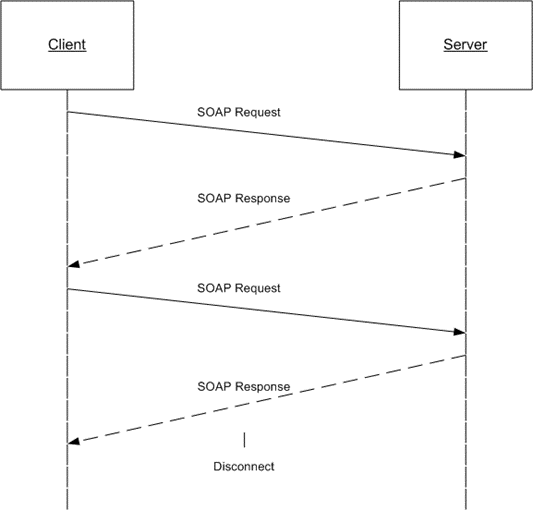

<html dir="LTR" xmlns:mshelp="http://msdn.microsoft.com/mshelp" xmlns:ddue="http://ddue.schemas.microsoft.com/authoring/2003/5" xmlns:xlink="http://www.w3.org/1999/xlink" xmlns:tool="http://www.microsoft.com/tooltip">
    <head>
        <meta http-equiv="Content-Type" content="text/html; CHARSET=utf-8"></meta>
        <meta name="save" content="history"></meta>
        <title>1.3 Overview</title>
        <xml>
            <mshelp:toctitle title="1.3 Overview"></mshelp:toctitle>
            <mshelp:rltitle title="[MS-RSWSRMSM2006]: Overview"></mshelp:rltitle>
            <mshelp:keyword index="A" term="5bf7f08a-a67f-43df-9dd6-8f2f29f14984"></mshelp:keyword>
            <mshelp:attr name="DCSext.ContentType" value="open specification"></mshelp:attr>
            <mshelp:attr name="AssetID" value="5bf7f08a-a67f-43df-9dd6-8f2f29f14984"></mshelp:attr>
            <mshelp:attr name="TopicType" value="kbRef"></mshelp:attr>
            <mshelp:attr name="DCSext.Title" value="[MS-RSWSRMSM2006]: Overview" />
        </xml>
    </head>
    <body>
        

            <h1 class="heading">1.3 Overview</h1>
        

        

            

                

                

                    

The ReportService2006 web service protocol that is described
in this document<a href="e6dc7a06-a4f3-440e-a596-8ed628f702e3.html#Appendix_A_1" aria-label="Product behavior note 1">&lt;1&gt;</a> provides methods for managing
objects and settings on a <a href="755aec02-e59f-4377-9100-4673bbf7b123.html#gt_cbdd3a12-e9ec-43e2-ac97-9c47f171f96a">report
server</a> <a href="https://go.microsoft.com/fwlink/?LinkId=152499">[MSDN-SSRS]</a>
that is configured for SharePoint integrated mode <a href="https://go.microsoft.com/fwlink/?LinkId=155398">[MSDN-SSMode]</a>.
Objects and settings that can be managed by the protocol include the following:

<ul><li>
 
Security tasks, roles, and policies

</li><li>
 
Data source connections and credentials

</li><li>
 
Parameters for reports

</li><li>
 
Report execution and caching

</li><li>
 
Report history snapshots

</li><li>
 
Schedules

</li><li>
 
Subscriptions and deliveries of reports

</li><li>
 
Linked reports

</li><li>
 
Server system properties

</li></ul>
Typically, the client establishes a connection with the
server. After the connection is established by using the HTTP <a href="https://go.microsoft.com/fwlink/?LinkId=402094">[RFC7230]</a> or HTTPS <a href="https://go.microsoft.com/fwlink/?LinkId=90383">[RFC2818]</a> protocol, <a href="755aec02-e59f-4377-9100-4673bbf7b123.html#gt_96185df3-4677-478c-b239-f72fcf514c59">SOAP messages</a> <a href="https://go.microsoft.com/fwlink/?LinkId=90520">[SOAP1.1]</a> <a href="https://go.microsoft.com/fwlink/?LinkId=94664">[SOAP1.2-1/2007]</a> are
used to communicate between the client and the server.

The ReportService2006 web service protocol uses the security
facilities that are built into HTTP or HTTPS for authentication and
identification and for channel encryption negotiation. The protocol uses the
facilities that are built into SOAP for specification of requests from client
to server and for returning data from the server to the client. The following
diagram depicts a (simplified) typical flow of communication in the protocol.

<b>Figure 1: Communication flow for ReportService2006</b>

Each method in the protocol is a SOAP operation that accepts
a set of parameters as a SOAP request and returns a set of values as a SOAP
response. The client sends a request to the server through a SOAP request
message, and the server sends return values to the client through a SOAP
response message.

The following procedure describes a simple example
client/server exchange for creating a report.

<ol><li>
    The client calls
the <b>CreateReport</b> method, which accepts the following parameters:

<ul><li>
  <b>Report</b>:
The name of the new report

</li><li>
  <b>Parent</b>:
The full path name of the parent folder to which to add the report

</li><li>
  <b>Overwrite</b>:
A <b>Boolean</b> expression that indicates whether an existing report with the
same name in the location specified is to be overwritten

</li><li>
  <b>Definition</b>:
The report definition to publish to the report server

</li><li>
  <b>Properties</b>:
An array of <b>Property</b> objects <a href="https://go.microsoft.com/fwlink/?LinkId=184682">[MSDN-PropertyClass2006]</a>
that contains the property names and values to set for the report

</li></ul></li><li>
    The server
creates the report, modifies the <b>ModifiedBy</b> and <b>ModifiedDate</b>
properties of the parent folder, and then returns an array of <b>Warning</b>
objects <a href="https://go.microsoft.com/fwlink/?LinkId=184683">[MSDN-WarningClass2006]</a>
that describes any warnings that occurred when the report definition was
validated to the client.

<b>Note</b>   If errors
occur, the report is not created.

</li></ol>
                

            

        

    </body>
</html>