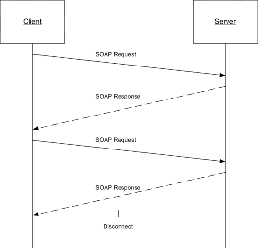

<html dir="LTR" xmlns:mshelp="http://msdn.microsoft.com/mshelp" xmlns:ddue="http://ddue.schemas.microsoft.com/authoring/2003/5" xmlns:xlink="http://www.w3.org/1999/xlink" xmlns:tool="http://www.microsoft.com/tooltip">
    <head>
        <meta http-equiv="Content-Type" content="text/html; CHARSET=utf-8"></meta>
        <meta name="save" content="history"></meta>
        <title>1.3 Overview</title>
        <xml>
            <mshelp:toctitle title="1.3 Overview"></mshelp:toctitle>
            <mshelp:rltitle title="[MS-RSWSSFA]: Overview"></mshelp:rltitle>
            <mshelp:keyword index="A" term="10b5fc2d-79f5-41f1-b117-7647699425fe"></mshelp:keyword>
            <mshelp:attr name="DCSext.ContentType" value="open specification"></mshelp:attr>
            <mshelp:attr name="AssetID" value="10b5fc2d-79f5-41f1-b117-7647699425fe"></mshelp:attr>
            <mshelp:attr name="TopicType" value="kbRef"></mshelp:attr>
            <mshelp:attr name="DCSext.Title" value="[MS-RSWSSFA]: Overview" />
        </xml>
    </head>
    <body>
        

            <h1 class="heading">1.3 Overview</h1>
        

        

            

                

                

                    

The ReportServiceAuthentication web service protocol <a href="https://go.microsoft.com/fwlink/?LinkId=155562">[MSDN-RSAN]</a> that is
described in this document provides methods for retrieving the authentication
mode and for authenticating users against a <a href="74870060-537e-429d-95e1-0b0783092fb6.htm#gt_cbdd3a12-e9ec-43e2-ac97-9c47f171f96a">report server</a> <a href="https://go.microsoft.com/fwlink/?LinkId=152499">[MSDN-SSRS]</a> when the
SharePoint web application is configured for Forms Authentication <a href="https://go.microsoft.com/fwlink/?linkid=865493">[MSDN-SORSSIM]</a>. 

Typically, the client establishes a connection with the
server. After the connection is established by using the HTTP <a href="https://go.microsoft.com/fwlink/?LinkId=402094">[RFC7230]</a> or HTTPS <a href="https://go.microsoft.com/fwlink/?LinkId=90383">[RFC2818]</a> protocol, <a href="74870060-537e-429d-95e1-0b0783092fb6.htm#gt_96185df3-4677-478c-b239-f72fcf514c59">SOAP messages</a> <a href="https://go.microsoft.com/fwlink/?LinkId=90520">[SOAP1.1]</a> <a href="https://go.microsoft.com/fwlink/?LinkId=94664">[SOAP1.2-1/2007]</a> are
used to communicate between the client and the server. 

The ReportServiceAuthentication web service protocol uses
the security facilities that are built into HTTP or HTTPS for authentication
and identification and for channel encryption negotiation. The protocol uses
the facilities that are built into SOAP for specification of requests from
client to server and for returning data from the server to the client. The
following diagram depicts a (simplified) typical flow of communication in the
protocol.

<b>Figure 1: Communication flow for
ReportServiceAuthentication</b>

Each method in the protocol is a SOAP operation that accepts
a set of parameters as a SOAP request and returns a set of values as a SOAP
response. The client sends a request to the server through a SOAP request
message, and the server sends return values to the client through a SOAP
response message.

The following procedure is a simple example client/server
exchange for authenticating a user.

<ol><li>
    The client calls
the <b>LogonUser</b> method and passes in the user name and the password as
method parameters.

</li><li>
    The server
authenticates the user. If authentication is successful, the server outputs the
authentication cookie and its name and then returns true. If authentication is
unsuccessful, the server returns false.

</li><li>
    The client makes
subsequent web requests, presenting the authentication cookie (through a
different web protocol). The requests can then be authenticated by the server.

</li></ol>
                

            

        

    </body>
</html>