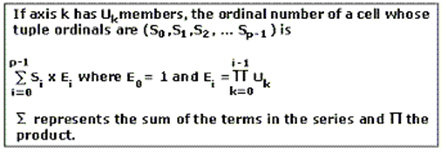

<html dir="LTR" xmlns:mshelp="http://msdn.microsoft.com/mshelp" xmlns:ddue="http://ddue.schemas.microsoft.com/authoring/2003/5" xmlns:xlink="http://www.w3.org/1999/xlink" xmlns:tool="http://www.microsoft.com/tooltip">
    <head>
        <meta http-equiv="Content-Type" content="text/html; CHARSET=utf-8"></meta>
        <meta name="save" content="history"></meta>
        <title>2.2.4.1.1.3.1.2 CellOrdinal Attribute</title>
        <xml>
            <mshelp:toctitle title="2.2.4.1.1.3.1.2 CellOrdinal Attribute"></mshelp:toctitle>
            <mshelp:rltitle title="[MS-SSAS]: CellOrdinal Attribute"></mshelp:rltitle>
            <mshelp:keyword index="A" term="c24f3d01-b9ca-4d3c-a970-7d7b13b3cebe"></mshelp:keyword>
            <mshelp:attr name="DCSext.ContentType" value="open specification"></mshelp:attr>
            <mshelp:attr name="AssetID" value="c24f3d01-b9ca-4d3c-a970-7d7b13b3cebe"></mshelp:attr>
            <mshelp:attr name="TopicType" value="kbRef"></mshelp:attr>
            <mshelp:attr name="DCSext.Title" value="[MS-SSAS]: CellOrdinal Attribute" />
        </xml>
    </head>
    <body>
        

            <h1 class="heading">2.2.4.1.1.3.1.2 CellOrdinal Attribute</h1>
        

        

            

                

                

                    

The <b>CellOrdinal</b> attribute MUST be specified and
indicates the ordinal of the cell. <b>CellOrdinal</b> is numbered 0 to n-1, for
n cells.

The axis reference for a cell can be calculated based on <b>CellOrdinal</b>.
Conceptually, cells are numbered in a dataset as if the dataset were a
p-dimensional array, where p is the number of axes. Cells are addressed in
row-major order. The following illustration shows the formula for calculating
the ordinal number of a cell.

<b>Figure 4: Calculating ordinal number of a cell</b>

The preceding formula will be applied to the result set
shown in the following table. The query asked for four measures on columns and
a crossjoin of two states with four quarters on rows. In the following dataset
result, the <b>CellOrdinal</b> property for the part of the dataset result
shown in the box is the set {9, 10, 11, 13, 14, 15, 17, 18, 19}. This is
because the cells are numbered in row-major order, starting with a <b>CellOrdinal</b>
of zero for the upper left cell.

Next, the preceding formula is applied to the cell that is
{CA, Q3, Store Cost}. Axis k=0 has Uk=4 members and axis k=1 has Uk=8 tuples. P
is the total number of axes in the query, here equal to 2. So, the initial
summation is i=0 to 1. For i=0, the tuple ordinal on axis 0 of {Store Cost} is
1. For i = 1, the tuple ordinal of {CA, Q3} is 2.

For i=0, Ei = 1, so for i = 0 the sum is 1 * 1 = 1 and for
i=1, the sum is 2 (tuple ordinal) * 4 (the value of Ei, computed as 1 * 4), or
8, and so the sum is equal to 1 + 8 = 9, the cell ordinal for that cell.

<table>
 <thead>
  <tr>
   <th>
   
Location

   </th>
   <th>
   
Quarter

   </th>
   <th>
   
Unit Sales

   </th>
   <th>
   
Store Cost

   </th>
   <th>
   
Store Sales

   </th>
   <th>
   
Sales Count

   </th>
  </tr>
 </thead>
 <tr>
  <td rowspan="4">
  
      CA

  </td>
  <td>
  
   Q1

  </td>
  <td>
  
16,890.00

  </td>
  <td>
  
14,431.09

  </td>
  <td>
  
$36,175.20

  </td>
  <td>
  
5498

  </td>
 </tr>
 <tr>
  <td>
  
   Q2

  </td>
  <td>
  
18,052.00

  </td>
  <td>
  
15,332.02

  </td>
  <td>
  
$38,396.75

  </td>
  <td>
  
5915

  </td>
 </tr>
 <tr>
  <td>
  
   Q3

  </td>
  <td>
  
18,370.00

  </td>
  <td>
  
15,672.83

  </td>
  <td>
  
$39,394.05

  </td>
  <td>
  
6014

  </td>
 </tr>
 <tr>
  <td>
  
   Q4

  </td>
  <td>
  
21,436.00

  </td>
  <td>
  
18,094.50

  </td>
  <td>
  
$45,201.84

  </td>
  <td>
  
7015

  </td>
 </tr>
 <tr>
  <td rowspan="4">
  
      OR

  </td>
  <td>
  
   Q1

  </td>
  <td>
  
19,287.00

  </td>
  <td>
  
16,081.07

  </td>
  <td>
  
$40,170.29

  </td>
  <td>
  
6184

  </td>
 </tr>
 <tr>
  <td>
  
   Q2

  </td>
  <td>
  
15,079.00

  </td>
  <td>
  
12,678.96

  </td>
  <td>
  
$31,772.88

  </td>
  <td>
  
4799

  </td>
 </tr>
 <tr>
  <td>
  
   Q3

  </td>
  <td>
  
16,940.00

  </td>
  <td>
  
14,273.78

  </td>
  <td>
  
$35,880.46

  </td>
  <td>
  
5432

  </td>
 </tr>
 <tr>
  <td>
  
   Q4

  </td>
  <td>
  
16,353.00

  </td>
  <td>
  
13,738.68

  </td>
  <td>
  
$34,453.44

  </td>
  <td>
  
5196

  </td>
 </tr>
</table>

 

                

            

        

    </body>
</html>