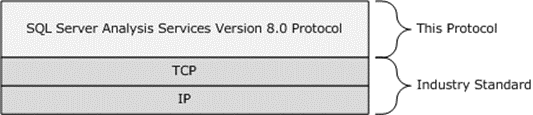
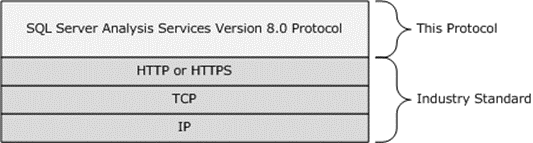

<html dir="LTR" xmlns:mshelp="http://msdn.microsoft.com/mshelp" xmlns:ddue="http://ddue.schemas.microsoft.com/authoring/2003/5" xmlns:xlink="http://www.w3.org/1999/xlink" xmlns:tool="http://www.microsoft.com/tooltip">
    <head>
        <meta http-equiv="Content-Type" content="text/html; CHARSET=utf-8"></meta>
        <meta name="save" content="history"></meta>
        <title>1.4 Relationship to Other Protocols</title>
        <xml>
            <mshelp:toctitle title="1.4 Relationship to Other Protocols"></mshelp:toctitle>
            <mshelp:rltitle title="[MS-SSAS8]: Relationship to Other Protocols"></mshelp:rltitle>
            <mshelp:keyword index="A" term="9cf00775-c506-4e3f-9493-140d98f52d85"></mshelp:keyword>
            <mshelp:attr name="DCSext.ContentType" value="open specification"></mshelp:attr>
            <mshelp:attr name="AssetID" value="9cf00775-c506-4e3f-9493-140d98f52d85"></mshelp:attr>
            <mshelp:attr name="TopicType" value="kbRef"></mshelp:attr>
            <mshelp:attr name="DCSext.Title" value="[MS-SSAS8]: Relationship to Other Protocols" />
        </xml>
    </head>
    <body>
        

            <h1 class="heading">1.4 Relationship to Other Protocols</h1>
        

        

            

                

                

                    

The conversation between a client and a server is performed
over <a href="c527450b-f5bd-424b-8c98-ba6365288f35.htm#gt_b08d36f6-b5c6-4ce4-8d2d-6f2ab75ea4cb">Transmission Control
Protocol (TCP)</a> as defined in <a href="https://go.microsoft.com/fwlink/?LinkId=150872">[RFC793]</a> or HTTP 1.1
as defined in <a href="https://go.microsoft.com/fwlink/?LinkId=90372">[RFC2616]</a>
with a number of layers added on top of them.

When the protocol is performed over TCP/IP, it is stacked as
shown in the following diagram.

<b>Figure 2: TCP/IP</b>

Alternatively, the conversation can be performed over HTTP
or HTTPS by using a data pump component which tunnels the binary packages over
HTTP or HTTPS, as specified in section <a href="a1f5ccfa-35e3-4052-ae96-ca61dd271ee0.htm">2.2.1.6</a>. In this method,
the protocol transmits the same binary content that is transmitted over TCP/IP,
but it is now wrapped in HTTP or HTTPS. A few small exceptions between the
TCP/IP and the HTTP or HTTPS binary packages are noted in section <a href="52457140-43c9-4e21-b694-1c87ecc51533.htm">2.1.2</a>. The protocol stack
when using HTTP or HTTPS is as shown in the following diagram.

<b>Figure 3: HTTP or HTTPS over TCP/IP</b>

                

            

        

    </body>
</html>