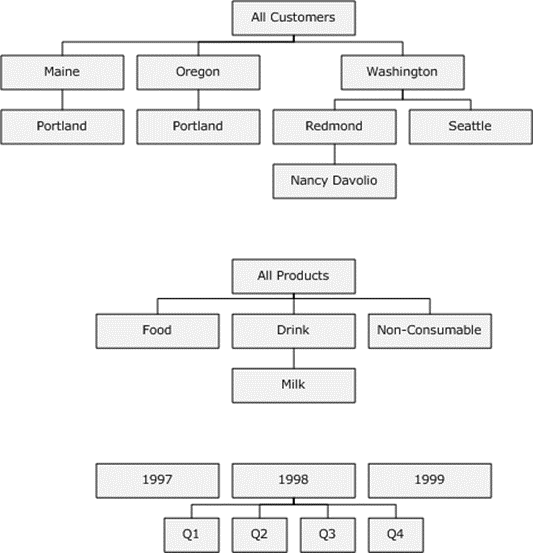

<html dir="LTR" xmlns:mshelp="http://msdn.microsoft.com/mshelp" xmlns:ddue="http://ddue.schemas.microsoft.com/authoring/2003/5" xmlns:xlink="http://www.w3.org/1999/xlink" xmlns:tool="http://www.microsoft.com/tooltip">
    <head>
        <meta http-equiv="Content-Type" content="text/html; CHARSET=utf-8"></meta>
        <meta name="save" content="history"></meta>
        <title>7 Appendix B: Paths</title>
        <xml>
            <mshelp:toctitle title="7 Appendix B: Paths"></mshelp:toctitle>
            <mshelp:rltitle title="[MS-SSAS8]: Appendix B: Paths"></mshelp:rltitle>
            <mshelp:keyword index="A" term="d7582073-3671-4ed8-a296-b5638dc7bff7"></mshelp:keyword>
            <mshelp:attr name="DCSext.ContentType" value="open specification"></mshelp:attr>
            <mshelp:attr name="AssetID" value="d7582073-3671-4ed8-a296-b5638dc7bff7"></mshelp:attr>
            <mshelp:attr name="TopicType" value="kbRef"></mshelp:attr>
            <mshelp:attr name="DCSext.Title" value="[MS-SSAS8]: Appendix B: Paths" />
        </xml>
    </head>
    <body>
        

            <h1 class="heading">7 Appendix B: Paths</h1>
        

        

            

                

                

                    

SQL Server Analysis Services Version 8.0 is an
application-level protocol that describes the transfer of requests and
responses between client and server OLAP applications. More specifically, the
protocol describes the binary data structures for authentication, requests, and
responses for OLAP data constructs, and requests and responses for formulas and
metadata. The data structures that are returned are self-describing.

The main data object that is used in the message exchange
between a client and server is the dimension tree. A dimension tree is a
multi-level representation of data that consists of a root node and succeeding
layers of additional nodes that terminate at leaf nodes that represent the most
detailed data. The dimension tree structure, dimension paths, and indexes are
best explained through the following examples.

<b>Figure 5: Example dimension trees and dimension members</b>

In Figure 3, the [Customers] dimension tree consists of a
root node, inner nodes that correspond to aggregated data for states and
cities, and a leaf node that corresponds to the most detailed data, in this
case data about a specific person. The root contains the aggregate of all
leafs.

<b>Dimension Path (DPath)</b>

The dimension tree structure defines a fully-qualified
dimension path to its members. Consider the city of [Seattle]. Using the path
provided, the unique name for [Seattle] is [Customers].[All
Customers].[Washington].[Seattle]. The path qualifies data constructs that
might have the same name, as illustrated by the city of [Portland] which exists
in both [Maine] and [Oregon].

Internally, fully qualified paths are represented by an
array of numbers, where each position in the array corresponds to a level. The
server converts the fully qualified name to a number array. Within the array,
the number in a given position corresponds to the one-based index of an item
among its siblings, in the natural order. The index of the root is 1. If the
member is not a leaf, all positions below the level of the member get the value
0.

The internal name for the array is <b>DPath</b>. It
represents the internal depiction of a coordinate of a data cell on one of the
dimensions.

Using Figure 3 as an illustration, the <b>DPath</b> for each
level in the [Customers] dimension are as follows:

[1-0-0-0] corresponds to [All Customers]. The zeros
correspond to non-leaf levels that are unspecified.

[1-48-0-0] corresponds to [All Customers].[Washington]. In
the natural (alphabetical) order of states in the United States, [Washington]
is the forty-eighth state.

[1-48-2-0] corresponds to [All
Customers].[Washington].[Redmond]. If the database contains customer data for
only [Redmond] and [Seattle], and [Redmond] is the second member that was
processed, then [Redmond] will be 2. This example emphasizes that <b>DPath</b>
does not reflect the natural order, but the order in which members are
processed.

[1-48-2-5] corresponds to [All
Customers].[Washington].[Redmond].[Nancy Davolio]

<b>Dimension Forest</b>

A dimension tree is not required to have a root node.
Consider the [Time] dimension in Figure 3. It does not have a root. If a
dimension does not have a root, it is called a <b>dimension forest</b>. To
calculate the <b>DPaths</b> of data cells in a dimension forest, the server
calculates index of members at the first left by taking their corresponding
index in the natural order (for example, the <b>DPath</b> of the first quarter
in 1999 is [3-1-0].

<b>System Path (Path)</b>

Given that each data cell has a coordinate on each
dimension, a single cell might have multiple <b>DPaths</b> if it is an
intersection point for multiple dimensions. For data cells that correspond to
intersection points on multiple dimension, the address scheme is called a <b>Path</b>
data structure.

A <b>Path</b> (or system path) is an array that concatenates
the collection of <b>DPaths</b> for that data cell. The order of the <b>DPaths</b>
inside the <b>Path</b> depends on the internal order of the dimensions in the
cube. The internal order is the order in which the dimensions were added to the
cube. The cardinality of <b>Path</b> is the number of dimensions in the cube.

The internal order can be found by using OLAP Manager and
checking the order of dimensions inside the cube. Programmatically, this can be
done by using the Dimensions(&lt;index&gt;) function. For example to discover
the first dimension name, use the expression Dimensions(1).UniqueName to return
the full-qualified name for that dimension.

Using Figure 3 as an illustration, the Path for the cell
([Customers].[All Customers].[Washington].[Redmond].[Nancy Davolio],
[Products].[All Products], [Time].[1998].[Q4]) is [1-48-2-5]-[1-0-0]-[2-4-0].

<b>Measure Extended Path (MPath)</b>

Although each multidimensional data cell holds all the
measures, data retrieval as described for the SQL Server Analysis Services
Protocol Version 8 is done for only one measure at a time. This explains why a
tuple is used to uniquely identify the data cell. The tuple consists of a
measure and a <b>Path</b>. Internally, this array is referred to as <b>MPath.</b>

The index of the measure corresponds to the internal order
of the measures inside the cube (again, this can be seen in the OLAP Manager).
For example, if total purchases is the second measure defined in the cube, the
purchase measure for the above data cell is referred by the following <b>MPath</b>:

2-[1-48-2-5]-[1-0-0]-[2-4-0].

The index number that is assigned to a measure remains in
effect even if preceding measures are deleted. For example, if the first
measure is deleted, total purchases (which is measure 2) retains the index
value of 2.

Given an <b>MPath</b> value, the system can quickly identify
the referred value. However, there is still one question that remains unanswered:
what if the data cell is not a value inside the physical cube (that is, it is a
formula)? The system needs to be able to identify this. This is easily achieved
by having special values for the elements of the <b>MPath</b>, dedicated to
formulas. These values are:

<ul><li>
 
Measure indexes between 1 and 128 are reserved for regular
measures (maximum 128 regular formulas).

</li><li>
 
Measure indexes between 129 and 32831 are reserved for session
and global measure formulas (maximum 32703 session and global measure
formulas).

</li><li>
 
Measure indexes between 32832 and 65534 are reserved for query
measure formulas (maximum 32703 session and global measure formulas).

</li><li>
 
Dimension indexes between 1 and 64000 are reserved for regular
members (maximum 64000 children under the same parent).

</li><li>
 
Dimension indexes between 64001 and 64760 are reserved for
session and global regular formulas (maximum 760 session and global regular
formulas under the same parent).

</li><li>
 
Dimension indexes between 64761 and 65520 are reserved for
session and global regular formulas (maximum 760 session and global regular
formulas under the same parent).

</li></ul>
The indexes of formulas are assigned in the order in which
the formula was created. For example, given two session measure formulas,
[Cost] and [Volume] (created in this order), and one query formula [Consumable]
created under the parent [Products].[All Products], the <b>MPath</b>
corresponding to the data cell ([Measures].[Volume], ([Customers].[All
Customers].[WA].[Redmond].[Cristian Petculescu], [Products].[All
Products].[Consumable], [Time].[1998].[Q4])) will be the following:

130-[1-48-2-5]-[1-64761-0]-[2-4-0].

Every cell has coordinates on each and every dimension. For
client requests that specify an MDX query, the server formulates a response
that includes dimension information in the following ways:

<ul><li>
 
Dimensions that are not specified on the horizontal and vertical
axes are taken from the Where condition.

</li><li>
 
If a dimension is neither on an axes nor in a Where condition,
the server returns the <b>MPath</b> of the default member of that <b>dimension</b>.
A default member needs to be explicitly defined as such in the underlying cube.
Although the default member of a dimension is one of the members at the first
level, you cannot infer which member in that level is the actual default. As
such, SQL Server Analysis Services Protocol Version 8 does not imply or infer
default status for any member.

</li></ul>
<b>Records</b>

Data records are represented inside the internal caches and
in the protocol. The data record contains all of the measures; therefore, it
has just a <b>Path</b>, not an <b>MPath</b>. The <b>Path</b> is followed by the
array of the measures, each of them in their original data types: 4 bytes for
integer measures, 8 bytes for long integer measures, 4 bytes for float
measures, 8 bytes for double measures, and 8 bytes for date measures. The
format for the representation of measures conforms to the IEEE specifications
for the above-mentioned data types.

<b>Client Request Structure Using the (DataSet, Slice) Tuple</b>

The server uses paths to get a very fast response to
individual data cells. The path mechanism supported on the server allows that
regular, physical, data cells can be accessed by the same mechanism by which
formulas are referred to, even though the cells have a different underlying
mechanism for data retrieval. This creates a level of abstraction that allows
for uniform treatment of formulas and regular data cells. The level abstraction
is the <b>DataSet</b>, <b>Slice</b> tuple that is defined for a specific
dimension. It represents all descendants of the same common ancestor.

On each dimension:

<ul><li>
 
<b>Slice</b> specifies the <b>Path</b> of a common ancestor.
Depending on the ancestor, the path can be to a single data cell or a group of
data cells.

</li><li>
 
<b>DataSet</b> specifies the target level (of the descendants).

</li></ul>
The (<b>DataSet</b>, <b>Slice</b>) is the request format
that the server supports. The client side (such as the Pivot Table Service, DR
and <a href="c527450b-f5bd-424b-8c98-ba6365288f35.htm#gt_4aee94b3-5ccf-4da0-a9e6-91d599146175">SONAR</a>) needs to
organize client requests for data cells using the (<b>DataSet</b>, <b>Slice</b>)
tuple . <b>DataSets</b> and <b>Slices</b> exist only for real (physical) cells.
They do not exist for formulas.

A tuple (<b>DataSet</b>, <b>Slice</b>) corresponding to an <b>MPath</b>
will have the <b>Slice</b> equal to <b>MPath</b> and a <b>DataSet</b> that
contains the active levels of each member (from all <b>DPaths</b> that form the
<b>MPath</b>, where the active level is the level of the member inside a <b>DPath</b>).

For example, given the cell ([Customers].[All
Customers].[Washington].[Redmond].[Nancy Davolio], [Products].[All Products],
[Time].[1998].[Q4], the <b>MPath</b> is:

(4-1-2, [1-48-2-5]-[1-0-0]-[2-4-0])

The (<b>DataSet</b>, <b>Slice</b>) for the cell will specify
the active level of the target member (corresponds to the <b>DataSet</b>) and
the <b>MPath</b> (corresponds to <b>Slice</b>):

([Customers].[All Customers].[Washington].[Redmond].[Nancy
Davolio], Descendants([Products].[All Products], [Product].Family]),
Descendants([Time].[1998], [Time].[Quarter])) is: ( 4-2-2,
[1-48-2-5]-[1-0-0]-[2-0-0]).

                

            

        

    </body>
</html>