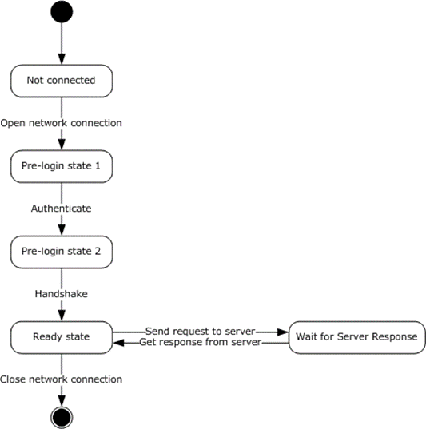

<html dir="LTR" xmlns:mshelp="http://msdn.microsoft.com/mshelp" xmlns:ddue="http://ddue.schemas.microsoft.com/authoring/2003/5" xmlns:xlink="http://www.w3.org/1999/xlink" xmlns:tool="http://www.microsoft.com/tooltip">
    <head>
        <meta http-equiv="Content-Type" content="text/html; CHARSET=utf-8"></meta>
        <meta name="save" content="history"></meta>
        <title>3.1.3 Initialization</title>
        <xml>
            <mshelp:toctitle title="3.1.3 Initialization"></mshelp:toctitle>
            <mshelp:rltitle title="[MS-SSAS8]: Initialization"></mshelp:rltitle>
            <mshelp:keyword index="A" term="ee71829d-94af-40f5-bb94-28853b01af4c"></mshelp:keyword>
            <mshelp:attr name="DCSext.ContentType" value="open specification"></mshelp:attr>
            <mshelp:attr name="AssetID" value="ee71829d-94af-40f5-bb94-28853b01af4c"></mshelp:attr>
            <mshelp:attr name="TopicType" value="kbRef"></mshelp:attr>
            <mshelp:attr name="DCSext.Title" value="[MS-SSAS8]: Initialization" />
        </xml>
    </head>
    <body>
        

            <h1 class="heading">3.1.3 Initialization</h1>
        

        

            

                

                

                    

Initialization of the protocol occurs as the result of a
higher layer on the client asking for connection to the server. The connection
establishes a session on the server, with state being associated with the
session. The state contains security information, which is used to decide what
information is allowed to be sent to the client.

<b>Figure 4: Client connection state diagram (client
perspective)</b>

The state machine for clients is depicted in figure 1 above.
Note that error handling and timeout logic are not illustrated. Errors or
timeout during the login phase MUST be propagated to the higher level caller
and MUST close the network connection.

A network connection MUST be established. From the Ready
state, the client can send any request message to the server. To reach the
ready state, the client MUST first make several requests in the sequence shown
in figure 2 below. Note that Authenticate and Handshake actually require
several network request/response message pairs, as described in section <a href="8d2c5acb-eb98-477b-9fe2-c934b19fb018.html">2</a>.

The Connect Timeout value is used as a network timeout value
for each send and receive operation during the login sequence.

<table>
 <thead>
  <tr>
   <th>
   
MUST Request to Authenticate

   </th>
  </tr>
 </thead>
 <tr>
  <td>
  
MUST Request to Handshake

  </td>
 </tr>
 <tr>
  <td>
  
SHOULD Request to Get Database Collection

  </td>
 </tr>
</table>

The client network connection is done in a loop using the
following pseudocode:

<dl>
<dd>

<pre> Set network timeout to user-specified ConnectTimeout
 Repeat
 Try to open network connection
 Until ( time spent in loop &gt; 100 milliseconds || status == WSAECONNREFUSED || status == WSAECONNRESET || status == WSAETIMEDOUT )
</pre>

</dd></dl>

Note that when using TCP, an implementation MAY<a href="05c9e5c4-4566-418c-a56e-69fca8d73f4b.html#Appendix_A_12" aria-label="Product behavior note 12">&lt;12&gt;</a> set TCP_NODELAY and the receive
buffer size, but this is an implementation decision and not part of the
protocol. 

                

            

        

    </body>
</html>