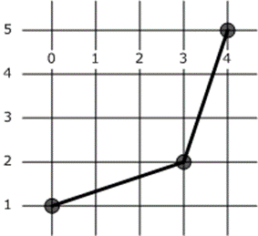

<html dir="LTR" xmlns:mshelp="http://msdn.microsoft.com/mshelp" xmlns:ddue="http://ddue.schemas.microsoft.com/authoring/2003/5" xmlns:xlink="http://www.w3.org/1999/xlink" xmlns:tool="http://www.microsoft.com/tooltip">
    <head>
        <meta http-equiv="Content-Type" content="text/html; CHARSET=utf-8"></meta>
        <meta name="save" content="history"></meta>
        <title>3.1.3 Linestring Structure</title>
        <xml>
            <mshelp:toctitle title="3.1.3 Linestring Structure"></mshelp:toctitle>
            <mshelp:rltitle title="[MS-SSCLRT]: Linestring Structure"></mshelp:rltitle>
            <mshelp:keyword index="A" term="315c6b83-5ec8-42a4-aeea-8585e9a4b35a"></mshelp:keyword>
            <mshelp:attr name="DCSext.ContentType" value="open specification"></mshelp:attr>
            <mshelp:attr name="AssetID" value="315c6b83-5ec8-42a4-aeea-8585e9a4b35a"></mshelp:attr>
            <mshelp:attr name="TopicType" value="kbRef"></mshelp:attr>
            <mshelp:attr name="DCSext.Title" value="[MS-SSCLRT]: Linestring Structure" />
        </xml>
    </head>
    <body>
        

            <h1 class="heading">3.1.3 Linestring Structure</h1>
        

        

            

                

                

                    

LINESTRING is an ordered series of connected points.
LINESTRING (0 1 1, 3 2 2, 4 5 NULL) contains a Z value for each point location,
with the last Z value being NULL. The following figure represents the x and y
coordinates only for a geometry type.

<b>Figure 2: A geometry linestring</b>

LINESTRING (0 1 1, 3 2 2, 4 5 NULL) is represented by the
following binary string:

0xE6100000 01 05 03000000 0000000000000000 000000000000F03F
0000000000000840 0000000000000040 0000000000001040 0000000000001440
000000000000F03F 0000000000000040 000000000000F8FF 01000000 01 00000000
01000000 FFFFFFFF 00000000 02

This string is interpreted as shown in the following table.

<table>
 <thead>
  <tr>
   <th>
   
Binary value

   </th>
   <th>
   
Description

   </th>
  </tr>
 </thead>
 <tr>
  <td>
  
E6100000

  </td>
  <td>
  
SRID = 4326

  </td>
 </tr>
 <tr>
  <td>
  
01

  </td>
  <td>
  
Version = 1

  </td>
 </tr>
 <tr>
  <td>
  
05

  </td>
  <td>
  
Serialization Properties = V + Z (geometry is valid,
  has Z values)

  </td>
 </tr>
 <tr>
  <td>
  
03000000

  </td>
  <td>
  
Number of Points = 3

  </td>
 </tr>
 <tr>
  <td>
  
0000000000000000

  </td>
  <td>
  
1st point X = 0

  </td>
 </tr>
 <tr>
  <td>
  
000000000000F03F

  </td>
  <td>
  
1st point Y = 1

  </td>
 </tr>
 <tr>
  <td>
  
0000000000000840

  </td>
  <td>
  
2nd point X = 3

  </td>
 </tr>
 <tr>
  <td>
  
0000000000000040

  </td>
  <td>
  
2nd point Y = 2

  </td>
 </tr>
 <tr>
  <td>
  
0000000000001040

  </td>
  <td>
  
3rd point X = 4

  </td>
 </tr>
 <tr>
  <td>
  
0000000000001440

  </td>
  <td>
  
3rd point Y = 5

  </td>
 </tr>
 <tr>
  <td>
  
000000000000F03F

  </td>
  <td>
  
1st point Z = 1

  </td>
 </tr>
 <tr>
  <td>
  
0000000000000040

  </td>
  <td>
  
2nd point Z= 2

  </td>
 </tr>
 <tr>
  <td>
  
000000000000F8FF

  </td>
  <td>
  
3rd point Z = QNaN

  </td>
 </tr>
 <tr>
  <td>
  
01000000

  </td>
  <td>
  
Number of Figures = 1

  </td>
 </tr>
 <tr>
  <td>
  
01

  </td>
  <td>
  
1st Figure Attribute = 1 (stroke)

  </td>
 </tr>
 <tr>
  <td>
  
00000000

  </td>
  <td>
  
1st Figure Point Offset = 0 (figure starts with 1st
  point)

  </td>
 </tr>
 <tr>
  <td>
  
01000000

  </td>
  <td>
  
Number of Shapes = 1

  </td>
 </tr>
 <tr>
  <td>
  
FFFFFFFF

  </td>
  <td>
  
1st Shape Parent Offset = -1 (no parent)

  </td>
 </tr>
 <tr>
  <td>
  
00000000

  </td>
  <td>
  
1st Shape Figure Offset = 0 (shape starts with 1st
  figure)

  </td>
 </tr>
 <tr>
  <td>
  
02

  </td>
  <td>
  
1st Shape OpenGIS Type = 2 (linestring)

  </td>
 </tr>
</table>

 

                

            

        

    </body>
</html>