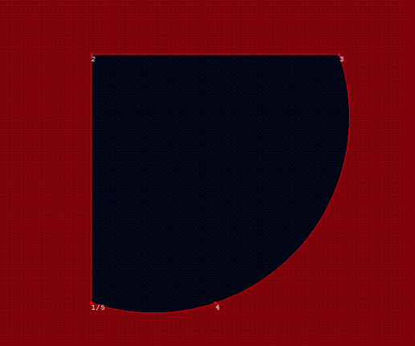

<html dir="LTR" xmlns:mshelp="http://msdn.microsoft.com/mshelp" xmlns:ddue="http://ddue.schemas.microsoft.com/authoring/2003/5" xmlns:xlink="http://www.w3.org/1999/xlink" xmlns:tool="http://www.microsoft.com/tooltip">
    <head>
        <meta http-equiv="Content-Type" content="text/html; CHARSET=utf-8"></meta>
        <meta name="save" content="history"></meta>
        <title>3.1.5 Object Serialized in Version 2</title>
        <xml>
            <mshelp:toctitle title="3.1.5 Object Serialized in Version 2"></mshelp:toctitle>
            <mshelp:rltitle title="[MS-SSCLRT]: Object Serialized in Version 2"></mshelp:rltitle>
            <mshelp:keyword index="A" term="39434040-43ab-45e8-b822-73d3e995a8ab"></mshelp:keyword>
            <mshelp:attr name="DCSext.ContentType" value="open specification"></mshelp:attr>
            <mshelp:attr name="AssetID" value="39434040-43ab-45e8-b822-73d3e995a8ab"></mshelp:attr>
            <mshelp:attr name="TopicType" value="kbRef"></mshelp:attr>
            <mshelp:attr name="DCSext.Title" value="[MS-SSCLRT]: Object Serialized in Version 2" />
        </xml>
    </head>
    <body>
        

            <h1 class="heading">3.1.5 Object Serialized in Version 2</h1>
        

        

            

                

                

                    

In version 2 of the serialization format, this CURVEPOLYGON
instance is a surface whose boundary is a curve. In this example, the curve is
COMPOUNDCURVE.

<b>Figure 4: A curve polygon hole</b>

CURVEPOLYGON(COMPOUNDCURVE((0 0, 0 2, 2 2), CIRCULARSTRING
(2 2, 1 0, 0 0))) is represented by the following binary string:

<dl>
<dd>

<pre> E6100000 02 24 05000000
 0000000000000000 0000000000000000 0000000000000040 0000000000000000 0000000000000040 0000000000000040 0000000000000000 000000000000F03F 0000000000000000 0000000000000000 
 01000000 03 00000000
 01000000 FFFFFFFF 00000000 0A
 03000000 02 00 03
</pre>

</dd></dl>

This string is interpreted as shown in the following table.

<table>
 <thead>
  <tr>
   <th>
   
Binary value

   </th>
   <th>
   
Description

   </th>
  </tr>
 </thead>
 <tr>
  <td>
  
E6100000

  </td>
  <td>
  
SRID = 4326

  </td>
 </tr>
 <tr>
  <td>
  
02

  </td>
  <td>
  
Version = 2

  </td>
 </tr>
 <tr>
  <td>
  
24

  </td>
  <td>
  
Serialization Properties = VH (geography which is
  valid and larger than a hemisphere)

  </td>
 </tr>
 <tr>
  <td>
  
05000000

  </td>
  <td>
  
Number of Points = 5

  </td>
 </tr>
 <tr>
  <td>
  
0000000000000000

  </td>
  <td>
  
1st point latitude = 0

  </td>
 </tr>
 <tr>
  <td>
  
0000000000000000

  </td>
  <td>
  
1st point longitude = 0

  </td>
 </tr>
 <tr>
  <td>
  
0000000000000040

  </td>
  <td>
  
2nd point latitude = 2

  </td>
 </tr>
 <tr>
  <td>
  
0000000000000000

  </td>
  <td>
  
2nd point longitude = 0

  </td>
 </tr>
 <tr>
  <td>
  
0000000000000040

  </td>
  <td>
  
3rd point latitude = 2

  </td>
 </tr>
 <tr>
  <td>
  
0000000000000040

  </td>
  <td>
  
3rd point longitude = 2

  </td>
 </tr>
 <tr>
  <td>
  
0000000000000000

  </td>
  <td>
  
4th point latitude = 0

  </td>
 </tr>
 <tr>
  <td>
  
000000000000F03F

  </td>
  <td>
  
4th point longitude = 1

  </td>
 </tr>
 <tr>
  <td>
  
0000000000000000

  </td>
  <td>
  
5th point latitude = 0

  </td>
 </tr>
 <tr>
  <td>
  
0000000000000000

  </td>
  <td>
  
5th point longitude = 0

  </td>
 </tr>
 <tr>
  <td>
  
01000000

  </td>
  <td>
  
Number of Figures = 1

  </td>
 </tr>
 <tr>
  <td>
  
03

  </td>
  <td>
  
1st Figure Attribute = 3 (compound curve)

  </td>
 </tr>
 <tr>
  <td>
  
00000000

  </td>
  <td>
  
1st Figure Point Offset = 0 (figure starts with 1st
  point)

  </td>
 </tr>
 <tr>
  <td>
  
01000000

  </td>
  <td>
  
Number of Shapes = 1

  </td>
 </tr>
 <tr>
  <td>
  
FFFFFFFF

  </td>
  <td>
  
1st Shape Parent Offset = -1 (no parent)

  </td>
 </tr>
 <tr>
  <td>
  
00000000

  </td>
  <td>
  
1st Shape Figure Offset = 0 (shape starts with 1st
  figure)

  </td>
 </tr>
 <tr>
  <td>
  
0A

  </td>
  <td>
  
1st Shape OpenGIS Type = 10 (CurvePolygon)

  </td>
 </tr>
 <tr>
  <td>
  
03000000

  </td>
  <td>
  
Number of Segments = 3

  </td>
 </tr>
 <tr>
  <td>
  
02

  </td>
  <td>
  
1st Segment Segment Type = 2 (First Line)

  </td>
 </tr>
 <tr>
  <td>
  
00

  </td>
  <td>
  
2nd Segment Segment Type = 0 (Line)

  </td>
 </tr>
 <tr>
  <td>
  
03

  </td>
  <td>
  
3rd Segment Segment Type = 3 (First Arc)

  </td>
 </tr>
</table>

 

                

            

        

    </body>
</html>