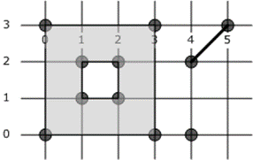

<html dir="LTR" xmlns:mshelp="http://msdn.microsoft.com/mshelp" xmlns:ddue="http://ddue.schemas.microsoft.com/authoring/2003/5" xmlns:xlink="http://www.w3.org/1999/xlink" xmlns:tool="http://www.microsoft.com/tooltip">
    <head>
        <meta http-equiv="Content-Type" content="text/html; CHARSET=utf-8"></meta>
        <meta name="save" content="history"></meta>
        <title>3.1.4 Geometry Collection Structure</title>
        <xml>
            <mshelp:toctitle title="3.1.4 Geometry Collection Structure"></mshelp:toctitle>
            <mshelp:rltitle title="[MS-SSCLRT]: Geometry Collection Structure"></mshelp:rltitle>
            <mshelp:keyword index="A" term="3faa3a6a-c744-4760-b47e-71658e7f4334"></mshelp:keyword>
            <mshelp:attr name="DCSext.ContentType" value="open specification"></mshelp:attr>
            <mshelp:attr name="AssetID" value="3faa3a6a-c744-4760-b47e-71658e7f4334"></mshelp:attr>
            <mshelp:attr name="TopicType" value="kbRef"></mshelp:attr>
            <mshelp:attr name="DCSext.Title" value="[MS-SSCLRT]: Geometry Collection Structure" />
        </xml>
    </head>
    <body>
        

            <h1 class="heading">3.1.4 Geometry Collection Structure</h1>
        

        

            

                

                

                    

GEOMETRYCOLLECTION is a heterogeneous collection of simple
features. The following figure shows a geography containing a single point, a
single linestring, and a polygon with an interior ring (hole).

<b>Figure 3: A geometry collection containing a point, a
linestring, and a polygon with a hole</b>

GEOMETRYCOLLECTION (POINT (4 0), LINESTRING (4 2, 5 3),
POLYGON ((0 0, 3 0, 3 3, 0 3, 0 0), (1 1, 1 2, 2 2, 2 1, 1 1))) is represented
by the following binary string:           

<dl>
<dd>

<pre> 0xE6100000 01 04 0D000000
 0000000000000000 0000000000001040 0000000000000040 0000000000001040 0000000000000840 0000000000001440 0000000000000000 0000000000000000 0000000000000000 0000000000000840 0000000000000840 0000000000000840 0000000000000840 0000000000000000 0000000000000000 0000000000000000 000000000000F03F 000000000000F03F 0000000000000040 000000000000F03F 0000000000000040 0000000000000040 000000000000F03F 0000000000000040 000000000000F03F 000000000000F03F
 04000000 01 00000000 01 01000000 02 03000000 00 08000000
 04000000 FFFFFFFF 00000000 07 00000000 00000000 01 00000000 01000000 02 
 00000000 02000000 03
</pre>

</dd></dl>

This string is interpreted as shown in the following table.

<table>
 <thead>
  <tr>
   <th>
   
Binary value

   </th>
   <th>
   
Description

   </th>
  </tr>
 </thead>
 <tr>
  <td>
  
E6100000

  </td>
  <td>
  
SRID = 4326

  </td>
 </tr>
 <tr>
  <td>
  
01

  </td>
  <td>
  
Version = 1

  </td>
 </tr>
 <tr>
  <td>
  
04

  </td>
  <td>
  
Serialization Properties = V (geography is valid)

  </td>
 </tr>
 <tr>
  <td>
  
0D000000

  </td>
  <td>
  
Number of Points = 13

  </td>
 </tr>
 <tr>
  <td>
  
0000000000000000

  </td>
  <td>
  
1st point latitude = 0

  </td>
 </tr>
 <tr>
  <td>
  
0000000000001040

  </td>
  <td>
  
1st point longitude = 4

  </td>
 </tr>
 <tr>
  <td>
  
0000000000000040

  </td>
  <td>
  
2nd point latitude = 2

  </td>
 </tr>
 <tr>
  <td>
  
0000000000001040

  </td>
  <td>
  
2nd point longitude = 4

  </td>
 </tr>
 <tr>
  <td>
  
0000000000000840

  </td>
  <td>
  
3rd point latitude = 3

  </td>
 </tr>
 <tr>
  <td>
  
0000000000001440

  </td>
  <td>
  
3rd point longitude = 5

  </td>
 </tr>
 <tr>
  <td>
  
0000000000000000

  </td>
  <td>
  
4th point latitude = 0

  </td>
 </tr>
 <tr>
  <td>
  
0000000000000000

  </td>
  <td>
  
4th point longitude = 0

  </td>
 </tr>
 <tr>
  <td>
  
0000000000000000

  </td>
  <td>
  
5th point latitude = 0

  </td>
 </tr>
 <tr>
  <td>
  
0000000000000840

  </td>
  <td>
  
5th point longitude = 3

  </td>
 </tr>
 <tr>
  <td>
  
0000000000000840

  </td>
  <td>
  
6th point latitude = 3

  </td>
 </tr>
 <tr>
  <td>
  
0000000000000840

  </td>
  <td>
  
6th point longitude = 3

  </td>
 </tr>
 <tr>
  <td>
  
0000000000000840

  </td>
  <td>
  
7th point latitude = 3

  </td>
 </tr>
 <tr>
  <td>
  
0000000000000000

  </td>
  <td>
  
7th point longitude = 0

  </td>
 </tr>
 <tr>
  <td>
  
0000000000000000

  </td>
  <td>
  
8th point latitude = 0

  </td>
 </tr>
 <tr>
  <td>
  
0000000000000000

  </td>
  <td>
  
8th point longitude = 0

  </td>
 </tr>
 <tr>
  <td>
  
000000000000F03F

  </td>
  <td>
  
9th point latitude = 1

  </td>
 </tr>
 <tr>
  <td>
  
000000000000F03F

  </td>
  <td>
  
9th point longitude = 1

  </td>
 </tr>
 <tr>
  <td>
  
0000000000000040

  </td>
  <td>
  
10th point latitude = 2

  </td>
 </tr>
 <tr>
  <td>
  
000000000000F03F

  </td>
  <td>
  
10th point longitude = 1

  </td>
 </tr>
 <tr>
  <td>
  
0000000000000040

  </td>
  <td>
  
11th point latitude = 2

  </td>
 </tr>
 <tr>
  <td>
  
0000000000000040

  </td>
  <td>
  
11th point longitude = 2

  </td>
 </tr>
 <tr>
  <td>
  
000000000000F03F

  </td>
  <td>
  
12th point latitude = 1

  </td>
 </tr>
 <tr>
  <td>
  
0000000000000040

  </td>
  <td>
  
12th point longitude = 2

  </td>
 </tr>
 <tr>
  <td>
  
000000000000F03F

  </td>
  <td>
  
13th point latitude = 1

  </td>
 </tr>
 <tr>
  <td>
  
000000000000F03F

  </td>
  <td>
  
13th point longitude = 1

  </td>
 </tr>
 <tr>
  <td>
  
04000000

  </td>
  <td>
  
Number of Figures = 4

  </td>
 </tr>
 <tr>
  <td>
  
01

  </td>
  <td>
  
1st Figure Attribute = 1 (stroke)

  </td>
 </tr>
 <tr>
  <td>
  
00000000

  </td>
  <td>
  
1st Figure Point Offset = 0 (figure starts with 1st
  point)

  </td>
 </tr>
 <tr>
  <td>
  
01

  </td>
  <td>
  
2nd Figure Attribute = 1 (stroke)

  </td>
 </tr>
 <tr>
  <td>
  
01000000

  </td>
  <td>
  
2nd Figure Point Offset = 1 (figure starts with 2nd
  point)

  </td>
 </tr>
 <tr>
  <td>
  
02

  </td>
  <td>
  
3rd Figure Attribute = 2 (exterior polygon ring)

  </td>
 </tr>
 <tr>
  <td>
  
03000000

  </td>
  <td>
  
3rd Figure Point Offset = 3 (figure starts with 4th
  point)

  </td>
 </tr>
 <tr>
  <td>
  
00

  </td>
  <td>
  
4th Figure Attribute = 0 (interior polygon ring)

  </td>
 </tr>
 <tr>
  <td>
  
08000000

  </td>
  <td>
  
4th Figure Point Offset = 8 (figure starts with 9th
  point)

  </td>
 </tr>
 <tr>
  <td>
  
04000000

  </td>
  <td>
  
Number of Shapes = 4

  </td>
 </tr>
 <tr>
  <td>
  
FFFFFFFF

  </td>
  <td>
  
1st Shape Parent Offset = -1 (no parent)

  </td>
 </tr>
 <tr>
  <td>
  
00000000

  </td>
  <td>
  
1st Shape Figure Offset = 0 (shape starts with 1st
  figure)

  </td>
 </tr>
 <tr>
  <td>
  
07

  </td>
  <td>
  
1st Shape OpenGIS Type = 7 (GeometryCollection)

  </td>
 </tr>
 <tr>
  <td>
  
00000000

  </td>
  <td>
  
2nd Shape Parent Offset = 0 (parent shape is 1st
  shape)

  </td>
 </tr>
 <tr>
  <td>
  
00000000

  </td>
  <td>
  
2nd Shape Figure Offset = 0 (shape starts with 1st
  figure)

  </td>
 </tr>
 <tr>
  <td>
  
01

  </td>
  <td>
  
2nd Shape OpenGIS Type = 1 (Point)

  </td>
 </tr>
 <tr>
  <td>
  
00000000

  </td>
  <td>
  
3rd Shape Parent Offset = 0 (parent shape is 1st
  shape)

  </td>
 </tr>
 <tr>
  <td>
  
01000000

  </td>
  <td>
  
3rd Shape Figure Offset = 1 (shape starts with 2nd
  figure)

  </td>
 </tr>
 <tr>
  <td>
  
02

  </td>
  <td>
  
3rd Shape OpenGIS Type = 2 (LineString)

  </td>
 </tr>
 <tr>
  <td>
  
00000000

  </td>
  <td>
  
4th Shape Parent Offset = 0 (parent shape is 1st
  shape)

  </td>
 </tr>
 <tr>
  <td>
  
02000000

  </td>
  <td>
  
4th Shape Figure Offset = 2 (shape starts with 3rd
  figure)

  </td>
 </tr>
 <tr>
  <td>
  
03

  </td>
  <td>
  
4th Shape OpenGIS Type = 3 (Polygon)

  </td>
 </tr>
</table>

 

                

            

        

    </body>
</html>