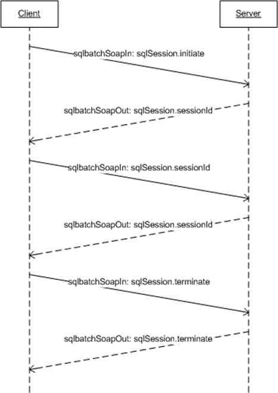

<html dir="LTR" xmlns:mshelp="http://msdn.microsoft.com/mshelp" xmlns:ddue="http://ddue.schemas.microsoft.com/authoring/2003/5" xmlns:xlink="http://www.w3.org/1999/xlink" xmlns:tool="http://www.microsoft.com/tooltip">
    <head>
        <meta http-equiv="Content-Type" content="text/html; CHARSET=utf-8"></meta>
        <meta name="save" content="history"></meta>
        <title>3.1.4.2 Session-based sqlbatch</title>
        <xml>
            <mshelp:toctitle title="3.1.4.2 Session-based sqlbatch"></mshelp:toctitle>
            <mshelp:rltitle title="[MS-SSNWS]: Session-based sqlbatch"></mshelp:rltitle>
            <mshelp:keyword index="A" term="14cd6178-7e20-426f-9b80-c5973d5190ef"></mshelp:keyword>
            <mshelp:attr name="DCSext.ContentType" value="open specification"></mshelp:attr>
            <mshelp:attr name="AssetID" value="14cd6178-7e20-426f-9b80-c5973d5190ef"></mshelp:attr>
            <mshelp:attr name="TopicType" value="kbRef"></mshelp:attr>
            <mshelp:attr name="DCSext.Title" value="[MS-SSNWS]: Session-based sqlbatch" />
        </xml>
    </head>
    <body>
        

            <h1 class="heading">3.1.4.2 Session-based sqlbatch</h1>
        

        

            

                

                

                    

<b>Figure 5: Session-based sqlbatch operation</b>

This section and its subsections describe the scenario in
which the client is establishing a session to enable subsequent <a href="4baedaec-b5a7-4176-be88-e1cec659ab8c.htm#gt_96185df3-4677-478c-b239-f72fcf514c59">SOAP messages</a> to
participate in the same SQL Server session environment. The sqlbatch
operation has an input message named <b>sqlbatchSoapIn</b> and an output
message named <b>sqlbatchSoapOut</b>, as shown in the following <a href="4baedaec-b5a7-4176-be88-e1cec659ab8c.htm#gt_5a824664-0858-4b09-b852-83baf4584efa">WSDL</a> snippet for this
operation.

<dl>
<dd>

<pre>  
 &lt;wsdl:operation name=&quot;sqlbatch&quot;&gt;
   &lt;wsdl:input message=&quot;tns:sqlbatchSoapIn&quot;/&gt;
   &lt;wsdl:output message=&quot;tns:sqlbatchSoapOut&quot;/&gt;
 &lt;/wsdl:operation&gt;
</pre>

</dd></dl>

As shown in this figure, the client MUST first send a <b>sqlbatchSoapIn</b>
message with the <b>sqlSession</b> <a href="4baedaec-b5a7-4176-be88-e1cec659ab8c.htm#gt_093a0af2-e71c-40fc-a484-d2f802da0277">SOAP header</a>, described in
section <a href="98c2837d-8678-494c-98c3-7ffa64695586.htm">2.2.2.1.2.10</a>, <b>Initiate</b>
attribute set to true. The server then creates a <a href="4baedaec-b5a7-4176-be88-e1cec659ab8c.htm#gt_17f801a6-987e-4c3e-a07c-d0acca5f3477">NWS object</a>, setting the
NWS.sessionId value to the <b>sqlSession.sessionId</b> attribute (if
specified), and setting the timeout value to the <b>sqlSession.timeout</b>
attribute. In the <b>sqlbatchSoapOut</b> response message, if no errors occur,
the server MUST set the <b>sqlSession</b> SOAP header, described in section <a href="0a3b49a0-3ad1-4256-a5df-66f397085504.htm">2.2.2.2.2.1</a>, <b>sessionId</b>
attribute to NWS.sessionId. The server SHOULD also set the <b>sqlSession.timeout</b>
attribute to NWS.timeout.

The client can then send additional <b>sqlbatchSoapIn</b>
messages with the same ID value for the <b>sqlSession.sessionId</b> attribute
so that each message is executed in the same server environment context of the
existing NWS object where the NWS.sessionId value is equal to the <b>sqlSession.sessionId</b>
attribute. When the client is done with the session, the client SHOULD send a <b>sqlbatchSoapIn</b>
message with the <b>sqlSession.sessionId</b> attribute set to the ID value and
the <b>sqlSession.terminate</b> attribute set to true. This allows the server
to release any resources held by the session, such as the associated NWS
object, without the need to wait until the timeout expires. If no errors occur,
the server MUST send a <b>sqlbatchSoapOut</b> response message with the <b>sqlSession.terminate</b>
attribute set to true and the <b>sqlSession.sessionId</b> attribute set to the
value of the ID.

At any time throughout the various SOAP message exchanges,
if there are any parsing errors, then the server returns a <a href="4baedaec-b5a7-4176-be88-e1cec659ab8c.htm#gt_ec8728a8-1a75-426f-8767-aa1932c7c19f">SOAP fault</a> message and
closes the connection.

                

            

        

    </body>
</html>