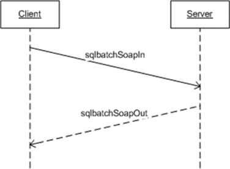

<html dir="LTR" xmlns:mshelp="http://msdn.microsoft.com/mshelp" xmlns:ddue="http://ddue.schemas.microsoft.com/authoring/2003/5" xmlns:xlink="http://www.w3.org/1999/xlink" xmlns:tool="http://www.microsoft.com/tooltip">
    <head>
        <meta http-equiv="Content-Type" content="text/html; CHARSET=utf-8"></meta>
        <meta name="save" content="history"></meta>
        <title>3.1.4.1 Single sqlbatch</title>
        <xml>
            <mshelp:toctitle title="3.1.4.1 Single sqlbatch"></mshelp:toctitle>
            <mshelp:rltitle title="[MS-SSNWS]: Single sqlbatch"></mshelp:rltitle>
            <mshelp:keyword index="A" term="26804fd8-f813-4b33-be8a-ccdc32648582"></mshelp:keyword>
            <mshelp:attr name="DCSext.ContentType" value="open specification"></mshelp:attr>
            <mshelp:attr name="AssetID" value="26804fd8-f813-4b33-be8a-ccdc32648582"></mshelp:attr>
            <mshelp:attr name="TopicType" value="kbRef"></mshelp:attr>
            <mshelp:attr name="DCSext.Title" value="[MS-SSNWS]: Single sqlbatch" />
        </xml>
    </head>
    <body>
        

            <h1 class="heading">3.1.4.1 Single sqlbatch</h1>
        

        

            

                

                

                    

<b>Figure 4: Single sqlbatch operation</b>

This section and its subsections describe the scenario in
which the client sends one-off sqlbatch requests to the server. The sqlbatch
operation has an input message named <b>sqlbatchSoapIn</b> and an output
message named <b>sqlbatchSoapOut</b>, as shown in the following <a href="4baedaec-b5a7-4176-be88-e1cec659ab8c.html#gt_5a824664-0858-4b09-b852-83baf4584efa">WSDL</a> snippet for this
operation.

<dl>
<dd>

<pre> &lt;wsdl:operation name=&quot;sqlbatch&quot;&gt;
   &lt;wsdl:input message=&quot;tns:sqlbatchSoapIn&quot;/&gt;
   &lt;wsdl:output message=&quot;tns:sqlbatchSoapOut&quot;/&gt;
 &lt;/wsdl:operation&gt;
</pre>

</dd></dl>

As shown in this figure, only one <a href="4baedaec-b5a7-4176-be88-e1cec659ab8c.html#gt_96185df3-4677-478c-b239-f72fcf514c59">SOAP message</a> sequence is
required to execute a SQL Server query statement. At any time throughout
the entire SOAP message parsing process, if there are any parsing errors, the
server returns a <a href="4baedaec-b5a7-4176-be88-e1cec659ab8c.html#gt_ec8728a8-1a75-426f-8767-aa1932c7c19f">SOAP fault</a>
message and closes the connection.

                

            

        

    </body>
</html>