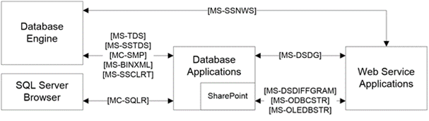

<html dir="LTR" xmlns:mshelp="http://msdn.microsoft.com/mshelp" xmlns:ddue="http://ddue.schemas.microsoft.com/authoring/2003/5" xmlns:xlink="http://www.w3.org/1999/xlink" xmlns:tool="http://www.microsoft.com/tooltip">
    <head>
        <meta http-equiv="Content-Type" content="text/html; CHARSET=utf-8"></meta>
        <meta name="save" content="history"></meta>
        <title>2.1.1 Network Connectivity and Application Development</title>
        <xml>
            <mshelp:toctitle title="2.1.1 Network Connectivity and Application Development"></mshelp:toctitle>
            <mshelp:rltitle title="[MS-SSSO]: Network Connectivity and Application Development"></mshelp:rltitle>
            <mshelp:keyword index="A" term="5a04be42-3dc8-4041-b79e-f7545aadedaf"></mshelp:keyword>
            <mshelp:attr name="DCSext.ContentType" value="open specification"></mshelp:attr>
            <mshelp:attr name="AssetID" value="5a04be42-3dc8-4041-b79e-f7545aadedaf"></mshelp:attr>
            <mshelp:attr name="TopicType" value="kbRef"></mshelp:attr>
            <mshelp:attr name="DCSext.Title" value="[MS-SSSO]: Network Connectivity and Application Development" />
        </xml>
    </head>
    <body>
        

            <h1 class="heading">2.1.1 Network Connectivity and Application Development</h1>
        

        

            

                

                

                    

Network connectivity and application development include
protocols and formats that are used for communication between the SQL Server
Browser, the application, and the Database Engine, as shown in the following
figure. For more information about the Database Engine, see section <a href="cebb1dbf-9d7c-4732-bcbf-62ee147c41da.html">2.1.5</a>.

The Native Web Services protocol <mshelp:link keywords="de41906d-ae82-406b-8ad6-2504bf966536" tabindex="0">[MS-SSNWS]</mshelp:link>
is used to transfer Transact-SQL requests and responses between <a href="20049766-3c6e-4f20-a20e-64785e88f6f2.html#gt_a96bfb18-c329-40f5-89fd-df7a94b89882">web service</a> client
applications and the Database Engine.

The protocols that are used between database applications
and the Database Engine are the Session Multiplex Protocol <mshelp:link keywords="04c8edde-371d-4af5-bb33-a39b3948f0af" tabindex="0">[MC-SMP]</mshelp:link>,
which is used to multiplex database communication <a href="20049766-3c6e-4f20-a20e-64785e88f6f2.html#gt_0cd96b80-a737-4f06-bca4-cf9efb449d12">sessions</a> over a single
reliable transport connection, and the Tabular Data Stream (TDS) protocol,
which is specified in <mshelp:link keywords="b46a581a-39de-4745-b076-ec4dbb7d13ec" tabindex="0">[MS-TDS]</mshelp:link>
and <mshelp:link keywords="dab36a48-6c13-44c7-954a-0f5c8623590d" tabindex="0">[MS-SSTDS]</mshelp:link>
and is used to transfer Transact-SQL requests and responses between clients and
database products.

The Tabular Data Stream (TDS) protocol also uses the binary
XML structure <mshelp:link keywords="11ab6e8d-2472-44d1-a9e6-bddf000e12f6" tabindex="0">[MS-BINXML]</mshelp:link>,
the OLE DB <a href="20049766-3c6e-4f20-a20e-64785e88f6f2.html#gt_03a9d0ca-2f10-4f3d-b910-052714a96f7d">connection string</a>
structure <mshelp:link keywords="774039da-09c1-4b24-b53b-8f9ae019830c" tabindex="0">[MS-OLEDBSTR]</mshelp:link>,
the <a href="20049766-3c6e-4f20-a20e-64785e88f6f2.html#gt_7883fa02-8dc0-4154-894f-fe3a7bff153e">Open Database
Connectivity (ODBC)</a> connection string structure <mshelp:link keywords="13b4e848-b36c-4b11-acce-d6bf199d5391" tabindex="0">[MS-ODBCSTR]</mshelp:link>,
and the system-provided and user-defined SQL Server CLR types <mshelp:link keywords="77460aa9-8c2f-4449-a65e-1d649ebd77fa" tabindex="0">[MS-SSCLRT]</mshelp:link>.

The SQL Server Browser uses the SQL Server Resolution
Protocol <mshelp:link keywords="1ea6e25f-bff9-4364-ba21-5dc449a601b7" tabindex="0">[MC-SQLR]</mshelp:link>
to resolve the name of a named database server instance and to enumerate
available database server instances. 

The Microsoft ADO.NET <b>DataSet</b> <b>DiffGram</b>
structure specification <mshelp:link keywords="a0102bae-8980-4c2a-9edf-56f215b08308" tabindex="0">[MS-DSDG]</mshelp:link>
describes how a <b>DataSet</b>, a component in the .NET Framework, serializes
schema and data for transmission over a network. The Microsoft SharePoint <b>DataSet</b>
<b>DiffGram</b> structure <mshelp:link keywords="021e1033-8322-486d-a4de-56075686a09e" tabindex="0">[MS-DSDIFFGRAM]</mshelp:link>
is used to represent the results of a SharePoint Search service web service
call; the <b>DiffGram</b> structure is useful for serializing schema and data
for transmission over a network or for storage on disk. Note that the <b>DiffGram</b>
specification that is used by the SharePoint Search service is a subset of the
full <b>DiffGram</b> structure that is used by the ADO.NET <b>DataSet</b>.

<b>Figure 2: Network connectivity and application development
architecture</b>

                

            

        

    </body>
</html>