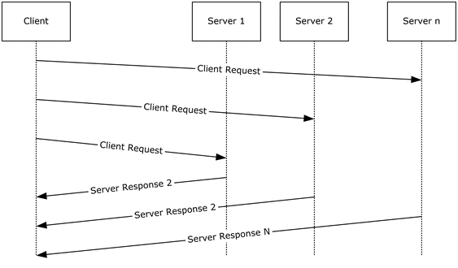

<html dir="LTR" xmlns:mshelp="http://msdn.microsoft.com/mshelp" xmlns:ddue="http://ddue.schemas.microsoft.com/authoring/2003/5" xmlns:xlink="http://www.w3.org/1999/xlink" xmlns:tool="http://www.microsoft.com/tooltip">
    <head>
        <meta http-equiv="Content-Type" content="text/html; CHARSET=utf-8"></meta>
        <meta name="save" content="history"></meta>
        <title>2.4.1.1 SQL Server Instance Discovery Use Case</title>
        <xml>
            <mshelp:toctitle title="2.4.1.1 SQL Server Instance Discovery Use Case"></mshelp:toctitle>
            <mshelp:rltitle title="[MS-SSSO]: SQL Server Instance Discovery Use Case"></mshelp:rltitle>
            <mshelp:keyword index="A" term="e63322c7-1e6f-481d-b09d-d3a47ea3cde1"></mshelp:keyword>
            <mshelp:attr name="DCSext.ContentType" value="open specification"></mshelp:attr>
            <mshelp:attr name="AssetID" value="e63322c7-1e6f-481d-b09d-d3a47ea3cde1"></mshelp:attr>
            <mshelp:attr name="TopicType" value="kbRef"></mshelp:attr>
            <mshelp:attr name="DCSext.Title" value="[MS-SSSO]: SQL Server Instance Discovery Use Case" />
        </xml>
    </head>
    <body>
        

            <h1 class="heading">2.4.1.1 SQL Server Instance Discovery Use Case</h1>
        

        

            

                

                

                    

This use case describes how an instance of Microsoft SQL
Server is discovered in the local network. The actors are the application and
the SQL Server Browser.

<b>Actions</b>

<ol><li>
    A database
application broadcasts an SSRP <mshelp:link keywords="1ea6e25f-bff9-4364-ba21-5dc449a601b7" tabindex="0">[MC-SQLR]</mshelp:link>
message (UDP packet). 

</li><li>
    Each SQL Server
Browser service that receives the message responds with the instances of SQL
Server (another UDP packet) on its computer. The database application now has a
list of instances of SQL Server to which it can connect.

</li></ol>

<b>Figure 11: SQL Server instance discovery use case</b>

                

            

        

    </body>
</html>