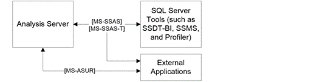

<html dir="LTR" xmlns:mshelp="http://msdn.microsoft.com/mshelp" xmlns:ddue="http://ddue.schemas.microsoft.com/authoring/2003/5" xmlns:xlink="http://www.w3.org/1999/xlink" xmlns:tool="http://www.microsoft.com/tooltip">
    <head>
        <meta http-equiv="Content-Type" content="text/html; CHARSET=utf-8"></meta>
        <meta name="save" content="history"></meta>
        <title>2.1.4 Analysis Services</title>
        <xml>
            <mshelp:toctitle title="2.1.4 Analysis Services"></mshelp:toctitle>
            <mshelp:rltitle title="[MS-SSSO]: Analysis Services"></mshelp:rltitle>
            <mshelp:keyword index="A" term="e8ec30a5-3c27-478b-9921-74e0d4d7f12b"></mshelp:keyword>
            <mshelp:attr name="DCSext.ContentType" value="open specification"></mshelp:attr>
            <mshelp:attr name="AssetID" value="e8ec30a5-3c27-478b-9921-74e0d4d7f12b"></mshelp:attr>
            <mshelp:attr name="TopicType" value="kbRef"></mshelp:attr>
            <mshelp:attr name="DCSext.Title" value="[MS-SSSO]: Analysis Services" />
        </xml>
    </head>
    <body>
        

            <h1 class="heading">2.1.4 Analysis Services</h1>
        

        

            

                

                

                    

SQL Server Analysis Services (SSAS) enables business
intelligence (BI) applications to perform complex and high performance
analytics on Multidimensional and Tabular data models. The data models can be
enriched with business logic by using Multidimensional Expressions (MDX) or
Data Analysis Expressions (DAX) calculations. Additionally, they can expose a
unified conceptual model that BI applications can query by using the MDX and
DAX languages. Data mining APIs enable the creation, management, and
exploration of data mining models. BI applications can run prediction queries
on these models by using the Data Mining Extensions (DMX) language.

The SQL Server Analysis Services <mshelp:link keywords="854a72f2-d637-4be3-b60f-6a44422e80c9" tabindex="0">[MS-SSAS]</mshelp:link>
and SQL Server Analysis Services Tabular <mshelp:link keywords="f85cd3b9-690c-4bc7-a1f0-a854d7daecd8" tabindex="0">[MS-SSAS-T]</mshelp:link>
protocols provide methods for a client to communicate with and perform
operations on an analysis server, as shown in the following figure. These
protocols are based on <a href="20049766-3c6e-4f20-a20e-64785e88f6f2.html#gt_c1c313af-2310-4380-a6ea-c2cedc115958">SOAP</a>
and XML for Analysis (XMLA) and use binary XML <mshelp:link keywords="11ab6e8d-2472-44d1-a9e6-bddf000e12f6" tabindex="0">[MS-BINXML]</mshelp:link>
and OLE DB connection string <mshelp:link keywords="774039da-09c1-4b24-b53b-8f9ae019830c" tabindex="0">[MS-OLEDBSTR]</mshelp:link>
formats. The SSAS protocols support TCP/IP as an underlying transport mechanism
in addition to HTTP/HTTPS.

The SSAS protocols define the <b>Authenticate</b>, <b>Discover</b>,
and <b>Execute</b> operations:

<ul><li>
 
<b>Authenticate</b> is used by the client and server to exchange
UTF-8 <a href="https://go.microsoft.com/fwlink/?LinkId=90331">[RFC2279]</a>
encoded security token data blocks as part of the authentication process. 

</li><li>
 
<b>Discover</b> is used to obtain information from an analysis
server, such as a list of catalogs on a server. Properties are used to control
what data is obtained. This generic interface and the use of properties allow
for extensibility without the need to rewrite existing functions. 

</li><li>
 
<b>Execute</b> is used to execute commands against a particular
analysis server, optionally returning a result set in either tabular or
multidimensional form.

</li></ul>
Additionally, by using the Analysis Services Usage Reporting
protocol <mshelp:link keywords="26b72b89-ed60-4991-b8cc-03f36f7c13be" tabindex="0">[MS-ASUR]</mshelp:link>,
external applications can load Analysis Services models from host servers and
then load them onto servers that are running Analysis Services. The host server
can then receive information from Analysis Services about how the models are
used and what machine resources these models use. This information helps
administrators of the host servers to optimize these models.

<b>Figure 6: Analysis Services architecture</b>

                

            

        

    </body>
</html>