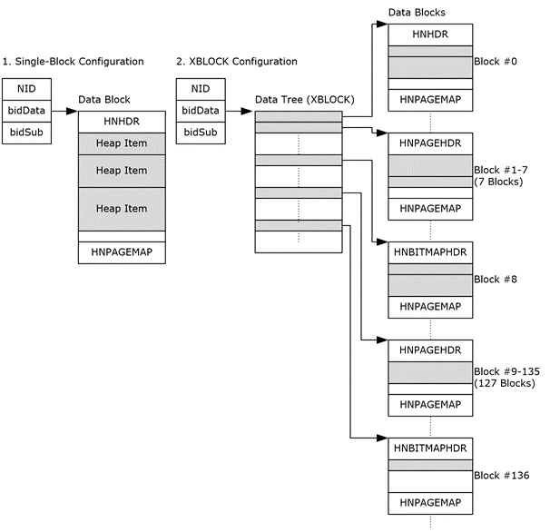

<html dir="LTR" xmlns:mshelp="http://msdn.microsoft.com/mshelp" xmlns:ddue="http://ddue.schemas.microsoft.com/authoring/2003/5" xmlns:xlink="http://www.w3.org/1999/xlink" xmlns:tool="http://www.microsoft.com/tooltip">
    <head>
        <meta http-equiv="Content-Type" content="text/html; CHARSET=utf-8"></meta>
        <meta name="save" content="history"></meta>
        <title>2.3.1.6 Anatomy of HN Data Blocks</title>
        <xml>
            <mshelp:toctitle title="2.3.1.6 Anatomy of HN Data Blocks"></mshelp:toctitle>
            <mshelp:rltitle title="[MS-PST]: Anatomy of HN Data Blocks"></mshelp:rltitle>
            <mshelp:keyword index="A" term="a3fa280c-eba3-434f-86e4-b95141b3c7b1"></mshelp:keyword>
            <mshelp:attr name="DCSext.ContentType" value="open specification"></mshelp:attr>
            <mshelp:attr name="AssetID" value="a3fa280c-eba3-434f-86e4-b95141b3c7b1"></mshelp:attr>
            <mshelp:attr name="TopicType" value="kbRef"></mshelp:attr>
            <mshelp:attr name="DCSext.Title" value="[MS-PST]: Anatomy of HN Data Blocks" />
        </xml>
    </head>
    <body>
        

            <h1 class="heading">2.3.1.6 Anatomy of HN Data Blocks</h1>
        

        

            

                

                

                    

The following diagram shows the organization of a <b>Heap</b>
node.

<b>Figure 4: Data organization of a Heap node</b>

This illustrates the data organization for an <b>HN</b> that
consists of a single data block, and an <b>HN</b> that consists of multiple
data blocks through the use of a data tree construct. Note than an <b>XXBLOCK</b>
can be used if the space required exceeds the capacity of an <b>XBLOCK</b>.

                

            

        

    </body>
</html>