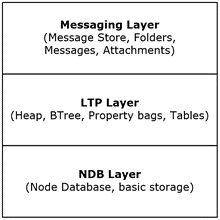

<html dir="LTR" xmlns:mshelp="http://msdn.microsoft.com/mshelp" xmlns:ddue="http://ddue.schemas.microsoft.com/authoring/2003/5" xmlns:xlink="http://www.w3.org/1999/xlink" xmlns:tool="http://www.microsoft.com/tooltip">
    <head>
        <meta http-equiv="Content-Type" content="text/html; CHARSET=utf-8"></meta>
        <meta name="save" content="history"></meta>
        <title>1.3.1 Logical Architecture of a PST File</title>
        <xml>
            <mshelp:toctitle title="1.3.1 Logical Architecture of a PST File"></mshelp:toctitle>
            <mshelp:rltitle title="[MS-PST]: Logical Architecture of a PST File"></mshelp:rltitle>
            <mshelp:keyword index="A" term="de4157d3-fc53-4aec-81be-d1659c8a2302"></mshelp:keyword>
            <mshelp:attr name="DCSext.ContentType" value="open specification"></mshelp:attr>
            <mshelp:attr name="AssetID" value="de4157d3-fc53-4aec-81be-d1659c8a2302"></mshelp:attr>
            <mshelp:attr name="TopicType" value="kbRef"></mshelp:attr>
            <mshelp:attr name="DCSext.Title" value="[MS-PST]: Logical Architecture of a PST File" />
        </xml>
    </head>
    <body>
        

            <h1 class="heading">1.3.1 Logical Architecture of a PST File</h1>
        

        

            

                

                

                    

The PST file structures are logically arranged in three
layers: the NDB (Node Database) layer, the LTP (Lists, Tables, and Properties)
layer, and the Messaging layer. The following diagram illustrates the logical
hierarchy of these layers, and what abstractions are handled by each layer.

<b>Figure 1: Logical layers of a PST file</b>

                

            

        

    </body>
</html>