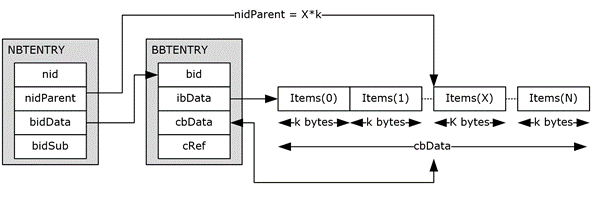

<html dir="LTR" xmlns:mshelp="http://msdn.microsoft.com/mshelp" xmlns:ddue="http://ddue.schemas.microsoft.com/authoring/2003/5" xmlns:xlink="http://www.w3.org/1999/xlink" xmlns:tool="http://www.microsoft.com/tooltip">
    <head>
        <meta http-equiv="Content-Type" content="text/html; CHARSET=utf-8"></meta>
        <meta name="save" content="history"></meta>
        <title>2.4.8.3 Basic Queue Node</title>
        <xml>
            <mshelp:toctitle title="2.4.8.3 Basic Queue Node"></mshelp:toctitle>
            <mshelp:rltitle title="[MS-PST]: Basic Queue Node"></mshelp:rltitle>
            <mshelp:keyword index="A" term="e08cffe6-faaf-4b16-af9b-e23ee96713c9"></mshelp:keyword>
            <mshelp:attr name="DCSext.ContentType" value="open specification"></mshelp:attr>
            <mshelp:attr name="AssetID" value="e08cffe6-faaf-4b16-af9b-e23ee96713c9"></mshelp:attr>
            <mshelp:attr name="TopicType" value="kbRef"></mshelp:attr>
            <mshelp:attr name="DCSext.Title" value="[MS-PST]: Basic Queue Node" />
        </xml>
    </head>
    <body>
        

            <h1 class="heading">2.4.8.3 Basic Queue Node</h1>
        

        

            

                

                

                    

A number of objects that are referenced in the remainder of
this section depend on a shared generic concept of a queue node. In the context
of Search, a queue is implemented as a node that contains an array of
fixed-size items. To maintain the FIFO properties of a queue, new items are
appended to the end of the array, and items are removed from the front of the
array.

However, the PST implementation of the queue object has a
special feature to optimize for speed of access by minimizing the amount of
data written. Specifically, when an item is removed from the queue, instead of
removing the item from the array and shifting remaining items forward, the <b>nidParent</b>
field of the queue node is overloaded to be used as a pointer to the
&quot;head&quot; of the queue. The following diagram illustrates how this
works.

<b>Figure 15: Basic queue structure</b>

Because a queue is a standalone entity and does not have the
concept of a &quot;parent&quot;, the <b>nidParent</b> field of the queue node
is re-purposed to be used as a byte offset pointer to the &quot;head&quot; of
the queue. Initially, <b>nidParent</b> points to 0 (that is, Item[0]), and new
items, each of size k bytes, are appended to the end of the array as shown.
When the first item is removed from the queue, the contents of Items[0] is
returned to the caller, and then the value of <b>nidParent</b> is updated to
point to the next item (that is, Items[1]). Note that <b>nidParent</b> stores
the byte offset of the &quot;head&quot; of the queue instead of an item index.
The number of items in the queue can be determined by dividing <b>cbData</b> by
k (that is, the size of each item). Implementations MUST NOT process the
contents of a queue if <b>cbData</b> is not an integer multiple of k.

As an implementation detail, when the last item of the queue
is removed (that is, NBTENTRY.<b>nidParent</b> == BBTENTRY.<b>cbData</b>), the
entire queue contents are deleted, and both <b>nidParent</b> and <b>cbData</b>
are reset to zero.

The same generic queue node concept is used throughout this
section, except that each type of queue has its own specific value for the size
of each item (that is, k).

                

            

        

    </body>
</html>