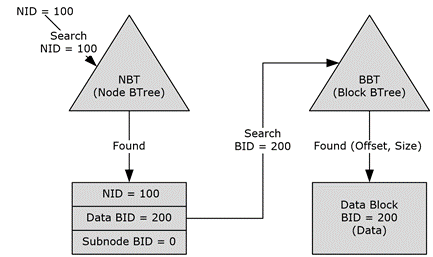

<html dir="LTR" xmlns:mshelp="http://msdn.microsoft.com/mshelp" xmlns:ddue="http://ddue.schemas.microsoft.com/authoring/2003/5" xmlns:xlink="http://www.w3.org/1999/xlink" xmlns:tool="http://www.microsoft.com/tooltip">
    <head>
        <meta http-equiv="Content-Type" content="text/html; CHARSET=utf-8"></meta>
        <meta name="save" content="history"></meta>
        <title>1.3.1.1 Node Database (NDB) Layer</title>
        <xml>
            <mshelp:toctitle title="1.3.1.1 Node Database (NDB) Layer"></mshelp:toctitle>
            <mshelp:rltitle title="[MS-PST]: Node Database (NDB) Layer"></mshelp:rltitle>
            <mshelp:keyword index="A" term="e4efaad0-1876-446e-9d34-bb921588f924"></mshelp:keyword>
            <mshelp:attr name="DCSext.ContentType" value="open specification"></mshelp:attr>
            <mshelp:attr name="AssetID" value="e4efaad0-1876-446e-9d34-bb921588f924"></mshelp:attr>
            <mshelp:attr name="TopicType" value="kbRef"></mshelp:attr>
            <mshelp:attr name="DCSext.Title" value="[MS-PST]: Node Database (NDB) Layer" />
        </xml>
    </head>
    <body>
        

            <h1 class="heading">1.3.1.1 Node Database (NDB) Layer</h1>
        

        

            

                

                

                    

The NDB layer consists of a database of nodes, which
represents the lower-level storage facilities of the PST file format. From an
implementation standpoint, the NDB layer consists of the header, file
allocation information, blocks, nodes, and two BTrees: the Node BTree (NBT) and
the Block BTree (BBT).

The NBT contains references to all of the accessible nodes
in the PST file. Its BTree implementation allows for efficient searches to
locate any specific node. Each node reference is represented using a set of
four properties that includes its NID, parent NID, data BID, and subnode BID.
The data BID points to the block that contains the data associated with the
node, and the subnode BID points to the block that contains references to
subnodes of this node. Top-level NIDs are unique across the PST and are
searchable from the NBT. Subnode NIDs are only unique within a node and are not
searchable (or found) from the NBT. The parent NID is an optimization for the
higher layers and has no meaning for the NDB Layer.

The BBT contains references to all of the data blocks of the
PST file. Its BTree implementation allows for efficient searches to locate any
specific block. A block reference is represented using a set of four
properties, which includes its BID, IB, CB, and CREF. The IB is the offset
within the file where the block is located. The CB is the count of bytes stored
within the block. The CREF is the count of references to the data stored within
the block.

The roots of the NBT and BBT can be accessed from the header
of the PST file.

The following diagram illustrates the high-level
relationship between nodes and blocks.

<b>Figure 2: Relationship between nodes and blocks</b>

The preceding figure illustrates how the data of a node with
NID=100 can be accessed. The NBT is searched to find the record with NID=100.
Once found, the record contains the BID (200) of the block that contains the
node's data. With the BID, the BBT can be searched to locate the block that
contains the node's data. As shown in the diagram, it is necessary to search
both the NBT and BBT to locate the data for a top-level node.

                

            

        

    </body>
</html>