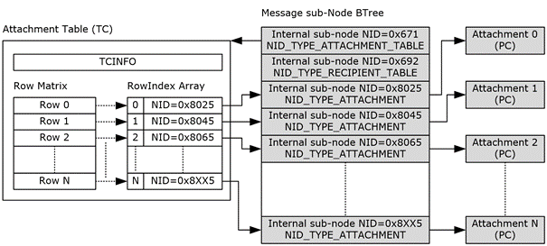

<html dir="LTR" xmlns:mshelp="http://msdn.microsoft.com/mshelp" xmlns:ddue="http://ddue.schemas.microsoft.com/authoring/2003/5" xmlns:xlink="http://www.w3.org/1999/xlink" xmlns:tool="http://www.microsoft.com/tooltip">
    <head>
        <meta http-equiv="Content-Type" content="text/html; CHARSET=utf-8"></meta>
        <meta name="save" content="history"></meta>
        <title>2.4.6.3 Relationship between Attachment Table and Attachment objects</title>
        <xml>
            <mshelp:toctitle title="2.4.6.3 Relationship between Attachment Table and Attachment objects"></mshelp:toctitle>
            <mshelp:rltitle title="[MS-PST]: Relationship between Attachment Table and Attachment objects"></mshelp:rltitle>
            <mshelp:keyword index="A" term="f3fcc68c-53ee-4c2a-82d7-113e44f1fb3f"></mshelp:keyword>
            <mshelp:attr name="DCSext.ContentType" value="open specification"></mshelp:attr>
            <mshelp:attr name="AssetID" value="f3fcc68c-53ee-4c2a-82d7-113e44f1fb3f"></mshelp:attr>
            <mshelp:attr name="TopicType" value="kbRef"></mshelp:attr>
            <mshelp:attr name="DCSext.Title" value="[MS-PST]: Relationship between Attachment Table and Attachment objects" />
        </xml>
    </head>
    <body>
        

            <h1 class="heading">2.4.6.3 Relationship between Attachment Table and Attachment objects</h1>
        

        

            

                

                

                    

<b>Figure 12: Relationship between Attachment table and
Attachment objects</b>

The preceding diagram depicts the mapping between rows in
the Attachment Table and the actual <a href="08220cc9-69b1-4072-a2e7-2a0ff201d505.htm#gt_6ab4cacc-0e1a-4843-b9e5-4f1fee5a695a">Attachment object</a> subnodes
using the <b>RowIndex</b> to obtain the subnode NID, and then using the subnode
BTree records to locate the BIDs associated with each Attachment object PC.

                

            

        

    </body>
</html>